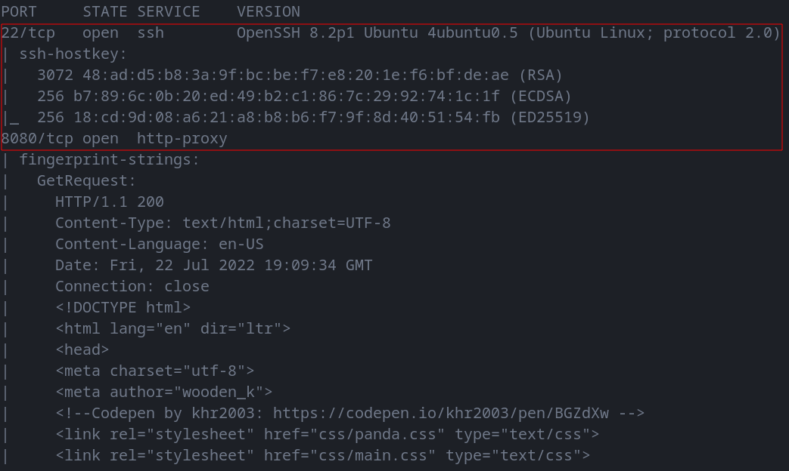

# RED PANDA BOX

--------------------------------------------------------------------

**TOOLS USED**: nmap

**nmap**: network exploration tool and security / port scanner<br>

```
nmap [Scan Type...] [Options] {target specification}
```

Scan Types:<br>
-Ss [DEFAULT] TCP SYN Scan (Doesn't open full TCP connection)<br>
-St TCP Scan (Opens full TCP connection)<br>
-Su UDP Scan<br>

**gobuster**: tool to brute force URIs (dirs, files, dns subdomains)

--------------------------------------------------------------------

## GIVEN INFO

**IP Address**: 10.10.11.170<br>

--------------------------------------------------------------------

## PROCEDURE

### 1. FIND EXPOSED PORTS

```
nmap -sC -sV -p- -oN nmap.txt 10.10.11.170
```



**EXPOSED PORT (SERVICE)**: 22 (ssh), 8080 (http-proxy)
