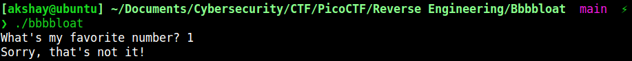
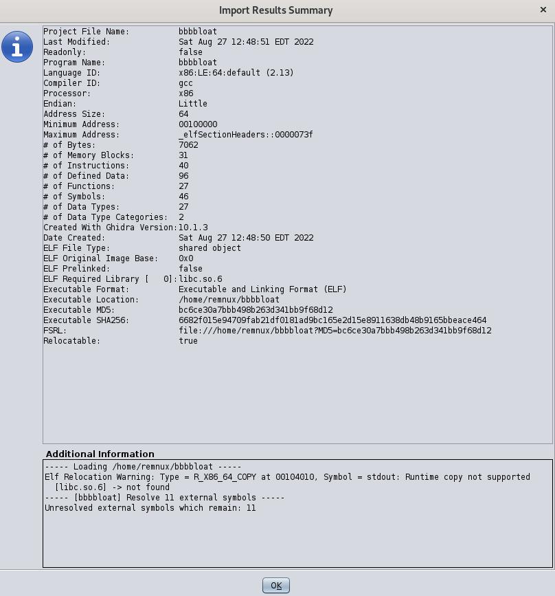
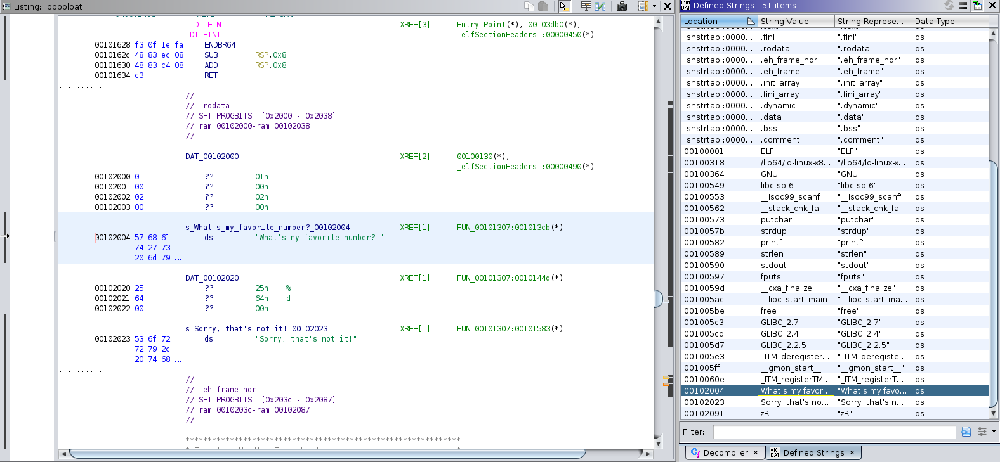
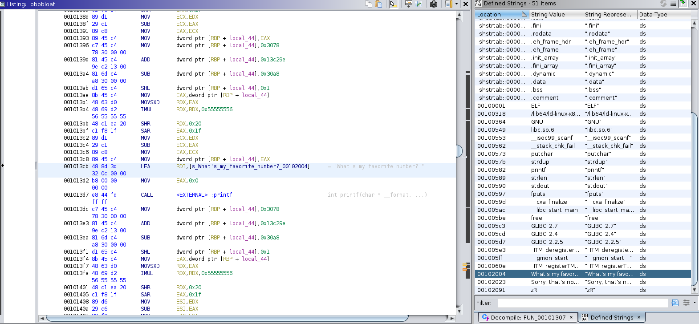
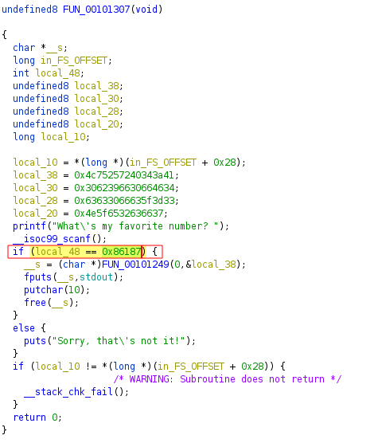
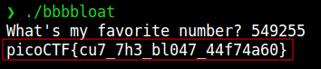

# Bbbbloat

--------------------------------------------------------------------

**TOOLS USED**: Ghidra 
**TARGET BINARY**: Bbbbloat

--------------------------------------------------------------------

## Initial Run

Program asks for user input.

## Ghidra

Initial ghidra summary on file import

Since the program ask for user input we can go to "window -> defined strings" and find that string

Cross reference to another function 
Click on memory address

In the decompile pane we can see the code (looks like a main function)

local_48 is the user input and it is checking if it is equal to 0x86187 (favorite number)

0x86187 = 549255

**FLAG:** picoCTF{cu7_7h3_bl047_44f74a60}
