# Carnage

--------------------------------------------------------------------

**TOOLS USED**: Wireshark

--------------------------------------------------------------------

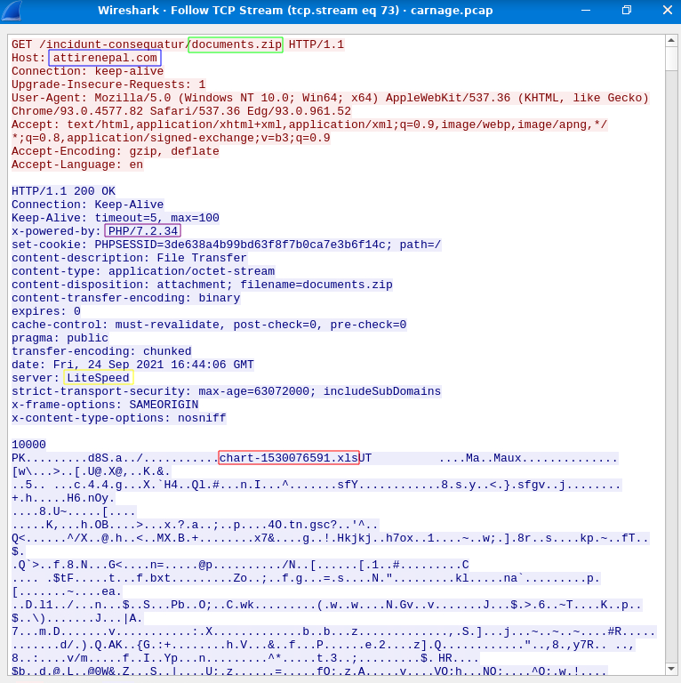

First HTTP Connection: 2021-09-24 16:44:38 
Zip Downloaded: documents.zip 
Domain: attirenepal.com 
File: chart-1530076591.xls 
Webserver: LiteSpeed 
Version: PHP/7.2.34 

Malicious File Domains: finejewels.com.au, thietbiagt.com, new.americold.com

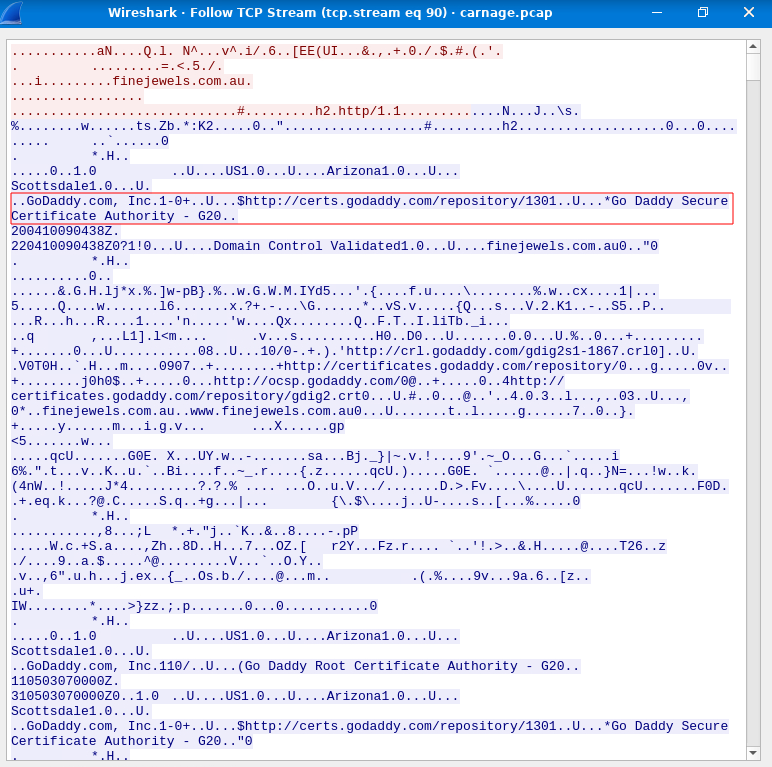

SSL Cert: godaddy

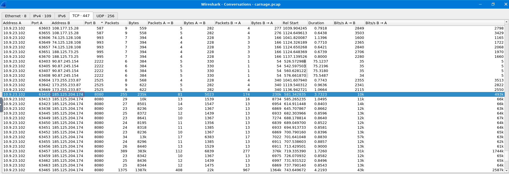

Search for port 8080 (default port for Cobalt Strike) in conversations 
Confirm using community tab in VirusTotal

Cobalt Strike Server: 185.125.204.174 
Domain: securitybusinpuff.com

Domain found through VirusTotal Relation Tab:
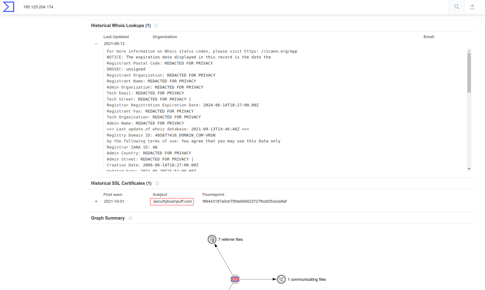

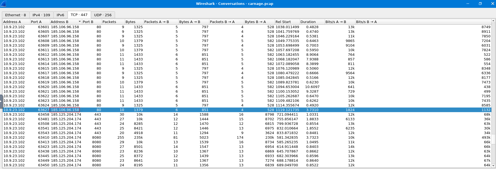

Cobalt Strike Server: 185.106.96.158 
Domain: survmeter.live

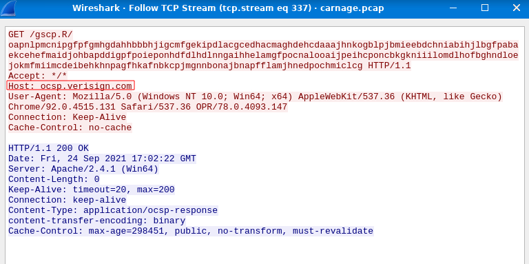

Host Header: ocsp.verisign.com

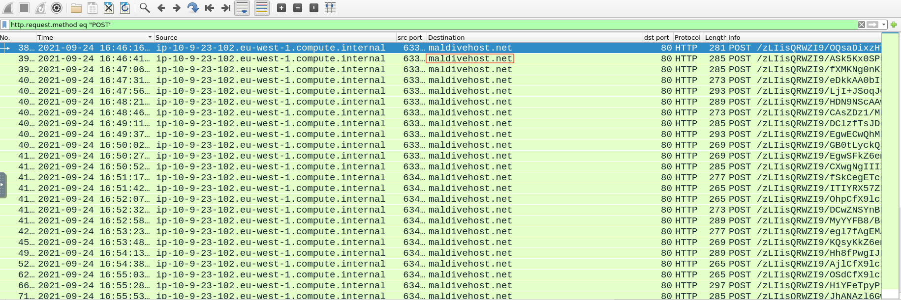

Filter by HTTP Post request

Post-Infection Traffic: maldivehost.net

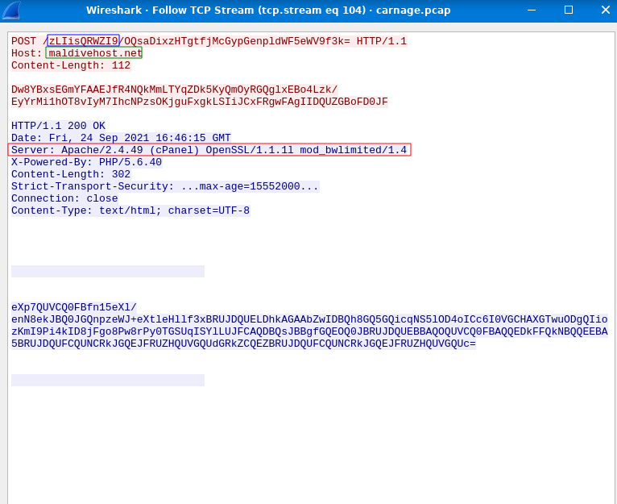

Packet Length: 281 
Server Header: Apache/2.4.49 (cPanel) OpenSSL/1.1.1l mod_bwlimited/1.4

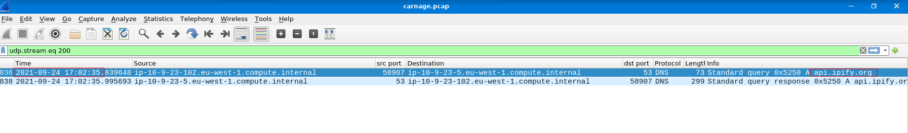

API Call: api.ipify.org

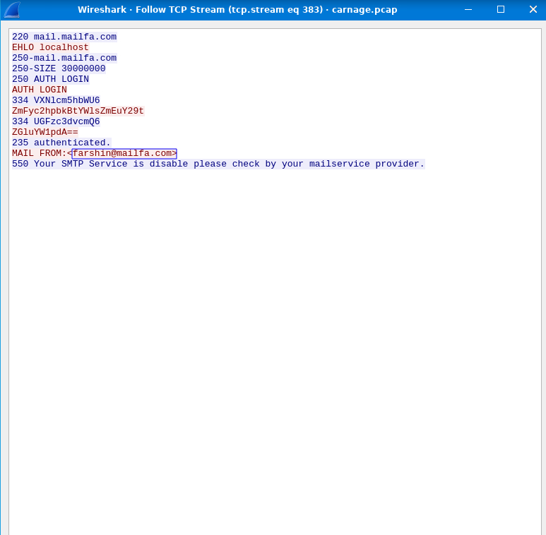

Mail: farshin@mailfa.com

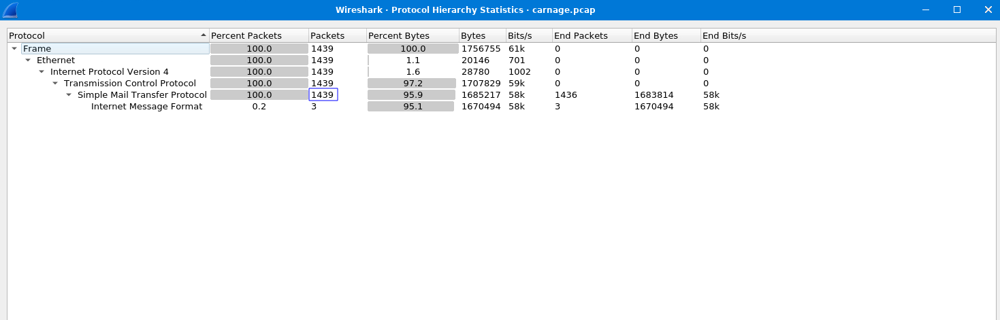

