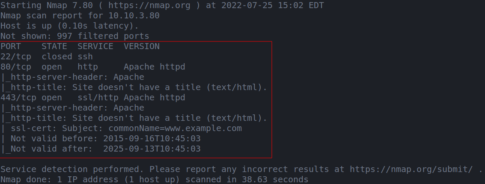
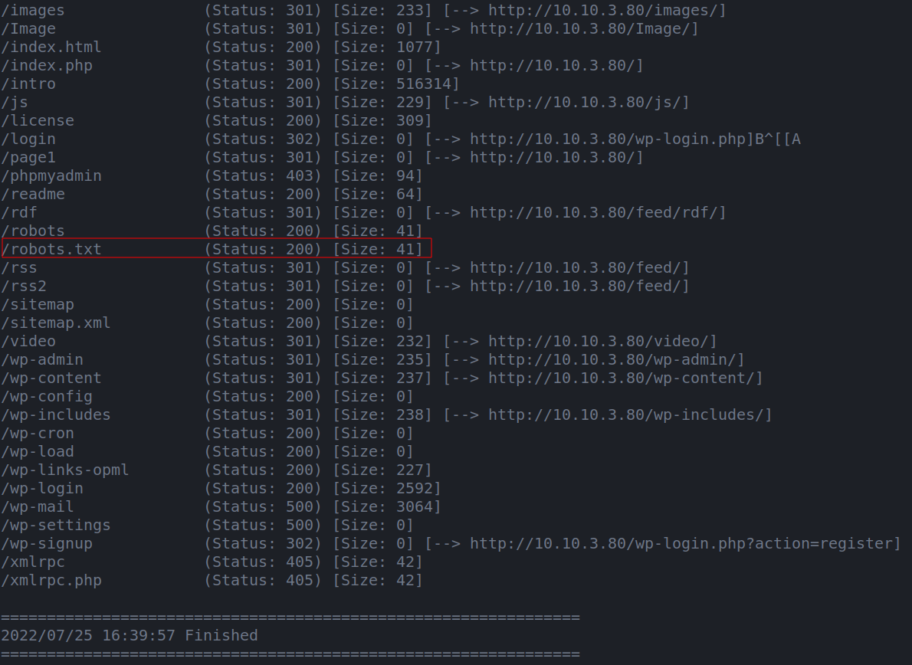

# MR. ROBOT CTF BOX

--------------------------------------------------------------------

**TOOLS USED**: nmap, dirbuster

**nmap**: network exploration tool and security / port scanner<br>

```
nmap [Scan Type...] [Options] {target specification}
```

Scan Types:<br>
-Ss [DEFAULT] TCP SYN Scan (Doesn't open full TCP connection)<br>
-St TCP Scan (Opens full TCP connection)<br>
-Su UDP Scan<br>

To find all devices connected to a network:

```
nmap -sL x.x.x.x/24
```

**dirbuster**: web content scanner

```
dirb <url_base> <url_base> [<wordlist_file(s)>] [options]
```

--------------------------------------------------------------------

## GIVEN INFO


**IP Address**: 10.10.3.80

--------------------------------------------------------------------

## PROCEDURE

### 1. FIND FLAG 1

**TOOLS**: nmap

```
nmap -sC -sV -oN nmap.txt 10.10.3.80
```




**EXPOSED PORT (SERVICE)**:<br>
22 (ssh),<br>
80 (http),<br>
443 (http)

```
gobuster dir -u "http://10.10.3.80" -w /usr/share/dirb/wordlists/common.txt
```



Go to http://10.10.3.80/robots.txt<br>
robots.txt is a common file found on websites that gives a list of files that are off limits for bots (web crawlers)

FILES: key-1-of-3.txt, fsocity.dic

FLAG 1: 073403c8a58a1f80d943455fb30724b9

--------------------------------------------------------------------

### 2. FIND FLAG 2

**TOOLS**:
