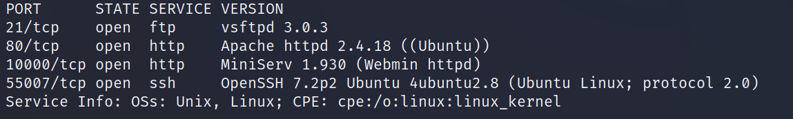
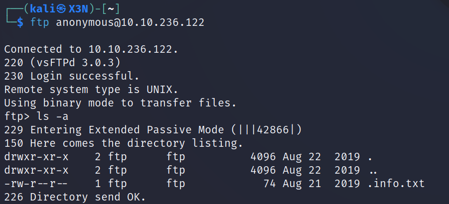
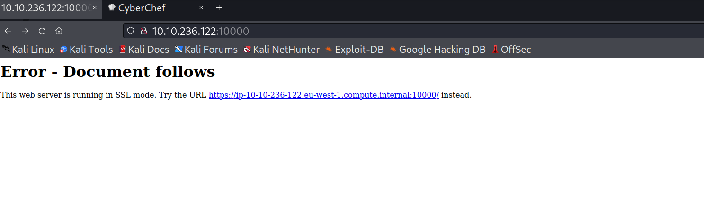
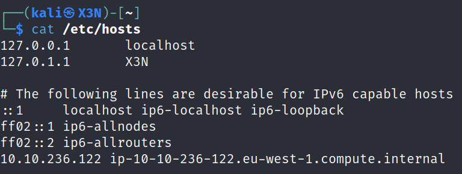
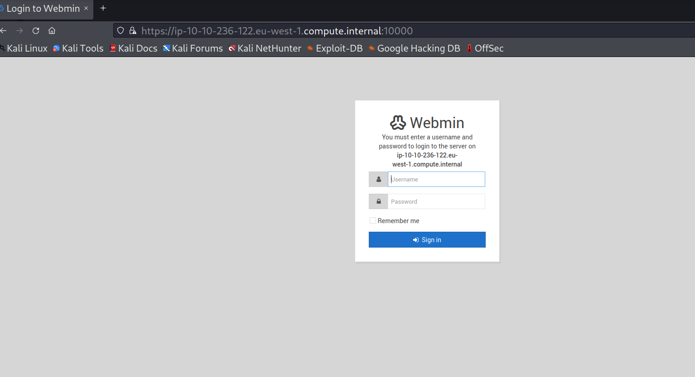
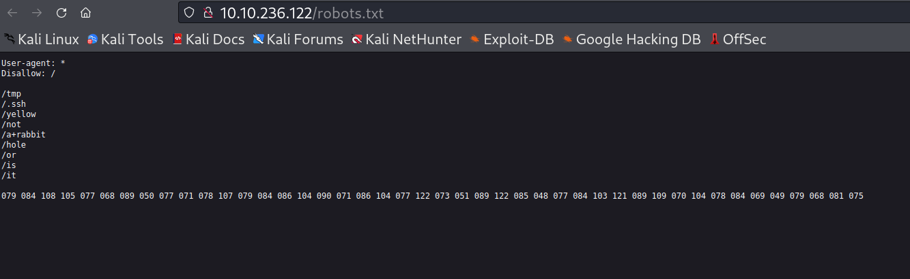

10.10.236.122

```
nmap -sV -p- 10.10.236.122
```



Webserver on port 80 is default apache page

ftp has anonymous login enabled

```
ftp anonymous@10.10.236.12
ls -la
```



```
less .info.txt
```


Possible substituion cipher<br>
**TEXT**: Whfg jnagrq gb frr vs lbh svaq vg. Yby. Erzrzore: Rahzrengvba vf gur xrl!

Try accessing http server at http://10.10.236.122:10000



Need to add new host to /etc/hosts
```
echo "10.10.236.122 ip-10-10-236-122.eu-west-1.compute.internal" >> /etc/hosts
```



webmin login page found



Enumerate hidden webdirectories on port 80
```
feroxbuster -u http://10.10.236.122 -w /usr/share/wordlists/dirb/common.txt 
```

Found robots.txt




### CRACK CIPHER

