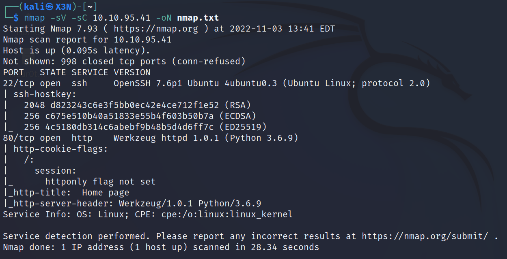
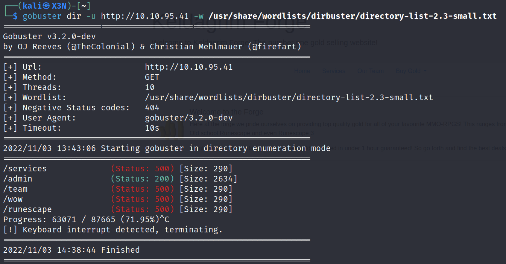

# KELDAGRIM
--------------------------------------------------------------------

**TOOLS USED**: nmap, gobuster

--------------------------------------------------------------------

## GIVEN INFO


**IP Address**: 10.10.95.41
--------------------------------------------------------------------

## PROCEDURE

### 1. RECON

-sV: probe open ports to determine service/version info<br>
-sC: scrit scan<br>
-oN OUTPUT_FILE: output results to given filename<br>
```
nmap -sV -sC -oN nmap.txt 10.10.95.41
```



**EXPOSED PORT (SERVICE)**:<br>
	22 (ssh OpenSSH 7.6p1),<br>
	80 (http Werkzeug httpd 1.0.1)

Enumerate hidden directories on website on port 80
```
gobuster dir -u http://10.10.95.41 -w /usr/share/wordlists/dirbuster/directory-list-2.3-small.txt
```

Directories of Interest: /admin



https://github.com/swisskyrepo/PayloadsAllTheThings/tree/master/Server%20Side%20Template%20Injection#jinja2