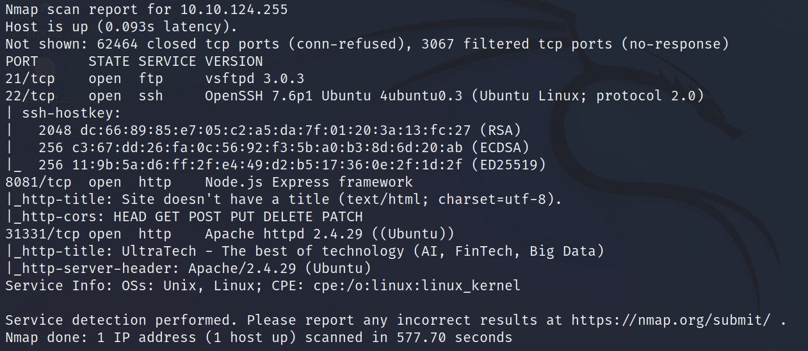
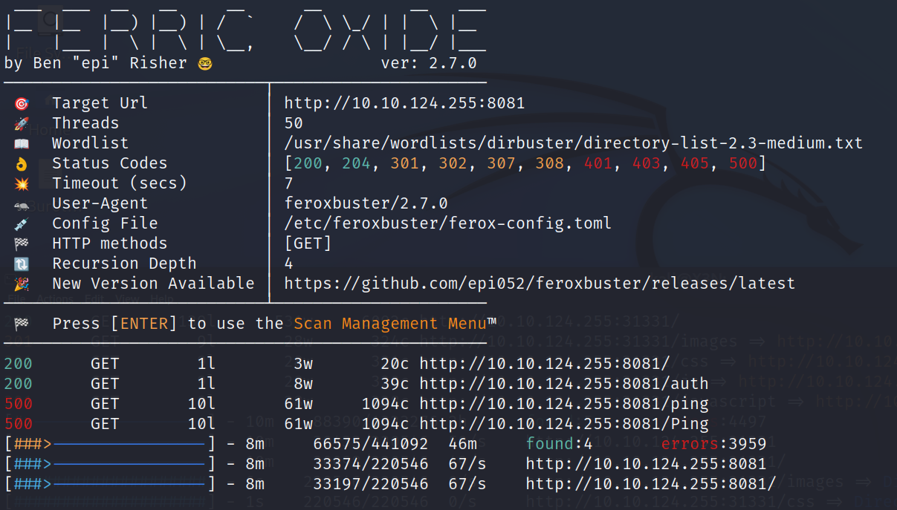
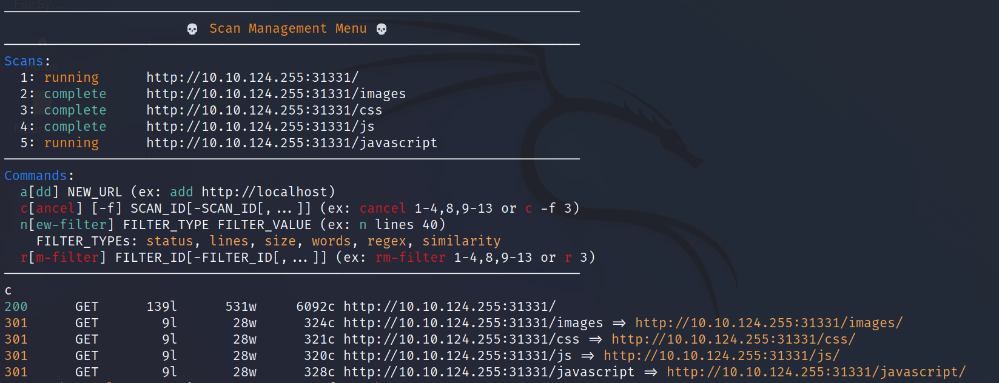

# UltraTech

--------------------------------------------------------------------

**TOOLS USED**: nmap, feroxbuster

--------------------------------------------------------------------

## GIVEN INFO


**IP Address**: 10.10.124.255

--------------------------------------------------------------------

## PROCEDURE

### 1. RECON

-sC: script scan<br>
-sV: probe open ports to determine service/version info
-p-: scan all ports
-T SCAN_SPEED (0-5)
```
nmap -sC -sV -p- -T5 10.10.124.255
```



**EXPOSED PORT (SERVICE)**:<br>
    21 (ftp vsftpd 3.0.3)<br>
    22 (ssh OpenSSH 7.6p1),<br>
    8081 (http node.js Express Framework),<br>
    31331 (http Apache httpd 2.4.29)

Enumerate hidden directories on webserver on port 8081
```
feroxbuster -u http://10.10.124.255:8081 -w /usr/share/wordlists/dirbuster/directory-list-2.3-medium.txt
```



Directory of Interest: /admin, /etc



Enumerate hidden directories on webserver on port 31331
```
feroxbuster -u http://10.10.124.255:31331 -w /usr/share/wordlists/dirbuster/directory-list-2.3-medium.txt
```


Directory of Interest: /admin, /etc


